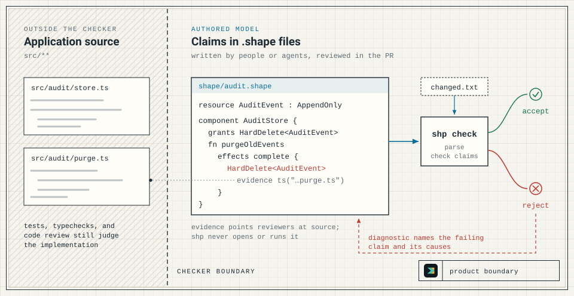

# Shape

Shape is a small language for writing architecture claims in `.shape` files, and `shp` is the checker that accepts or rejects them in review and CI. A claim states something the team has decided, such as "audit events are append-only", "this function only appends audit events", or "only the gateway may provide this endpoint".

`shp` judges only those declared claims. It reads `.shape` files and, when given, a list of changed files. It never opens or runs the source code the claims reference, so it does not prove that the implementation matches them, and it does not replace tests, typechecks, or code review.



## Example

`AuditEvent` is an append-only resource, so a function that hard-deletes it is rejected, even though its component grants the delete:

```shape
module audit

resource AuditEvent : AppendOnly

component AuditStore {
  owns AuditEvent
  grants Append<AuditEvent>
  grants HardDelete<AuditEvent>
  fn appendEvent
    effects complete {
      Append<AuditEvent>
    }
  fn purgeOldEvents
    source ts("src/audit/purge.ts#purgeOldEvents")
    effects complete {
      HardDelete<AuditEvent>
        evidence ts("src/audit/purge.ts#purgeOldEvents")
    }
}
```

Saved as `shape/audit.shape`, `shp check` prints this to stderr and exits 1:

```text
error: forbidden effect

AuditStore.purgeOldEvents emits HardDelete<AuditEvent>.
AuditEvent has trait AppendOnly.
AppendOnly forbids final HardDelete<AuditEvent>.
evidence: ts("src/audit/purge.ts#purgeOldEvents")

caused by:
  - shape/audit.shape: effect AuditStore.purgeOldEvents emits HardDelete<AuditEvent>
  - shape/audit.shape: resource AuditEvent : AppendOnly
  - standard prelude: trait AppendOnly forbids final HardDelete<T>
```

`AppendOnly` is built in. It finally forbids `HardDelete`, `Truncate`, and `DropStorage` on the resource that carries it, and nothing in the model can waive a final forbid.

## Install

Pin the version in scripts and CI:

```bash
curl --proto '=https' --tlsv1.2 -LsSf https://github.com/timbrinded/shapelang/releases/download/v0.9.0/install.sh | sh
```

On Windows:

```powershell
irm https://github.com/timbrinded/shapelang/releases/download/v0.9.0/install.ps1 | iex
```

The installer verifies the archive against the release's SHA-256 checksums and installs `shp` into `~/.local/bin` (`$HOME\.local\bin` on Windows). The binary needs neither Bun nor Node.

## GitHub Actions

```yaml
steps:
  - uses: actions/checkout@v4
  - uses: timbrinded/shapelang@v0.9.0
  - run: shp check
```

The setup action installs the release named by `version` when given; otherwise, the release named by a version-tag ref such as `@v0.9.0`; otherwise, the latest release:

```yaml
- uses: timbrinded/shapelang@master
  with:
    version: v0.9.0
```

## Claude Code plugin

```text
/plugin marketplace add timbrinded/shapelang
/plugin install shapelang@shapelang-local
/reload-plugins
```

The plugin adds six skills: `shapelang:shape-lang`, `shapelang:shape-contract-preflight`, `shapelang:shape-contract-guard`, `shapelang:shape-index`, `shapelang:shape-review`, and `shapelang:unix-system-visualiser`. They drive the `shp` CLI, so keep the binary on your `PATH`. The plugin is released as `shapelang--v0.9.0` from the same commit as `v0.9.0`.

## Documentation

- [Shape](https://timbrinded.github.io/shapelang/): what the checker decides and where it stops
- [Quickstart](https://timbrinded.github.io/shapelang/learn/quickstart/): install, write a first model, and resolve a failing check
- [Language Syntax](https://timbrinded.github.io/shapelang/reference/language-syntax/)
- [CLI Reference](https://timbrinded.github.io/shapelang/reference/cli/)
- [Diagnostics](https://timbrinded.github.io/shapelang/reference/diagnostics/)

## Contributing

[CONTRIBUTING.md](CONTRIBUTING.md) covers the Bun workspace, the local checks CI runs, and how code, docs, and the repository's own Shape model change together. [RELEASING.md](RELEASING.md) is the release procedure. [AGENTS.md](AGENTS.md) holds the instructions for coding agents working in this repository.

## License

BSD 3-Clause
