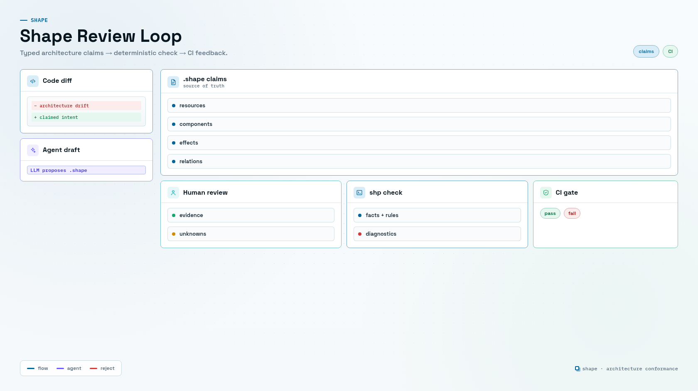

# Shape

Shape is a typed architecture conformance language for making architectural claims explicit and checkable.

Application code can be messy, implicit, and spread across many files. Shape gives the system a small human-readable model in `.shape` files:

- resources, traits, and invariants
- components, ownership, capabilities, and dependencies
- function effect summaries with source evidence
- model updates for architecture changes
- coverage rules for governed source paths
- bindings that require paired review-surface changes, such as docs updates
- typed design memory for refactor-sensitive functions
- constrained project rules such as dependency-cycle bans

The checker does not prove the application implementation is correct. It checks that the declared architecture model is coherent. That is the product boundary: humans and LLMs write reviewable claims, then a deterministic checker accepts or rejects those claims.



## Quick Start

Install the released `shp` typechecker binary. Pin the version in scripts and CI so checks are reproducible.

```bash
curl --proto '=https' --tlsv1.2 -LsSf https://github.com/timbrinded/shapelang/releases/download/v0.1.0/install.sh | sh
```

On Windows:

```powershell
irm https://github.com/timbrinded/shapelang/releases/download/v0.1.0/install.ps1 | iex
```

Run the checker from a repo that contains Shape files:

```bash
shp check
shp fmt --check
shp coverage --changed-files changed.txt
shp memory
shp obligations
```

`shp check` scans these paths when no files are provided:

```text
shape/**/*.shape
```

In GitHub Actions, install the same pinned release with the setup action:

```yaml
steps:
  - uses: actions/checkout@v4
  - uses: timbrinded/shapelang@v0.1.0
  - run: shp check
```

Manual archive downloads are available on the GitHub release if you do not want to run the installer script.

## What It Catches

The first core use case is append-only resource protection.

If a resource is declared `AppendOnly`, then a function that emits `HardDelete<Resource>` is rejected even if the component grants that effect. Final forbids win over grants.

Shape also covers:

- unknown effects in protected components
- missing grants for declared function effects
- governed source files changed without a Shape update or current attestation
- Shape-affecting files changed without a bound docs update or `docs_not_needed` attestation
- refactor-sensitive functions changed without a recorded reevaluation
- required design context or descriptions missing from non-obvious function shapes
- semantic dependency cycles with witness paths
- project-specific rules like "only Gateway may provide JsonRpcEndpoint"
- optional analyzer hints for obvious `DELETE`, `TRUNCATE`, and `DROP` operations

See [Refactor Constraints](docs-site/src/content/docs/concepts/refactor-constraints.md) for the design-memory workflow around rationale, memory, and reevaluation.

## Example Shape File

Shape files use the `.shape` extension. This example declares an append-only audit resource and two allowed functions:

```shape
module audit

trait AppendOnly<T: Resource> {
  allow Append<T>
  allow Read<T>
  forbid final DropStorage<T>
  forbid final HardDelete<T>
  forbid final Truncate<T>
}

resource AuditEvent : AppendOnly

component AuditStore {
  owns AuditEvent
  grants Append<AuditEvent>
  grants Read<AuditEvent>

  fn appendEvent
    source ts("src/audit/store.ts#appendEvent")
    effects complete {
      Append<AuditEvent>
        evidence ts("src/audit/store.ts:8-14")
    }

  fn listEvents
    source ts("src/audit/store.ts#listEvents")
    effects complete {
      Read<AuditEvent>
        evidence ts("src/audit/store.ts:18-25")
    }
}
```

A change file can preview a new function before the broader model is updated:

```shape
module changes.PR_001

import audit

change AddAuditRetentionPurge {
  add fn AuditStore.purgeOldEvents
    source ts("src/audit/purge.ts#purgeOldEvents")
    effects complete {
      HardDelete<AuditEvent>
        evidence ts("src/audit/purge.ts:12-16")
    }
}
```

That proposed change fails because `AuditEvent : AppendOnly` derives a final forbid for `HardDelete<AuditEvent>`.

## How It Works

The checker pipeline is:

1. Parse `.shape` files with Langium.
2. Apply change blocks on top of the base model.
3. Lower declarations into facts such as resources, traits, effects, grants, dependencies, and governed paths.
4. Evaluate deterministic rules.
5. Emit diagnostics with provenance, including the declarations that caused a violation.

The LLM-facing authoring helpers intentionally produce Shape deltas, not prose. The optional analyzer is advisory only: it can flag suspicious omissions, but `.shape` remains the source of truth.

## Commands

```bash
shp check
shp check --changed-files changed.txt
shp coverage --changed-files changed.txt
shp fmt --check
shp explain AuditEvent
shp graph Gateway --relation requires
shp memory
shp obligations
shp author --changed-files changed.txt --component AuditStore
shp analyze --shape-files fixtures/pass/append_only_append/audit.shape src/audit/purge.ts
```

`shp check` scans `shape/**/*.shape` when no files are provided. Any `.shape` file under `shape/` is part of the checked model.

Useful commands:

- `shp check`: run conformance checks.
- `shp coverage --changed-files changed.txt`: enforce Shape updates or current attestations for governed paths.
- `shp check --changed-files changed.txt`: run semantic checks, coverage, and bindings together.
- `shp fmt --check`: verify canonical formatting.
- `shp explain AuditEvent`: show derived facts and constraints for a symbol.
- `shp graph Gateway --relation requires`: print dependency paths.
- `shp memory`: list rationale and memory entries that protect design context.
- `shp obligations`: list open design-memory obligations such as missing rationale or reevaluation.
- `shp author --changed-files changed.txt --component AuditStore`: scaffold a review change file with explicit unknowns.
- `shp analyze --shape-files fixtures/pass/append_only_append/audit.shape src/file.ts`: compare obvious source hints against declared effects.

## Project Layout

```text
shape/
  checker.shape
  delivery.shape
  language.shape
  tooling.shape

fixtures/
  pass/
  fail/

packages/
  shp-checker/
  shp-cli/

docs-site/
  src/content/docs/
```

The implementation currently lives in two packages:

- `@shape/shp-checker`: parser, formatter, fact lowering, rule checks, authoring helpers, editor primitives, and analyzer hints.
- `@shape/shp-cli`: command-line wrapper around the checker package.

The Starlight documentation site lives in `docs-site/` and is configured for static publishing under `/shapelang/`.

## Local Development

Use the Bun workspace only when contributing to Shape itself:

```bash
bun install --frozen-lockfile
bun run langium:generate
bun shp check
bun run changed-files
bun run shape:ci
bun test
bun run typecheck
bun run docs:check
```

Run the docs site locally:

```bash
bun run docs:dev
```

Build release archives locally:

```bash
bun run build:release
```

Release archives are written under `dist/release/`, which is ignored by git.

## Contributing

Before opening changes, run the local development checks. Documentation changes should keep complete `shape` code fences parseable; use `shape no-verify` only for intentional fragments. CLI behavior changes should update the README, docs quickstart, and CLI reference together.

## Docs Deployment

The docs site is configured for GitHub Pages at `https://timbrinded.github.io/shapelang/`.

GitHub Pages should use the **GitHub Actions** publishing source. The deployment workflow builds `docs-site`, uploads `docs-site/dist`, and publishes the artifact with the Pages deployment actions.

## CI

CI is wired in `.github/workflows/shape.yml` for formatting, tests, typechecking, `shp check --changed-files changed.txt`, Shape coverage/bindings, and docs checks. Governed source changes require a faithful `shape` update or a narrow current attestation; bound docs surfaces must change unless a current `docs_not_needed` attestation explains why not.

## Release

Releases are built from version tags:

```bash
git tag v0.1.0
git push origin v0.1.0
```

The release workflow validates the repo, cross-compiles `shp` for Linux, macOS, and Windows, publishes tarballs as GitHub release assets, and includes SHA-256 checksums.

Other GitHub Actions workflows can install `shp` from a release:

```yaml
steps:
  - uses: actions/checkout@v4
  - uses: timbrinded/shapelang@v0.1.0
  - run: shp check
```

Use `with.version` to install a different release than the action ref:

```yaml
- uses: timbrinded/shapelang@master
  with:
    version: v0.1.0
```

## License

BSD 3-Clause
