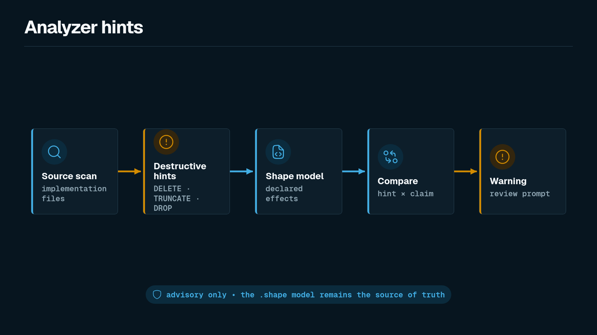

The source analyzer is advisory. It scans implementation files for obvious destructive operations and compares the hints with declared shape effects.



```bash
shp analyze --shape-files fixtures/pass/append_only_append/audit.shape fixtures/source/audit_purge.ts
```

If a source file appears to hard-delete data but the shape model does not declare `HardDelete`, the analyzer reports a warning.

## What the analyzer catches

The analyzer recognizes a deliberately small set of obvious patterns:

| Pattern family | Destructive hints |
| --- | --- |
| SQL | `DELETE FROM`, `TRUNCATE`, and `DROP TABLE` |
| Kysely | `deleteFrom(...)`, `dropTable(...)`, and destructive raw SQL |
| Prisma | `prisma.<model>.delete(...)`, `deleteMany(...)`, and destructive raw SQL |
| Drizzle | `db.delete(...)` or transaction `delete(...)`, plus destructive raw SQL |

The TypeScript matchers cover common `prisma`/`db`/`tx`/`trx` receiver names and a single member-call line wrap. Project-specific aliases or more heavily split chains may not be recognized. Conversely, textual SQL in an inert string or comment can still produce a hint because the analyzer does not parse control flow or string usage.

These hints are useful review aids. They are not a substitute for the `.shape` file.

## Source of truth

The checker evaluates Shape modules. The analyzer can draw attention to missing claims, but it does not authorize or reject an architecture model by itself.

Use analyzer warnings as prompts for better evidence and better effect summaries.
