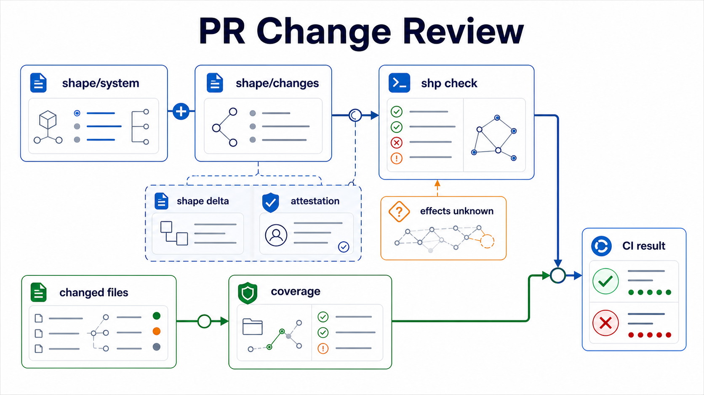

Change files let a PR express architecture deltas without rewriting the baseline model.



```shape
module changes.PR_001

import audit

change AddAuditRetentionPurge {
  add fn AuditStore.purgeOldEvents
    source ts("src/audit/purge.ts#purgeOldEvents")
    effects complete {
      HardDelete<AuditEvent>
        evidence ts("src/audit/purge.ts:12-16")
    }
}
```

The checker applies changes before rule evaluation. That means a failing PR delta fails in CI even if the base model still passes.

## Guarded changes

Some function shapes carry refactor constraints. If a function is protected by a `memory` or `rationale` with `guards on_change require ReEvaluation<Self>`, a `modify fn` or `remove fn` change must include a matching `reevaluation`.

```shape
module changes.PR_004

import gateway

reevaluation DecisionShapeRechecked {
  satisfies memory DecisionRefactorConstraint
  outcome Confirmed
  summary "Refactor preserves error-normalisation behaviour."
  reviewer GatewayTeam
  decided_on "2026-06-02"
  evidence test("gateway/error-normalisation.test.ts")
}

change RefactorDecision {
  modify fn Gateway.derivePolicyDecision
    effects complete {
      Read<PolicySnapshot>
    }
}
```

A source-path attestation does not satisfy this obligation. Coverage answers whether the PR documented a governed source change; reevaluation answers whether a guarded function shape was reviewed.

## Unknowns

Unknown effects should be explicit:

```shape
module changes.PR_002

import audit

change ReviewAuditChange {
  add fn AuditStore.reviewMe
    source ts("src/audit/review.ts#reviewMe")
    effects unknown
}
```

Explicit unknowns are better than silently omitting an effect. Protected components should treat unknowns as review blockers.

## Attestations

Attestations document a reviewer decision around a changed source path:

```shape
module changes.PR_003

attest shape_delta {
  source ts("src/audit/reporting.ts")
  reason "Reporting-only change; no resource effect changed."
}
```

Use attestations sparingly. They should explain why a governed source change does not need a shape delta.
