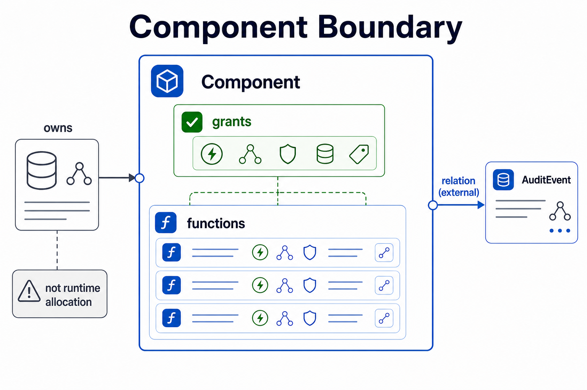

Components are the main boundary for claims about authority and behavior: what a component owns, what it is allowed to do, and which functions it provides.

Components do **not** carry structural dependencies. Calls, provides, and other links between components live in `relation` declarations. See [Relations and Hypergraphs](./relations-hypergraphs.md).



```shape
module audit

resource AuditEvent : AppendOnly

component AuditStore {
  owns AuditEvent
  grants Append<AuditEvent>
  grants Read<AuditEvent>
  fn appendEvent
    effects complete {
      Append<AuditEvent>
    }
}
```

## Ownership

`owns AuditEvent` says this component owns the resource in the architecture model. Ownership is a review claim, not a runtime allocation.

## Grants

`grants Append<AuditEvent>` says functions in this component may emit that effect. If a function emits an effect without a matching grant, the checker rejects the model.

Grants do not override final forbids. This model still fails:

```shape
module audit

trait AppendOnly<T: Resource> {
  forbid final HardDelete<T>
}

resource AuditEvent : AppendOnly

component AuditStore {
  owns AuditEvent
  grants HardDelete<AuditEvent>
  fn purgeOldEvents
    effects complete {
      HardDelete<AuditEvent>
    }
}
```

`AuditEvent : AppendOnly` derives a final forbid for `HardDelete<AuditEvent>`, so the grant is not enough.

## Function summaries

Each `fn` member declares the function's source location, effects, and any shape traits or descriptions the reviewer needs to see. Function-level `requires` is a capability term used together with `unsafe` effects; it is unrelated to structural dependencies between components.

## Structural dependencies

Structural links between components and resources live exclusively in top-level `relation` declarations, never inside a `component` block. See [Relations and Hypergraphs](./relations-hypergraphs.md) for the syntax and semantics.
