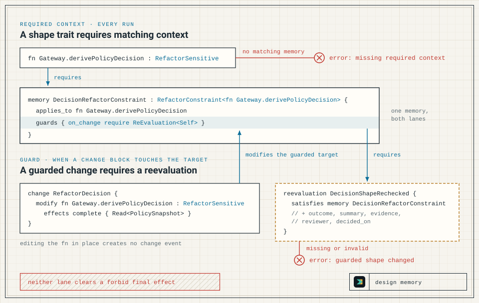

Design memory records why a fragile part of the Shape model looks the way it does, as typed `rationale` and `memory` declarations. It covers constraints that an effect summary cannot express: an authorization check that must stay inline, an error ordering that callers depend on, compatibility code, or a test-only helper that looks like production code. The checker enforces design memory through two separate mechanisms:

- **Required context.** A shape trait such as `RefactorSensitive` requires a `rationale` or `memory` of a matching type for the same target. `shp check` evaluates this on every run and reports `missing required context` until one exists.
- **Guards.** A `rationale` or `memory` can guard its target. When a `change` declaration modifies or removes that target, `shp check` reports `guarded shape changed` until a valid `reevaluation` satisfies the guarding declaration.

One declaration can take part in both: the same `memory` can satisfy a trait's requirement and carry a guard. Neither mechanism can make an effect rejected by a final forbid pass; see [Effect Model](/shapelang/concepts/effect-model/).

Review freshness is a separate, opt-in check: given a reference date, `shp check` fails on a context whose `review_by` date has passed (see [Review freshness](#review-freshness)).



## Required context

### A minimal example

`Gateway.derivePolicyDecision` builds an authorization decision, and earlier refactors of it broke error normalisation. The shape trait `RefactorSensitive` marks the function as needing recorded context:

```shape
module gateway

resource PolicySnapshot

component Gateway {
  owns PolicySnapshot
  grants Read<PolicySnapshot>
  fn derivePolicyDecision : RefactorSensitive
    effects complete {
      Read<PolicySnapshot>
    }
}
```

`shp check gateway.shape` exits 1:

```text
error: missing required context

fn Gateway.derivePolicyDecision has shape RefactorSensitive.
RefactorSensitive requires RefactorConstraint<fn Gateway.derivePolicyDecision>.

No matching rationale or memory found.

caused by:
  - gateway.shape: fn Gateway.derivePolicyDecision : RefactorSensitive
  - standard prelude: RefactorSensitive requires RefactorConstraint
```

The prelude defines this requirement: on a function, `RefactorSensitive` needs a `RefactorConstraint` for that function, and only a `memory` satisfies it. Adding one to the module makes the check pass:

```shape
memory DecisionRefactorConstraint : RefactorConstraint<fn Gateway.derivePolicyDecision> {
  applies_to fn Gateway.derivePolicyDecision
  status Unexplained
  confidence High
  summary "Previous refactors broke error normalisation."
  who {
    owner GatewayTeam
  }
}
```

```text
Shape check passed.
```

### Anatomy of a context declaration

`rationale` and `memory` declarations, together called contexts, share one form: the kind, a name, and a context type written with its target, such as `RefactorConstraint<fn Gateway.derivePolicyDecision>`. The target must be a declared `fn`, `component`, `resource`, `relation`, `implementation`, or `rule`; otherwise `shp check` reports `invalid context target`.

A context satisfies a trait's requirement only when its context type name, its kind, and its target all match what the trait requires. A `rationale` of type `RefactorConstraint` therefore does not satisfy `RefactorSensitive`, which accepts only a memory.

`applies_to` names the target again and must name the same one as the context type. When it names a different target, `shp check` reports `context target mismatch`, and the obligation stays unmet, so `missing required context` is reported as well. When `applies_to` is omitted, the checker uses the context type's target.

The remaining members are recorded for reviewers. The checker stores `status`, `confidence`, `why`, and `owner` as identifiers and `summary` as text, and `shp memory` and `shp explain` display several of them, but the checker never interprets their values. The `who { owner ... }` and `when { review_by ... }` blocks each hold one value. [Language Syntax](/shapelang/reference/language-syntax/) lists every member each declaration accepts, and [Diagnostics](/shapelang/reference/diagnostics/#design-memory) gives the printed form, cause, and fix of every design-memory diagnostic this page names.

### Rationale and memory

A `rationale` records a deliberate design choice and its reason, given as `why`. A `memory` records a known constraint, often one learned from past failures, with `status` and `confidence`; only a `memory` can be marked `sensitive` (see [Approvers and roles](#approvers-and-roles)). The table in the next section fixes the accepted kind for most traits; among the built-in traits, the choice between the two is open only for `ProtectedCheckOrder` and `NonIdiomatic`, which accept either.

`status Unexplained` records that a constraint is real but its cause is not yet understood; it signals to reviewers that the memory still needs an explanation. It differs from `effects unknown`, which marks incomplete effect analysis: `derivePolicyDecision` keeps a complete effect summary while its memory stays unexplained.

Adding `PreserveInline` to `derivePolicyDecision` asks for a rationale that explains why the function stays inline:

```shape
component Gateway {
  owns PolicySnapshot
  grants Read<PolicySnapshot>
  fn derivePolicyDecision : PreserveInline, RefactorSensitive
    effects complete {
      Read<PolicySnapshot>
    }
}

rationale DerivePolicyInline : InlineRationale<fn Gateway.derivePolicyDecision> {
  applies_to fn Gateway.derivePolicyDecision
  why CognitiveLocality
  summary "Policy checks stay inline so reviewers can read the authorization path in one place."
  who {
    owner GatewayTeam
  }
}
```

With this rationale and `DecisionRefactorConstraint` both present, the check passes.

### Built-in shape traits

The prelude defines six shape traits. Each one requires a context type for the same target, satisfied by the kinds listed:

| Shape trait | Targets | Required context type | Satisfied by |
| --- | --- | --- | --- |
| `PreserveInline` | `fn` | `InlineRationale` | rationale |
| `RequiresDescription` | `fn` | `DescriptionRationale`, plus a non-empty `description` | rationale |
| `ProtectedCheckOrder` | `fn` | `CheckOrderRationale` | rationale or memory |
| `RefactorSensitive` | `fn`, `component`, `resource` | `RefactorConstraint` | memory |
| `NonIdiomatic` | `fn`, `component`, `resource` | `DesignRationale` | rationale or memory |
| `TestOnly` | `fn`, `component` | `TestOnlyPurpose` | rationale |

A shape trait goes in the same trait list as any other trait: `fn name : Trait`, `component Name : Trait { ... }`, or `resource Name : Trait`. On a declaration kind that its row does not list, a shape trait derives no obligation, and the checker reports nothing.

### Required descriptions

`RequiresDescription` adds a second requirement: the function needs a non-empty `description` as well as a `DescriptionRationale` rationale. The description keeps a short explanation beside the effect summary. In this example `derivePolicyDecision` carries only `RequiresDescription`:

```shape
component Gateway {
  owns PolicySnapshot
  grants Read<PolicySnapshot>
  fn derivePolicyDecision : RequiresDescription
    description required "Builds the authorization decision from the current policy snapshot."
    effects complete {
      Read<PolicySnapshot>
    }
}

rationale DerivePolicyDescription : DescriptionRationale<fn Gateway.derivePolicyDecision> {
  applies_to fn Gateway.derivePolicyDecision
  why Auditability
  summary "Reviewers need the decision's purpose beside its effect summary."
  who {
    owner GatewayTeam
  }
}
```

Without the `description` line, `shp check` exits 1:

```text
error: missing required description

fn Gateway.derivePolicyDecision has shape RequiresDescription.
RequiresDescription requires a description.

caused by:
  - gateway.shape: fn Gateway.derivePolicyDecision : RequiresDescription
  - standard prelude: RequiresDescription requires description
```

The trait accepts a description written with or without `required`. `required` makes an empty description an error: `description required ""`, or one of only whitespace, fails with `missing required description`, with or without the trait.

### Components and resources

Components and resources take shape traits in their trait lists. Shape traits sit beside semantic traits such as `AppendOnly`, which derive no context obligation:

```shape
module gateway

resource AuditEvent : AppendOnly, RefactorSensitive

component AuditStore : RefactorSensitive {
  owns AuditEvent
  grants Append<AuditEvent>
  fn appendEvent
    effects complete {
      Append<AuditEvent>
    }
}

memory AuditEventLayout : RefactorConstraint<resource AuditEvent> {
  applies_to resource AuditEvent
  status Explained
  confidence High
  summary "External auditors parse the AuditEvent field layout."
  who {
    owner AuditTeam
  }
}

memory AuditStoreBoundary : RefactorConstraint<component AuditStore> {
  applies_to component AuditStore
  status Unexplained
  confidence Medium
  summary "Splitting AuditStore has broken audit exports before; the cause is not known."
  who {
    owner AuditTeam
  }
}
```

`AppendOnly` contributes final forbids on `AuditEvent`, and `RefactorSensitive` contributes a required context. The model passes; removing `AuditStoreBoundary` reports `missing required context` for `component AuditStore`.

### Project-defined obligations

A `require_context` member on a `trait` makes it a shape trait with a project-defined obligation. The bound of the type parameter it names chooses which declarations receive the obligation:

```shape
module gateway

trait PreserveLocal<T: Fn> {
  require_context LocalRationale<T> satisfied_by rationale
}

resource PolicySnapshot

component Gateway : PreserveLocal {
  owns PolicySnapshot
  grants Read<PolicySnapshot>
  fn derivePolicyDecision : PreserveLocal
    effects complete {
      Read<PolicySnapshot>
    }
}
```

`shp check gateway.shape` exits 1 with one diagnostic, for the function only:

```text
error: missing required context

fn Gateway.derivePolicyDecision has shape PreserveLocal.
PreserveLocal requires LocalRationale<fn Gateway.derivePolicyDecision>.

No matching rationale or memory found.

caused by:
  - gateway.shape: fn Gateway.derivePolicyDecision : PreserveLocal
  - gateway.shape: trait PreserveLocal require_context LocalRationale<T>
```

A `rationale DerivePolicyLocal : LocalRationale<fn Gateway.derivePolicyDecision>` satisfies it. The rules:

- The bound `Fn` (also `Function`, or no bound at all) targets functions; `Component` and `Resource` target those kinds. Bounds are case-insensitive.
- The same trait on another kind of declaration derives nothing. `component Gateway : PreserveLocal` above requires no context, because `T` is bound to `Fn`.
- `satisfied_by rationale`, `satisfied_by memory`, or `satisfied_by rationale or memory` sets the accepted kinds. Without `satisfied_by`, either kind is accepted.
- A `require_context` that names a type parameter the trait does not declare, or a parameter with any other bound, is reported as `invalid require_context`, and its obligation is dropped.
- The `caused by:` block cites the trait's `require_context` line instead of the standard prelude.
- A trait declared in the same module with the name of a built-in shape trait replaces that built-in obligation.

## Guards and reevaluation

### When a guard fires

A guard is a `guards` block inside a `rationale` or `memory`, and it protects that context's target. A `change` declaration groups `add`, `modify`, and `remove` entries against the Shape model; [Language Syntax](/shapelang/reference/language-syntax/) lists the entry forms. A guard fires only from a `change` declaration: a `modify` or `remove` entry whose target is the guarded `fn`, `component`, `resource`, or `relation`. A guard on any other target kind never fires.

A `guards` block holds two kinds of action:

- `on_change require ReEvaluation<Self>` (or `ReEvaluation`) fires on any `modify` or `remove` of the target. A `protects` block can narrow it to the removal of named properties (see [Narrowing a guard with protects](#narrowing-a-guard-with-protects)). Any other requirement name after `require` parses and has no effect.
- `forbid transform LABEL` fires on a `modify fn` that declares that transform label (see [Forbidding named transforms](#forbidding-named-transforms)).

`shp explain` on a target lists the contexts that guard it, which shows what a planned change must satisfy. `shp memory` does not print guard clauses.

### How `change` entries are applied

Editing a declaration in place in the Shape model produces no change event, so an in-place edit never triggers `guarded shape changed`.

The checker applies `change` declarations after all other declarations and checks the result. The checked Shape model then contains the changed declarations, not the originals, so every other rule, including the grant check, sees the modified function. Nothing in the checker marks a `change` as pending or done: every `change` declaration in the loaded files is applied and checked on every run.

A `modify fn` entry restates the complete function summary. Traits or a description that the entry omits count as removed. Without a guard, a `modify fn` that omits `RefactorSensitive` also drops that trait's required-context obligation, and the check reports nothing.

A `remove` entry leaves every context on the removed target pointing at a declaration that no longer exists, which `shp check` reports as `invalid context target`.

### A guarded change

Here `DecisionRefactorConstraint` guards `derivePolicyDecision`, and `change RefactorDecision` modifies the function. The `modify fn` entry repeats `: RefactorSensitive` because a modify restates the whole function. Any `modify` counts as a change, even one that restates the function unchanged, as this one does:

```shape
module gateway

resource PolicySnapshot

component Gateway {
  owns PolicySnapshot
  grants Read<PolicySnapshot>
  fn derivePolicyDecision : RefactorSensitive
    effects complete {
      Read<PolicySnapshot>
    }
}

memory DecisionRefactorConstraint : RefactorConstraint<fn Gateway.derivePolicyDecision> {
  applies_to fn Gateway.derivePolicyDecision
  status Unexplained
  confidence High
  summary "Previous refactors broke error normalisation."
  who {
    owner GatewayTeam
  }
  guards {
    on_change require ReEvaluation<Self>
  }
}

change RefactorDecision {
  modify fn Gateway.derivePolicyDecision : RefactorSensitive
    effects complete {
      Read<PolicySnapshot>
    }
}
```

`shp check gateway.shape` exits 1:

```text
error: guarded shape changed

fn Gateway.derivePolicyDecision is protected by memory DecisionRefactorConstraint.
This change modifies the guarded target.

Required:
  add reevaluation satisfying memory DecisionRefactorConstraint
  or preserve the protected shape.

caused by:
  - gateway.shape: change RefactorDecision modify fn Gateway.derivePolicyDecision
  - gateway.shape: memory DecisionRefactorConstraint guards on_change require ReEvaluation<Self>
```

`shp obligations` reports the same work:

```text
Open Shape Obligations

guarded changes:
  fn gateway::Gateway.derivePolicyDecision changed; requires reevaluation satisfying memory DecisionRefactorConstraint
```

A reevaluation that satisfies the memory clears the guard. Adding this declaration to the module makes the check pass:

```shape
reevaluation DecisionShapeRechecked {
  satisfies memory DecisionRefactorConstraint
  outcome Confirmed
  summary "Refactor preserves error-normalisation behaviour."
  reviewer GatewayTeam
  decided_on "2026-06-02"
  evidence test("gateway/error-normalisation.test.ts")
}
```

```text
Shape check passed.
```

### Valid reevaluations

A `reevaluation` is valid when it has all of these:

- `satisfies memory NAME` or `satisfies rationale NAME`, naming a context that exists;
- `outcome`, an identifier the checker does not interpret, such as `Confirmed`;
- a non-empty `summary`;
- at least one `evidence` source ref, which the checker records but does not open;
- `reviewer`;
- `decided_on`, a string the checker does not parse as a date;
- `approver`, when the rules in [Approvers and roles](#approvers-and-roles) require one.

An invalid reevaluation is reported as `invalid reevaluation` with the missing piece, and it does not satisfy the guard. Without the `evidence` line, the example above exits 1. The `guarded shape changed` error above is still reported, followed by (excerpt):

```text
error: invalid reevaluation

reevaluation gateway::DecisionShapeRechecked is invalid: missing evidence.

caused by:
  - gateway.shape: reevaluation DecisionShapeRechecked
```

A valid reevaluation is not tied to a particular change, and it does not expire. While it exists, none of that context's guards fire, whether `on_change` or `forbid transform`, for this change or for any later `modify` or `remove` of the target. A reevaluation should follow the review it records and cite the evidence that review used.

An attestation never satisfies a guard. `attest no_shape_change` answers the coverage question of whether a governed source change needs a model update; see [Keep the Model Current](/shapelang/guides/keep-model-current/).

### Approvers and roles

By default `approver` is optional, and `reviewer` and `approver` accept any identifier. Two opt-in declarations tighten this:

- `policy NAME { require approver }` makes `approver` mandatory on a reevaluation that satisfies a `sensitive` memory. `sensitive` exists only on `memory`, so a reevaluation of a rationale never needs an approver.
- Declaring any `role` restricts `reviewer` and `approver` to declared roles. With no roles declared, the checker does not check review identities.

```shape
role GatewayTeam

role Security

policy ReviewPolicy {
  require approver
}

memory DecisionRefactorConstraint : RefactorConstraint<fn Gateway.derivePolicyDecision> {
  applies_to fn Gateway.derivePolicyDecision
  status Unexplained
  confidence High
  sensitive
  summary "Previous refactors broke error normalisation."
  who {
    owner GatewayTeam
  }
  guards {
    on_change require ReEvaluation<Self>
  }
}

reevaluation DecisionShapeRechecked {
  satisfies memory DecisionRefactorConstraint
  outcome Confirmed
  summary "Refactor preserves error-normalisation behaviour."
  reviewer GatewayTeam
  approver Security
  decided_on "2026-06-02"
  evidence test("gateway/error-normalisation.test.ts")
}
```

In the model from [A guarded change](#a-guarded-change), with its memory replaced by this `sensitive` version and the other declarations added, the check passes. Without the `approver` line, the reevaluation is invalid and the guard stays unsatisfied (excerpt):

```text
error: invalid reevaluation

reevaluation gateway::DecisionShapeRechecked is invalid: missing approver required by policy.
```

A `reviewer` or `approver` that is not a declared role gives `unknown reviewer role NAME` or `unknown approver role NAME`, with the same effect on the guard.

### Narrowing a guard with protects

By default an `on_change` guard fires on any `modify` or `remove` of its target. A `protects` block narrows it to the removal of listed properties. The example below uses the function from [Rationale and memory](#rationale-and-memory), which carries `PreserveInline, RefactorSensitive`, and gives `DerivePolicyInline` a property guard:

```shape
rationale DerivePolicyInline : InlineRationale<fn Gateway.derivePolicyDecision> {
  applies_to fn Gateway.derivePolicyDecision
  why CognitiveLocality
  summary "Policy checks stay inline so reviewers can read the authorization path in one place."
  who {
    owner GatewayTeam
  }
  protects {
    shape PreserveInline
  }
  guards {
    on_change require ReEvaluation<Self>
  }
}

change RefactorDecision {
  modify fn Gateway.derivePolicyDecision : RefactorSensitive
    effects complete {
      Read<PolicySnapshot>
    }
}
```

The `modify fn` omits `PreserveInline`, which counts as removing it, so `shp check` exits 1:

```text
error: guarded shape changed

fn Gateway.derivePolicyDecision is protected by rationale DerivePolicyInline.
This change removes shape trait PreserveInline from the guarded target.

Required:
  add reevaluation satisfying rationale DerivePolicyInline
  or preserve the protected shape.

caused by:
  - gateway.shape: change RefactorDecision modify fn Gateway.derivePolicyDecision
  - gateway.shape: rationale DerivePolicyInline guards on_change require ReEvaluation<Self>
```

A `modify fn` that keeps `PreserveInline` in its trait list does not trigger this guard, whatever else it changes.

Narrowing applies only when every entry in `protects` is detectable:

- `shape NAME` is detectable when `NAME` is one of the six built-in shape traits, `AppendOnly`, or a `trait` declared in the Shape model. The other prelude traits, such as `Persistent`, and names that are not traits are not detectable.
- `description` is detectable on `fn` targets only.

If any entry is not detectable, the guard falls back to firing on any change to the target. Entries in a `protects` block are comma-separated. A `protects` block affects only `on_change` guards: without an `on_change` action it does nothing, and it never changes when a `forbid transform` guard fires.

### Forbidding named transforms

A `forbid transform` guard reacts to a declared refactor intent instead of to any change. A `modify fn` entry declares its intent with `transform`, followed by one or more comma-separated labels. Here `DerivePolicyInline` forbids extracting a helper:

```shape
rationale DerivePolicyInline : InlineRationale<fn Gateway.derivePolicyDecision> {
  applies_to fn Gateway.derivePolicyDecision
  why CognitiveLocality
  summary "Policy checks stay inline so reviewers can read the authorization path in one place."
  who {
    owner GatewayTeam
  }
  guards {
    forbid transform ExtractHelper
  }
}

change RefactorDecision {
  modify fn Gateway.derivePolicyDecision : PreserveInline, RefactorSensitive
    transform ExtractHelper
    effects complete {
      Read<PolicySnapshot>
    }
}
```

`shp check` exits 1:

```text
error: guarded shape changed

fn Gateway.derivePolicyDecision is protected by rationale DerivePolicyInline.
This change applies the ExtractHelper transform to the guarded target.

Required:
  add reevaluation satisfying rationale DerivePolicyInline
  or preserve the protected shape.

caused by:
  - gateway.shape: change RefactorDecision modify fn Gateway.derivePolicyDecision
  - gateway.shape: rationale DerivePolicyInline guards forbid transform ExtractHelper
```

Labels such as `ExtractHelper` have no built-in meaning. The guard fires only when a `modify fn` for the guarded function declares exactly that label. A change that declares a different label, or none, does not trigger it, and the checker does not detect an extraction that the change does not declare. Only `modify fn` entries carry `transform`, so transform guards apply only to functions. A reevaluation that satisfies `DerivePolicyInline` clears the guard.

### Guarding relations

A context can target a `relation`, so that a `change` that rewires or removes a load-bearing dependency needs a reevaluation. A relation carries no shape traits, so a context on a relation satisfies no required context; it exists to carry a guard and, optionally, a `review_by` date. This fragment assumes the model also contains the declarations from [A minimal example](#a-minimal-example), including its memory, and all of [Components and resources](#components-and-resources). It adds a `calls` relation from `Gateway` to `AuditStore`:

```shape
relation GatewayCallsAudit {
  kind calls
  connects Gateway -> AuditStore
}

memory GatewayAuditCoupling : RefactorConstraint<relation GatewayCallsAudit> {
  applies_to relation GatewayCallsAudit
  status Unexplained
  confidence High
  summary "Rerouting Gateway audit calls has dropped audit events before."
  who {
    owner GatewayTeam
  }
  guards {
    on_change require ReEvaluation<Self>
  }
}

change RerouteAuditCalls {
  modify relation GatewayCallsAudit {
    kind callbacks
    connects Gateway -> AuditStore
  }
}
```

`shp check` exits 1:

```text
error: guarded shape changed

relation GatewayCallsAudit is protected by memory GatewayAuditCoupling.
This change modifies the guarded target.

Required:
  add reevaluation satisfying memory GatewayAuditCoupling
  or preserve the protected shape.

caused by:
  - gateway.shape: change RerouteAuditCalls modify relation GatewayCallsAudit
  - gateway.shape: memory GatewayAuditCoupling guards on_change require ReEvaluation<Self>
```

`shp explain GatewayCallsAudit` lists `memory gateway::GatewayAuditCoupling` under `memory guards:`. [Relations and Graph Rules](/shapelang/concepts/relations/) covers relation kinds.

## Review freshness

A `memory` or `rationale` can carry a `review_by` date inside a `when` block. The examples in this section use the model from [A minimal example](#a-minimal-example), with its memory replaced by this one:

```shape
memory DecisionRefactorConstraint : RefactorConstraint<fn Gateway.derivePolicyDecision> {
  applies_to fn Gateway.derivePolicyDecision
  status Unexplained
  confidence High
  summary "Previous refactors broke error normalisation."
  who {
    owner GatewayTeam
  }
  when {
    review_by "2026-08-18"
  }
}
```

Freshness checking is off by default, and `review_by` is then informational. A reference date turns it on:

- `--as-of YYYY-MM-DD` sets the reference date explicitly.
- `--strict-freshness` uses today's date in UTC. When both flags are given, `--as-of` wins. The CLI reads the clock; the checker only compares the date it receives.

A context is stale when its `review_by` is strictly before the reference date, so a review due on the reference date is still fresh. Missing, non-ISO, and impossible `review_by` dates, such as `2026-02-30`, are ignored. An invalid `--as-of` value is a usage error with exit 2.

With a reference date, `shp check` fails on a stale context. `shp check --as-of 2026-09-01 gateway.shape` exits 1:

```text
error: stale design memory

memory DecisionRefactorConstraint protects fn Gateway.derivePolicyDecision.
Its review_by date 2026-08-18 is before 2026-09-01.

Required:
  review the design memory and update review_by, or replace it with a reevaluation.

caused by:
  - gateway.shape: memory DecisionRefactorConstraint
```

To clear the failure, review the context and move its `review_by` forward. The diagnostic's other suggestion does not work: a `reevaluation` does not affect freshness, and the context stays stale until its `review_by` is on or after the reference date. "protects" in the message names the context's target, not a `protects` block.

`shp obligations --as-of 2026-09-01` lists the same entry and exits 0:

```text
Open Shape Obligations

stale design memory:
  memory DecisionRefactorConstraint review_by 2026-08-18 is before 2026-09-01
```

Prefer `--as-of` in CI, because a fixed date makes the result reproducible, and turn freshness enforcement on only when the team will act on the failures. [CLI Reference](/shapelang/reference/cli/) lists the flags for `shp check` and `shp obligations`.

## Inspecting design memory

Three commands report design memory for review. Each exits 0 whenever its input parses, so `shp check` remains the gate.

`shp obligations` lists open obligations in groups: `missing context:`, `missing description:`, `guarded changes:`, `invalid reevaluations:`, and, with a reference date (`--as-of` or `--strict-freshness`), `stale design memory:`. For the model in [A minimal example](#a-minimal-example) before the memory was added:

```text
Open Shape Obligations

missing context:
  fn gateway::Gateway.derivePolicyDecision requires RefactorConstraint<fn Gateway.derivePolicyDecision>
```

`shp memory` lists every `memory` and `rationale` grouped by target, with its type, `status`, `confidence`, `protects` entries, owner, and `review_by`. It does not print guard clauses. For the model in [Rationale and memory](#rationale-and-memory):

```text
Memory Guards

fn Gateway.derivePolicyDecision
  memory DecisionRefactorConstraint
  type: RefactorConstraint
  status: Unexplained
  confidence: High
  owner: GatewayTeam

fn Gateway.derivePolicyDecision
  rationale DerivePolicyInline
  type: InlineRationale
  owner: GatewayTeam
```

`shp explain SYMBOL` shows one declaration. For a function, component, or resource it lists the shape traits (under `classifiers:` on a component and `traits:` on a resource), the required context, and, once a guard exists, the contexts that guard it under `memory guards:`. Under `satisfied by:` it lists every rationale or memory that targets the declaration, whether or not its type and kind match; `shp check` and `shp obligations` decide whether the obligation is met. For the same model:

```text
gateway::Gateway.derivePolicyDecision
  kind: function

  shape traits:
    PreserveInline
    RefactorSensitive

  required context:
    InlineRationale<fn Gateway.derivePolicyDecision>
    RefactorConstraint<fn Gateway.derivePolicyDecision>

  satisfied by:
    memory gateway::DecisionRefactorConstraint
    rationale gateway::DerivePolicyInline
  effects:
    Read<PolicySnapshot>
```
