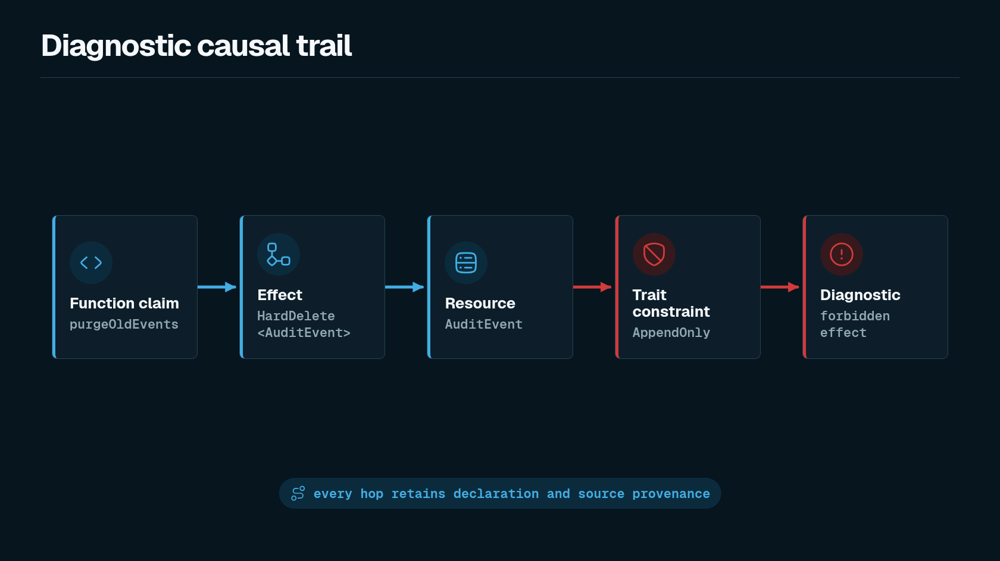

Diagnostics are a primary product surface for Shape. A useful diagnostic names the failed claim, shows why it failed, and points at the declarations or evidence that caused the rejection. Diagnostics judge the declared `.shape` model; they do not prove that arbitrary application code is correct.



A useful diagnostic follows a causal path such as:

```text
function emits effect
effect targets resource
resource has trait
trait derives forbidden effect
component grant does not override final forbid
```

Diagnostics are ordered deterministically: by diagnostic kind, then by rendered text. Reordering declarations in `.shape` files does not churn checker output for the same model.

## Example: forbidden effect

The hard-delete fixture fails because the function emits an effect that the resource trait forbids finally:

```text
error: forbidden effect

AuditStore.purgeOldEvents emits HardDelete<AuditEvent>.
AuditEvent has trait AppendOnly.
AppendOnly forbids final HardDelete<AuditEvent>.
evidence: ts("src/audit/purge.ts#purgeOldEvents")

caused by:
  - fixtures/fail/append_only_hard_delete/audit.shape: effect AuditStore.purgeOldEvents emits HardDelete<AuditEvent>
  - fixtures/fail/append_only_hard_delete/audit.shape: resource AuditEvent : AppendOnly
  - fixtures/fail/append_only_hard_delete/audit.shape: trait AppendOnly forbids final HardDelete<T>
```

Reproduce with:

```bash
shp check fixtures/fail/append_only_hard_delete/audit.shape
```

## Provenance

Shape keeps the declarations that caused a violation close to the diagnostic. Effect evidence makes the final step reviewable when present:

```shape no-verify
HardDelete<AuditEvent>
  evidence ts("src/audit/purge.ts#purgeOldEvents")
```

The fragment above is intentionally incomplete (`shape no-verify`). In a full function summary, the evidence sits on the emitted effect. The diagnostic should lead the reviewer from the failed function to the source span behind the claim.

Graph and path rules use a similar pattern: they cite the rule, the relations that form the witness, and a vertex path. See [Rules and Hypercycles](./rules-hypercycles.md).

## Common diagnostic families

| Kind | Typical cause |
| --- | --- |
| `forbidden effect` | Emitted effect matches `forbid final` from a trait or rule. |
| `missing grant` | Function emits an effect the component does not grant. |
| `unknown effects` | Authored function still declares `effects unknown`. |
| `governed source changed without current Shape update` | Coverage: governed path changed without current update or attestation. |
| `forbidden path` / `forbidden hypercycle` / `forbidden provides` | Structural rule matched a witness in the relation hypergraph. |
| `missing required context` / `guarded shape changed` | Shape trait or guard obligation not satisfied. |
| `stale design memory` | `review_by` is past under `--strict-freshness` / `--as-of`. |

Full message shapes and fixes are catalogued in [Diagnostics](../reference/diagnostics.md).

## Practice

Do:

- Read the first lines for the claim, then the `caused by` list for the contributing declarations.
- Fix final-forbidden effects by changing the architecture or the implementation claim; do not add memory to waive them.
- Keep evidence on production effects so forbidden-effect diagnostics can point at a source span.
- Treat diagnostic text as a review surface: stable wording and order matter for CI diffs.

Do not:

- Silence a final forbid with rationale, reevaluation, or grants.
- Assume an analyzer warning is the same as a checker diagnostic; analyzer output is advisory.
- Expect declaration order to change diagnostic order; order is canonicalized.
- Ignore `caused by` when several declarations interact.

## Related pages

- [Diagnostics catalog](../reference/diagnostics.md)
- [Evidence and Source Refs](./evidence-source-refs.md)
- [Unknowns and Safety](./unknowns-safety.md)
