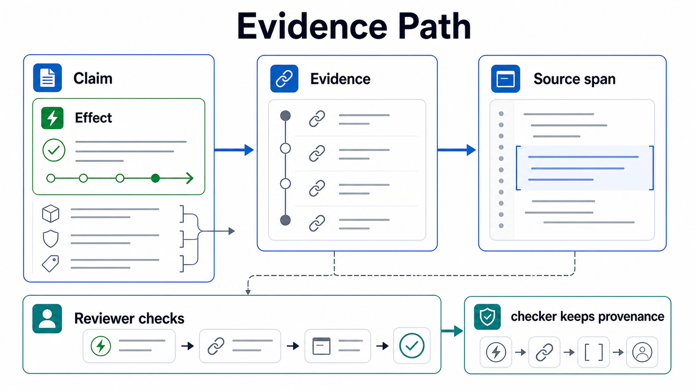

Evidence is how Shape stays reviewable. An effect summary should point to the code span that supports the claim.



```shape
module audit

resource AuditEvent : AppendOnly

component AuditStore {
  owns AuditEvent
  grants Append<AuditEvent>
  fn appendEvent
    source ts("src/audit/store.ts#appendEvent")
    effects complete {
      Append<AuditEvent>
        evidence ts("src/audit/store.ts:8-14")
    }
}
```

## Source refs

Source refs use a language tag and a string path:

```shape no-verify
source ts("src/audit/store.ts#appendEvent")
evidence ts("src/audit/store.ts:8-14")
```

The parser accepts the structure; reviewers interpret the path convention.

## Why evidence matters

The checker intentionally does not prove the implementation is correct. Evidence gives reviewers a concrete place to compare source code with the declared effect.

Good evidence is narrow, stable, and points at the behavior being claimed. Broad file-level evidence is better than no evidence, but less useful during review.

## Analyzer relationship

The analyzer can flag obvious destructive operations such as `DELETE`, `TRUNCATE`, or `DROP`, then compare hints with declared effects. It is advisory.

The declared `.shape` model remains the source of truth.
