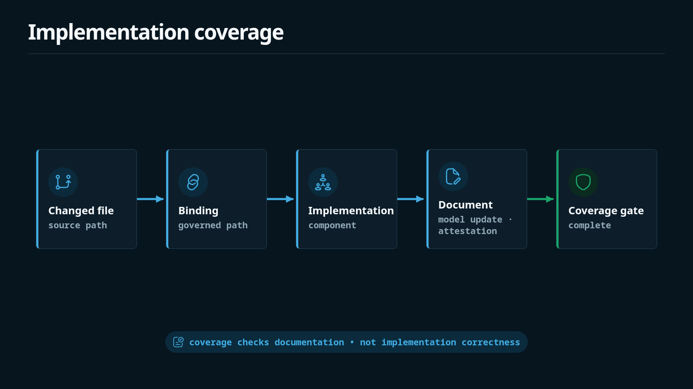

Implementation blocks map source paths to component shapes.



```shape
module audit

resource AuditEvent : AppendOnly

component AuditStore {
  owns AuditEvent
}

implementation AuditStoreImpl {
  paths {
    "src/audit/**/*.ts"
  }
  conforms_to AuditStore
  on_change require shape_update
}
```

The coverage command compares changed files with these governed paths. A matching `source` or `evidence` reference only counts when the declaring `.shape` file is part of the current changed-file list.

## Missing model update failure

Run:

```bash
shp coverage --changed-files fixtures/changed/audit_purge.txt fixtures/fail/missing_shape_update/audit.shape
```

If `src/audit/purge.ts` is governed by `AuditStoreImpl` and the change set does not include a Shape update or current attestation, coverage fails.

## Why coverage is separate

Conformance checks answer: "Is this model coherent?"

Coverage checks answer: "Did this change set update the model when governed source changed?"

Both checks matter. A coherent Shape model can still miss a required current global model update.
