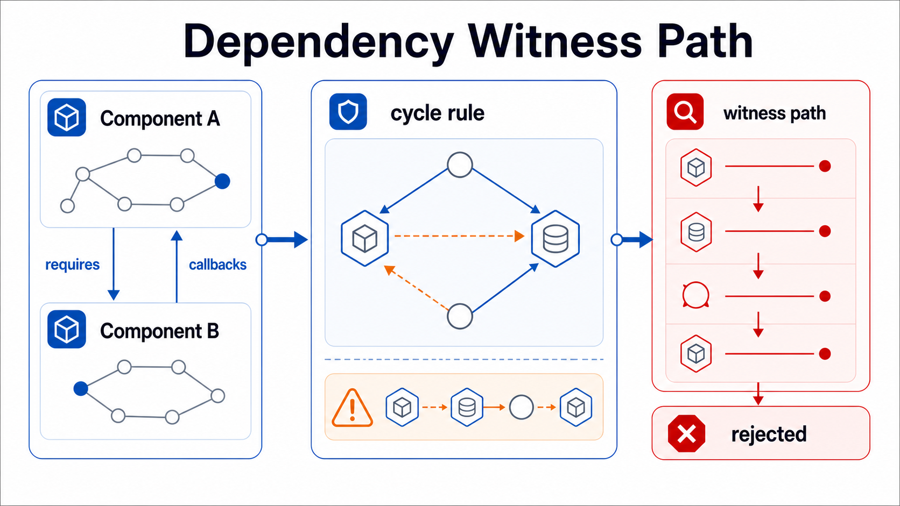

Rules capture project-specific constraints beyond generic resource protection.



```shape
module gateway

rule GatewayBoundary {
  when subject has ExternalApi
  forbid provides JsonRpcEndpoint except Gateway
}
```

Rules are intentionally narrow. They should encode architecture decisions that are stable enough for CI.

## Cycle rules

Dependency cycle checks operate over graph relations:

```shape
module gateway

component Gateway {
  requires AuditStore via calls
}

component AuditStore {
  requires Gateway via callbacks
}

rule NoRequiresCycle {
  forbid cycle over requires where includes calls or callbacks
}
```

Run graph inspection with:

```bash
shp graph Gateway --relation requires
```

The checker reports witness paths for semantic dependency cycles so reviewers can see the path, not just the fact that a cycle exists.
