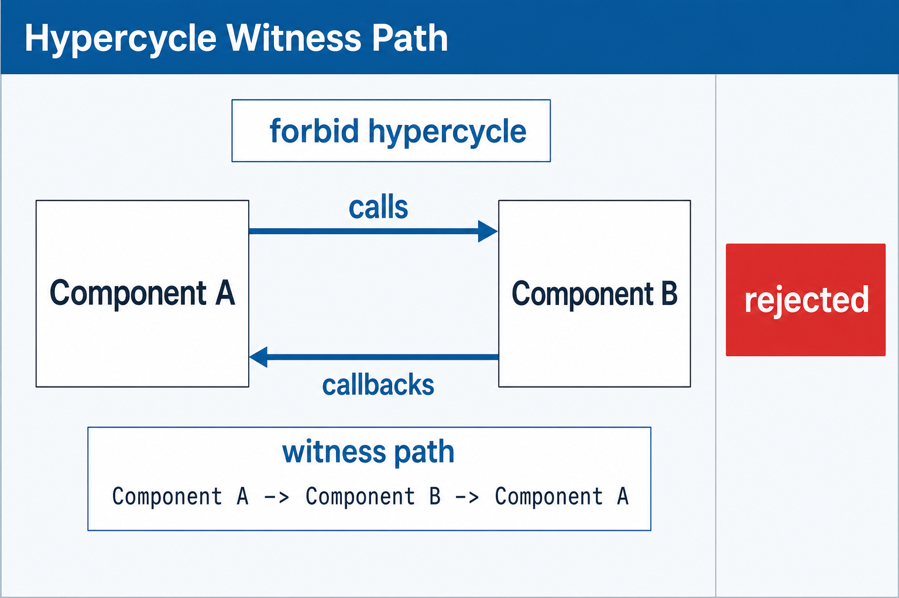

Rules capture project-specific architectural constraints that operate over the structural hypergraph.



```shape
module gateway

resource JsonRpcEndpoint

component Gateway {
}

relation GatewayProvidesRpc {
  kind provides
  connects Gateway -> JsonRpcEndpoint
}

rule GatewayBoundary {
  forbid provides JsonRpcEndpoint except Gateway
}
```

Rules are intentionally narrow. They should encode architecture decisions that are stable enough for CI.

## `forbid provides`

`forbid provides T except C` scans the hypergraph for relations whose `kind` is `provides` and whose target endpoint is `T`. If any relation provides `T` from a component other than `C`, the rule rejects the model with a witness that cites the offending relation and component.

## Forbidden path rules

`forbid path SOURCE -> TARGET over KIND or KIND ...` rejects a directed dependency path between two declared components or resources. The `over` filter is required: every hop in a matching path must use one of the listed relation kinds.

```shape
module gateway

resource SecretStore

component Gateway {
}

component PolicyService {
}

relation GatewayCallsPolicy {
  kind calls
  connects Gateway -> PolicyService
}

relation PolicyProvidesSecret {
  kind provides
  connects PolicyService -> SecretStore
}

rule no_gateway_to_secrets {
  forbid path Gateway -> SecretStore over calls or provides
}
```

The checker uses breadth-first search with the same directed traversal semantics as hypercycle detection. Relations with unresolved or ambiguous endpoints, and `provides` relations with invalid provider or target roles, cannot contribute to a path witness. The checker reports the fewest-hop witness; equal-length paths are resolved by canonical vertex, relation-kind, and relation-name order. Direction matters, and relation kinds outside the explicit filter cannot complete the path.

Path endpoints must be distinct. Use `forbid hypercycle` for cycle constraints. The listed kinds must have directed traversal semantics in the prelude registry; custom relation kinds remain visible in graph output but cannot be used in path rules until their direction is typed.

The diagnostic retains every hop, including repeated consecutive steps contributed by one ordered relation:

```text
error: forbidden path

rule no_gateway_to_secrets rejects this dependency path:
  calls GatewayCallsPolicy: Gateway -> PolicyService
  provides PolicyProvidesSecret: PolicyService -> SecretStore
witness: Gateway -> PolicyService -> SecretStore
```

## Hypercycle rules

Hypercycles are cycles in the directed hypergraph. The checker traverses each relation kind according to its traversal semantics from the prelude kind registry: directed binary kinds contribute one step per relation, ordered kinds contribute consecutive steps along their declared member order.

```shape
module gateway

component Gateway {
}
component AuditStore {
}

relation GatewayCallsAudit {
  kind calls
  connects Gateway -> AuditStore
}

relation AuditCallsGateway {
  kind callbacks
  connects AuditStore -> Gateway
}

rule no_runtime_cycle {
  forbid hypercycle over calls or callbacks
}
```

`forbid hypercycle` without `over` looks for cycles across every relation kind that participates in directed traversal.

After relation-kind filtering, the checker partitions the traversal graph into strongly connected components and reports the shortest cycle witness. Equal-length witnesses are resolved in canonical name order, so the result does not depend on relation declaration order.

The diagnostic cites the relations forming the cycle and prints a vertex witness path:

```text
error: forbidden hypercycle

rule no_runtime_cycle rejects this hypercycle:
  calls GatewayCallsAudit
  callbacks AuditCallsGateway
witness: AuditStore -> Gateway -> AuditStore
```

## Inspect the hypergraph

```bash
shp graph Gateway
shp graph Gateway --kind calls
```

`shp graph` prints the hyperedges incident to the symbol, grouped by relation. `--kind` filters by relation kind so reviewers can focus on a single concern.
