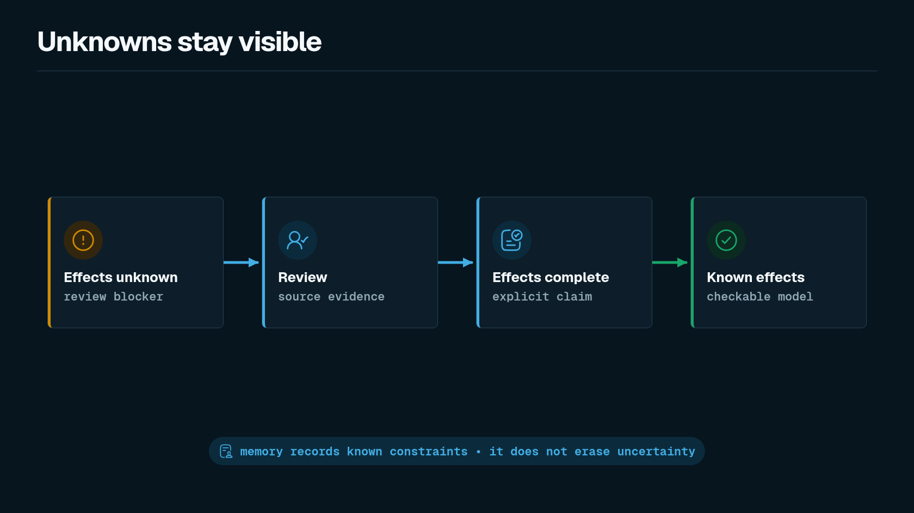

Shape should not hide uncertainty. If a function's effects are not known yet, declare `effects unknown` instead of inventing an empty complete summary. The checker treats authored unknowns as errors by default so incomplete analysis stays visible in CI. Shape still does not prove that application code is correct; it only accepts or rejects the declared model.



```shape
module audit

resource AuditEvent : AppendOnly

component AuditStore {
  owns AuditEvent
  fn importLegacyEvents
    source ts("src/audit/import.ts#importLegacyEvents")
    effects unknown
}
```

Strict check output:

```text
error: unknown effects

AuditStore.importLegacyEvents declares effects unknown.
```

`effects unknown` is valid syntax and a deliberate intermediate state. It is not a safe final state for protected production architecture.

## Complete effects

Use `effects complete` only when the summary is intended to be exhaustive:

```shape
module audit

resource AuditEvent : AppendOnly

component AuditStore {
  owns AuditEvent
  grants Read<AuditEvent>
  fn listEvents
    source ts("src/audit/store.ts#listEvents")
    effects complete {
      Read<AuditEvent>
        evidence ts("src/audit/store.ts#listEvents")
    }
}
```

Complete summaries make deterministic grant and forbid checks possible. An empty complete block claims “no effects,” which is different from “not analyzed yet.”

## Draft validation flag

While iterating on a draft, soften only unknown-effect diagnostics:

```bash
shp check --allow-unknown-effects draft.shape
```

Unknown effects become non-fatal warnings. Parse errors, final forbids, missing grants, coverage failures, bindings, and other semantic diagnostics remain blocking.

## Generated AST exception

Generated candidate modules under `shape/generated/ast` with `shape.generated.ast...` module names may keep `effects unknown` together with `effect candidate` hints. Those unknowns are candidate context, not reviewed completeness. Authored modules still fail on `effects unknown` under strict check. See [AST Generation](./ast-generation.md).

## Unexplained refactor constraints

`effects unknown` is for incomplete effect analysis. It is different from a known refactor constraint that the team cannot fully explain yet.

For refactor-sensitive targets, use typed `memory` with `status Unexplained`:

```shape
module bridge

resource Attestation

component BridgePoller {
  owns Attestation
  grants Read<Attestation>
  fn pollAttestation : RefactorSensitive
    effects complete {
      Read<Attestation>
    }
}

memory BridgePollingDelayConstraint : RefactorConstraint<fn BridgePoller.pollAttestation> {
  applies_to fn BridgePoller.pollAttestation
  status Unexplained
  confidence High
  summary "Previous attempts to lower this delay caused intermittent settlement failures."
  who {
    owner BridgeTeam
  }
}
```

That keeps the constraint reviewable without pretending the effects are unknown. Design memory cannot waive `forbid final`. See [Refactor Constraints](./refactor-constraints.md).

## Practice

Do:

- Prefer `effects unknown` over a false empty `effects complete` while analysis is incomplete.
- Resolve unknowns to source-backed complete summaries before accepting protected changes.
- Use `memory` with `status Unexplained` for known-but-not-fully-explained refactor constraints.
- Use `--allow-unknown-effects` only for local draft iteration, not as a permanent CI setting for authored production models.

Do not:

- Omit an effect and leave a complete summary that looks finished.
- Treat analyzer hints as a substitute for declaring unknowns or complete effects.
- Use unknowns or design memory to hide a final-forbidden effect.
- Leave `effects unknown` on protected components as the steady state in CI.

## Related pages

- [Resources, Traits, and Effects](./resources-traits-effects.md)
- [AST Generation](./ast-generation.md)
- [Refactor Constraints](./refactor-constraints.md)
