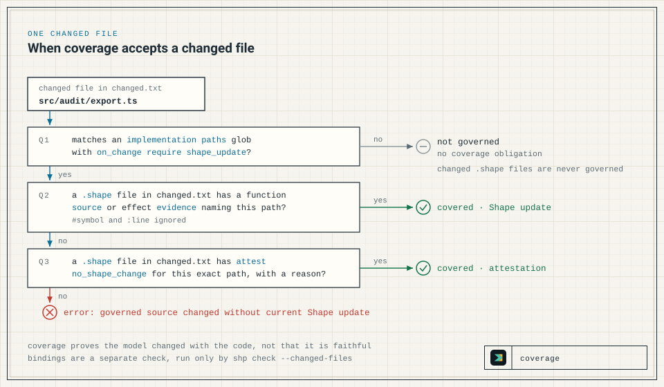

When application code changes, the Shape model should change with it. `shp` checks this against a changed-file list. Coverage asks whether each changed file that the model governs has a current Shape update or attestation. Bindings ask whether a paired review surface, such as a docs page, changed alongside a trigger path.

## Three checks

| Check | Question | Run by |
| --- | --- | --- |
| Conformance (semantic checks) | Is the Shape model coherent? | `shp check`, `shp coverage`, and `shp check --changed-files` |
| Coverage | Did each changed governed file get a current Shape update or attestation? | `shp coverage --changed-files F` and `shp check --changed-files F` |
| Bindings | When a trigger path changed, did a required path change too, or is there a current allowed attestation? | `shp check --changed-files F` only |

`shp check --changed-files changed.txt` runs all three checks. Use it locally and as the single gate in CI.

- Without a changed-file list, or with an empty one, coverage and bindings check nothing.
- `shp coverage --changed-files F` runs conformance and coverage but not bindings. It has no `--allow-unknown-effects` or freshness flags, so any `effects unknown` in an authored module fails it.

Flags and exit codes for both commands are in the [CLI Reference](/shapelang/reference/cli/).

## The changed-file list

The changed-file list is a text file, conventionally `changed.txt`, with one path per line. Paths are relative to the repository root, and `shp` takes the working directory as the repository root. Blank lines and surrounding whitespace are ignored, a leading `./` is dropped, and absolute paths are made relative to the working directory.

The list must include the `.shape` files that the change edits. That is how coverage tells which `.shape` files this change touched: a reference or attestation counts only when its file is in the list.

Build the list the same way locally and in CI: from a diff against the base branch. A diff of commits misses uncommitted and untracked files, so a local run adds them:

```bash
{
  git diff --name-only origin/main...HEAD
  git diff --name-only HEAD
  git ls-files --others --exclude-standard
} | sort -u > changed.txt
```

Replace `main` with your base branch, and add `changed.txt` to `.gitignore` so that the list does not name itself. [Run Shape in CI](/shapelang/guides/ci/) has the CI version.

## Governed paths

An `implementation` block declares which source paths the model governs:

```shape
module audit

resource AuditEvent : AppendOnly

component AuditStore {
  owns AuditEvent
  grants Append<AuditEvent>
  grants Read<AuditEvent>
  fn appendEvent
    source ts("src/audit/store.ts#appendEvent")
    effects complete {
      Append<AuditEvent>
        evidence ts("src/audit/store.ts#appendEvent")
    }
  fn listEvents
    source ts("src/audit/store.ts#listEvents")
    effects complete {
      Read<AuditEvent>
        evidence ts("src/audit/store.ts#listEvents")
    }
}

implementation AuditStoreImpl {
  paths {
    "src/audit/**/*.ts"
  }
  conforms_to AuditStore
  on_change require shape_update
}
```

| Field | Meaning |
| --- | --- |
| `paths { ... }` | Globs matched against each whole path in the changed-file list. `*` matches within one path segment, `**` matches across segments, and `?` matches one character. There is no brace or bracket expansion, so `src/**/*.{ts,tsx}` matches neither `.ts` nor `.tsx` files; write one glob per extension. |
| `conforms_to` | The component that the paths implement. The checker only verifies that the name resolves (otherwise `error: unknown component`); coverage never reads it. |
| `on_change require shape_update` | Turns on coverage for the paths. `shape_update` is the only supported value; any other, such as the typo `shape_updates`, fails the check with `error: invalid implementation` instead of silently disabling coverage. |

A changed file is *governed* when it matches a `paths` glob of an implementation that declares `on_change require shape_update`. Changed `.shape` files are never governed, even when a glob matches them.

Coverage cannot see a path that no such implementation governs: that path can change freely without a Shape update. Govern every production path that CI should hold to the model. Keep the globs tight enough that tests, fixtures, and generated code are not forced into architecture review.

## What counts as covered and current

A `.shape` file is *current* when it is in the changed-file list, and so is every declaration in it. A changed governed file is *covered* when a current `.shape` file contains either of these:

- **A Shape update.** A function's `source`, or the `evidence` on an entry in its `effects complete` summary, names the changed file.
- **An attestation.** An `attest no_shape_change` has a `source` that names the changed file and a `reason` that is not empty or whitespace.



Matching compares exact paths after dropping any `#anchor` and any `:line` or `:line-line` suffix. So `ts("src/audit/export.ts#exportEvents")` matches `src/audit/export.ts`, but `ts("src/audit")` matches nothing below that directory. The tag (`ts`, `md`, and so on) is any identifier and plays no part in the match. Other details:

- A reference from any component counts, because coverage never consults `conforms_to`.
- A function with `effects unknown` still contributes its `source`.
- Functions in generated-AST modules do not count. See [Generate Drafts from Source](/shapelang/guides/ast-drafts/).
- Other references do not count: `evidence` and `observed` lines in design memory (`rationale`, `memory`, `reevaluation`), and the `source` of an `effect candidate`.

Currency is per file, and the checker does not know which declarations were written for this change. Every reference and attestation in a `.shape` file that is in the list counts, including old ones. Two consequences follow:

- A reference or attestation in a file that the change does not touch never covers the change, however well it matches.
- An old reference or attestation in a file that the change does touch covers its path again. If a change adds an attestation to `shape/audit.shape` for `src/audit/reporting.ts`, the existing `source ts("src/audit/store.ts#appendEvent")` also covers any change to `src/audit/store.ts` in the same change set.

Reviewers therefore need to check which references and attestations in a touched `.shape` file still describe the change.

Coverage verifies co-change, not fidelity. It confirms that a current `.shape` file names each changed governed file. It does not check that the claims describe what the code does; that judgement belongs to the reviewer, optionally helped by the [Claude review job](/shapelang/guides/ci/#claude-contract-review-optional).

## Update the model when code changes

1. Make the edit that fits the case below.
2. Write `changed.txt` as described above. Do this after the edit, so that the list names the `.shape` file beside the code.
3. Run `shp fmt --check` and `shp check --changed-files changed.txt`. The formatter drops comments, so a `.shape` file that contains comments never passes `shp fmt --check`; see the [CLI Reference](/shapelang/reference/cli/).

If `shp explain TARGET` shows a guard on a claim you are changing, read [Guarded targets](#guarded-targets) first. If the check reports `bound docs change missing`, see [Bindings](#bindings).

### The architecture changed

Find the claims that describe the changed behaviour, such as a component and its functions, a resource, an implementation, a relation, a rule, or design memory, and edit them in place so that they match the code. Cite the changed file in a function's `source` or in an effect entry's `evidence`; only those references make the update count for coverage.

In this example, a change adds `src/audit/export.ts`, which reads audit events. Add the function to `AuditStore` in `shape/audit.shape`:

```shape no-verify
  fn exportEvents
    source ts("src/audit/export.ts#exportEvents")
    effects complete {
      Read<AuditEvent>
        evidence ts("src/audit/export.ts#exportEvents")
    }
```

`changed.txt` then contains both files:

```text
shape/audit.shape
src/audit/export.ts
```

```text
$ shp check --changed-files changed.txt
Shape check passed.
```

A covered change still has to pass conformance. If the new claim were `HardDelete<AuditEvent>`, coverage would accept it, but the `forbid final` on `AppendOnly` would reject it; the [Quickstart](/shapelang/learn/quickstart/) walks through that failure.

Deleting a governed file needs one more step. The deleted path still appears in the diff, and coverage has no notion of removal. When the change also removes the function whose `source` named the file, nothing in the model names the path any more, so coverage fails for it. The only way to cover it today is an `attest no_shape_change` that names the deleted path and gives a reason recording the removal; the next case shows the form.

### The architecture is unchanged

When a governed file changes without changing any claim, such as a formatting-only edit, add an attestation to a `.shape` file:

```shape
attest no_shape_change {
  source ts("src/audit/reporting.ts")
  reason "Formatting-only change; no resource access or effect changed."
}
```

With `shape/audit.shape` and `src/audit/reporting.ts` in `changed.txt`, `shp check --changed-files changed.txt` prints `Shape check passed.`

An attestation declares exactly one `source` and one `reason`, so use one attestation per changed file. Use `no_shape_change` only when the contract is truly unchanged: coverage accepts the attestation whether or not its reason is true, so it can hide real model drift from everyone but the reviewer. An attestation never waives a `forbid final`; nothing does. See the [Effect Model](/shapelang/concepts/effect-model/).

### The effects are not known yet

When a function's effects are not yet known, write `effects unknown` rather than guessing or writing an empty `effects complete {}`:

```shape no-verify
  fn importLegacyEvents
    source ts("src/audit/import.ts#importLegacyEvents")
    effects unknown
```

A draft that is not ready for strict checks stays outside `shape/`, where default discovery does not load it. Check it by naming the file, here `draft.shape`, a copy of the `audit` module with this function added. Naming files replaces discovery, so the draft must declare everything it references:

```text
$ shp check --allow-unknown-effects draft.shape
warning: unknown effects

AuditStore.importLegacyEvents declares effects unknown.

caused by:
  - draft.shape: fn AuditStore.importLegacyEvents

Shape check passed with warnings.
```

The exit code is `0`. `--allow-unknown-effects` turns only `unknown effects` into warnings, and every other check still blocks; the flag is described in the [CLI Reference](/shapelang/reference/cli/).

Once the function moves into `shape/audit.shape` and that file is in the list, its `source` covers `src/audit/import.ts`, but strict `shp check` rejects the unknown summary with exit code `1`:

```text
$ shp check --changed-files changed.txt
error: unknown effects

AuditStore.importLegacyEvents declares effects unknown.

caused by:
  - shape/audit.shape: fn AuditStore.importLegacyEvents
```

A strict CI gate therefore rejects the change until every unknown in an authored module is resolved. The [Effect Model](/shapelang/concepts/effect-model/) explains unknown and complete summaries.

## When coverage fails

If the change adds `src/audit/export.ts` but no current `.shape` file names it, coverage fails. With the model from [Governed paths](#governed-paths) unchanged and only `src/audit/export.ts` in `changed.txt`, the check writes this to stderr and exits `1`:

```text
$ shp check --changed-files changed.txt
error: governed source changed without current Shape update

Changed file: src/audit/export.ts
Governed by: audit::AuditStoreImpl
Matched path: src/audit/**/*.ts
Required: update a current .shape file with matching source/evidence, or add a no_shape_change attestation.

caused by:
  - shape/audit.shape: implementation AuditStoreImpl
  - shape/audit.shape: implementation AuditStoreImpl path src/audit/**/*.ts
```

The same diagnostic appears when `shape/audit.shape` has the new function but is missing from `changed.txt`. Fix it with one of the cases above. `shp coverage --changed-files changed.txt` reports the same diagnostic.

## Bindings

A binding pairs trigger paths with required paths that must change alongside them, typically documentation:

```shape
binding AuditDocs {
  when_changed paths {
    "src/audit/**/*.ts"
  }
  require_changed paths {
    "docs/audit.md"
  }
  allow attest docs_not_needed
}
```

A changed path that matches a `when_changed` glob is a trigger path, and it triggers the binding. One changed path that matches any `require_changed` glob then satisfies the whole binding. Otherwise, each trigger path needs a current attestation of a kind that the binding lists in `allow attest`, with the same exact-path and non-empty-reason rules as coverage. A binding with no `allow attest` line has no attestation escape. Unlike coverage, bindings do not skip `.shape` files, so a `when_changed` glob can name model files.

With this binding in `shape/audit.shape`, the `exportEvents` update above now fails with exit code `1`, because `docs/audit.md` did not change:

```text
$ shp check --changed-files changed.txt
error: bound docs change missing

binding audit::AuditDocs was triggered by src/audit/export.ts.
Required: change one of docs/audit.md, or add attest docs_not_needed.

caused by:
  - shape/audit.shape: binding AuditDocs
  - shape/audit.shape: binding AuditDocs when_changed src/audit/**/*.ts
```

Changing `docs/audit.md` fixes it. When the docs do not need to change, add the permitted attestation to a `.shape` file in the list:

```shape
attest docs_not_needed {
  source ts("src/audit/export.ts")
  reason "Export is internal tooling; the audit docs describe no export behaviour."
}
```

The attestation kind is any identifier, and `docs_not_needed` is a convention: a binding accepts exactly the kinds its `allow attest` lines name, and coverage accepts only `no_shape_change`. Only `shp check --changed-files` enforces bindings; `shp coverage` does not.

## Guarded targets

Some claims carry design-memory guards. A guard fires only from a `change` declaration that modifies or removes the guarded target: `modify fn`, `remove fn`, or the `component`, `resource`, and `relation` forms. Editing a guarded declaration in place produces no change event, so its guard does not fire. The checker therefore does not report an in-place edit to a guarded target. A fired guard is satisfied by a valid `reevaluation`, never by an attestation. Before changing a guarded target, run `shp obligations` for open obligations and `shp explain TARGET` to see which contexts guard it; `shp memory` lists recorded memory and rationale but not their guards. [Design Memory](/shapelang/concepts/design-memory/) explains guards, `change` declarations, and reevaluation.
