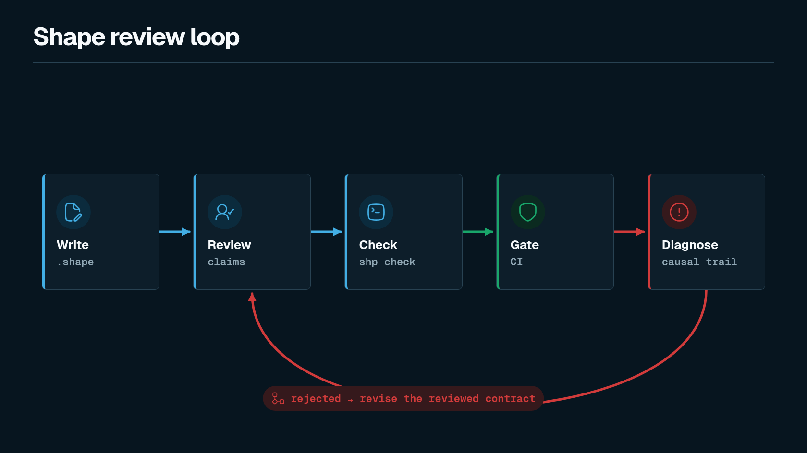

Shape gives a codebase a small human-readable model in `.shape` files. Humans and LLMs write reviewable claims about resources, components, effects, ownership, structural relations, changes, and refactor constraints. The deterministic checker accepts or rejects those claims.

The checker does not prove that application code is correct. It checks whether the declared architecture model is coherent enough to enforce in review and CI.



## The first demo

An append-only resource can allow reads and appends while forbidding final destructive effects:

```shape
module audit

trait AppendOnly<T: Resource> {
  allow Append<T>
  allow Read<T>
  forbid final DropStorage<T>
  forbid final HardDelete<T>
  forbid final Truncate<T>
}

resource AuditEvent : AppendOnly

component AuditStore {
  owns AuditEvent
  grants Append<AuditEvent>
  grants Read<AuditEvent>
  fn appendEvent
    effects complete {
      Append<AuditEvent>
    }
}
```

If a PR adds a function whose shape summary says it hard-deletes `AuditEvent`, Shape rejects the model before the change becomes architectural fact.

Shape can also require typed design context before accepting non-obvious function shapes. A refactor-sensitive function can require a matching `memory`, and guarded changes to that function can require a recorded `reevaluation`.

## What to read first

- [Quickstart](./learn/quickstart) installs the released typechecker and runs it against `.shape` files.
- [First Shape File](./learn/first-shape-file) explains the smallest useful model.
- [Append-Only Walkthrough](./learn/append-only-walkthrough) follows the core failure from declaration to diagnostic.
- [Refactor Constraints](./concepts/refactor-constraints) explains typed design memory for refactor-sensitive code.
- [CLI Reference](./reference/cli) lists the commands exposed by `shp`.
