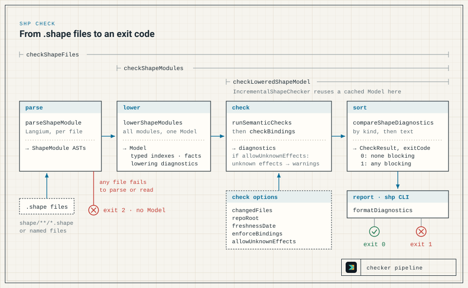

The checker reads `.shape` files and check options, and nothing else. `checkShapeFiles` parses every file with the Langium grammar ([Langium Grammar](/shapelang/inside-shape/langium-grammar/)), lowers the parsed modules into one `Model` ([Fact Lowering](/shapelang/inside-shape/fact-lowering/)), runs the semantic checks and binding enforcement over that model ([Rule Evaluation](/shapelang/inside-shape/rule-evaluation/)), and returns a `CheckResult` with sorted diagnostics. Each phase reads only the previous phase's output: rules read the `Model` and check options, and `formatDiagnostics` reads only the `CheckResult`.



## Phases

Paths are relative to `packages/shp-checker/src/`.

| Phase | Code | Output | Failure outcome |
| --- | --- | --- | --- |
| Read and parse | `checkShapeFiles` reads each path; `parseShapeModule` in `parser.ts` parses it with the Langium services from `language/shape-module.ts`. | One `ShapeModule` AST per file. | A read error, or any lexer or parser error in any file, ends the check. The result holds only `parse` diagnostics, `exitCode` is `2`, and no `Model` is built. |
| Lower | `lowerShapeModules` in `checker/lowerer.ts`, driving the domain lowerers in `checker/lowering/*`. | `Model`: typed indexes, `facts`, and lowering diagnostics. | Lowering always completes. Problems it finds (duplicate declarations, ambiguous or unknown names, invalid relations, invalid candidate effects, invalid `require_context`) become `model.diagnostics`. |
| Check | `runSemanticChecks` runs `SEMANTIC_CHECKS` in `checker/rules.ts`; then `checkBindings` runs unless `enforceBindings` is `false`. | Semantic diagnostics. | No check stops a later one; each appends its diagnostics. |
| Assemble | `checkLoweredShapeModel` in `checker/api.ts`. | `CheckResult`: `ok`, `exitCode`, sorted `diagnostics`, and `facts` when `includeFacts` is set. | `exitCode` is `1` when any diagnostic other than a downgraded `unknown_effects` warning remains; otherwise `0`. |
| Render | `formatDiagnostics` in `checker/diagnostics.ts`. | Text. | None. It reads only the `CheckResult`. |

`checkLoweredShapeModel` assembles the diagnostic list in a fixed order: lowering diagnostics, then the registry's output, then binding diagnostics. It then applies the `allowUnknownEffects` downgrade, computes `ok` and `exitCode`, sorts the diagnostics, and attaches sorted facts when requested. The sort makes the assembly order invisible in the returned list.

## Entry points

- **`checkShapeFiles(paths, options)`** is the path `shp check` takes. It reads and parses every path, in the given order, before lowering any of them. When all of them parse, it classifies each module's origin with `moduleOriginForShapeFile` against the normalized `repoRoot` and passes the modules to `checkShapeModules`. A module is generated AST only when its name is `shape.generated.ast` or starts with `shape.generated.ast.`, and its path relative to `repoRoot` is under `shape/generated/ast/`.
- **`checkShapeModules(modules, options)`** takes parsed `ShapeModule[]` or `CheckModuleInput[]` (`module`, optional `filePath`, optional `origin`). It trusts only explicit origins: an input without `origin: "generated_ast"` is authored. It normalizes the options, calls `lowerShapeModules`, and passes the model to `checkLoweredShapeModel`. It never returns exit code `2`.
- **`checkLoweredShapeModel(model, normalizedOptions)`** is internal. `checker/api.ts` exports it, but the package does not. Both entry points and the incremental checker assemble their results through it, so the pass condition and the sort exist in one place.
- **`IncrementalShapeChecker`** caches parsed documents and the last lowered model for callers that check an in-memory workspace repeatedly. See [Incremental checking](#incremental-checking).

`@shape/shp-checker` (`src/index.ts`) exports `checkShapeFiles`, `checkShapeModules`, and `IncrementalShapeChecker`. It does not export `lowerShapeModules` or `checkLoweredShapeModel`. The read-only query helpers in `checker/query.ts` (`explainShapeModules`, `graphShapeModules`, `listMemoryGuardsShapeModules`, and others) lower the modules themselves and never decide pass or fail; `listShapeObligations` calls `checkShapeModules` and filters its diagnostics.

`normalizeCheckOptions` prepares the options once per check:

| Option | Default | Read by | Effect |
| --- | --- | --- | --- |
| `changedFiles` | none | `checkCoverage`, `checkBindings` | Paths are normalized against `repoRoot`. With no paths, coverage and bindings report nothing. |
| `repoRoot` | the working directory | `checkShapeFiles`, `checkCoverage`, `checkBindings` | Resolved to an absolute path. It classifies module origins and normalizes absolute changed-file and provenance paths. |
| `freshnessDate` | unset | `checkFreshness` | An ISO `YYYY-MM-DD` date; unset turns freshness off. An invalid value throws a `TypeError` instead of producing a diagnostic. |
| `enforceBindings` | on | `checkLoweredShapeModel` | `false` skips `checkBindings`. |
| `allowUnknownEffects` | off | `checkLoweredShapeModel` | Downgrades every `unknown_effects` diagnostic to severity `warning` before `ok` is computed. |
| `includeFacts` | off | `checkLoweredShapeModel` | Returns `model.facts` in the result. |

`lowerShapeModules` takes no options. Only `repoRoot` can affect its input, through origin classification in `checkShapeFiles` and the incremental checker, so one lowered `Model` can be checked under any values of the other options.

## Pass condition and exit codes

`CheckResult.ok` is `true` only when every diagnostic is an `unknown_effects` diagnostic with severity `warning`. That happens when there are no diagnostics at all, or when `allowUnknownEffects` downgraded every remaining one.

| `exitCode` | Meaning |
| --- | --- |
| `0` | `ok` is `true`. `formatDiagnostics` prints `Shape check passed.`, or the warnings followed by `Shape check passed with warnings.` |
| `1` | The model was lowered, and at least one blocking diagnostic remains. |
| `2` | `checkShapeFiles` could not read or parse at least one file. Only parse diagnostics are reported, and no semantic check ran. |

The exit codes of each `shp` command, including usage errors, are listed in the [CLI Reference](/shapelang/reference/cli/).

## Determinism

The same `.shape` files and check options produce the same lowered model, facts, and diagnostics. The order of diagnostics is deterministic over the input set, not its source order:

- `checkLoweredShapeModel` sorts diagnostics with `compareShapeDiagnostics` from `checker/diagnostics.ts`: by kind, then by rendered text, comparing by Unicode codepoint (`compareCodepointStrings`), so the order does not depend on locale. Diagnostic order therefore depends on neither the `SEMANTIC_CHECKS` order nor declaration order.
- With `includeFacts`, facts are sorted by the codepoint order of their JSON text.
- A parse-failure result is not sorted. Parse diagnostics follow the order of the input paths, and within one file lexer errors come before parser errors. `shp` sorts the paths its default discovery finds; explicit file arguments keep their order.
- The checker never reads the system clock. `checkFreshness` compares against the injected `freshnessDate`; the CLI computes today's date when `--strict-freshness` asks for it.
- `forbid path` and `forbid hypercycle` witnesses are chosen canonically. The algorithm and its tie-breaks are in [Rule Evaluation](/shapelang/inside-shape/rule-evaluation/#graph-witnesses).

`packages/shp-checker/src/behavioural/determinism.test.ts` enforces these properties: byte-identical output across repeated runs of every public surface, identical diagnostics under a permutation of top-level declarations, and no clock reads in the checker.

## Incremental checking

`IncrementalShapeChecker` serves library callers that check an in-memory workspace repeatedly. Each `check(documents, options)` call supplies the complete current snapshot, so a document missing from the list counts as removed. It returns the `CheckResult` and an `invalidation` report.

```ts
import { IncrementalShapeChecker } from "@shape/shp-checker";

const checker = new IncrementalShapeChecker();
const { result, invalidation } = checker.check(
  [{ filePath: "shape/audit.shape", source: "module audit\nresource AuditEvent\n" }],
  { includeFacts: true }
);
```

Any document change rebuilds the complete `Model` and fact list, because imports, duplicate declarations, `change` blocks, concrete targets, and derived facts cross file boundaries. No file owns an independent fact shard.

| Change since the previous call | Reparsed | `Model` and facts | Rules | Report (`causes`; `derivedFacts`; `diagnostics`) |
| --- | --- | --- | --- | --- |
| First call | every document | built | run | `initial_check`; `rebuilt`; `recomputed` |
| A document added, removed, or changed (its `source` or explicit `origin`) | changed documents only | rebuilt | rerun | `shape_documents_changed`; `rebuilt`; `recomputed` |
| Options only, and the new `repoRoot` reclassifies a document with an absolute path and no explicit `origin` | none | rebuilt without reparsing | rerun | `check_options_changed`; `rebuilt`; `recomputed` |
| Any other options-only change, including `changedFiles` | none | reused | rerun | `check_options_changed`; `reused`; `recomputed` |
| Nothing | none | reused | not run; the previous result is returned | empty; `reused`; `reused` |
| Any document fails to parse | changed documents | discarded | not run; the result holds only parse diagnostics, exit code `2` | the cause from the matching row above; `unavailable`; `recomputed` if documents changed, otherwise `reused` |

`causes` lists both `shape_documents_changed` and `check_options_changed` when a call changes documents and options together.

The boundary contracts:

- Document paths must be unique within a snapshot. A duplicate path throws a `TypeError` rather than letting array order decide which source wins.
- `reparsedDocuments`, `reusedDocuments`, and `removedDocuments` are sorted by codepoint.
- Every returned `CheckResult` is a `structuredClone` of the cached one, so a caller's mutation cannot corrupt the cache.
- Like `checkShapeFiles`, the incremental checker classifies implicit origins against the normalized `repoRoot`, which defaults to the working directory.

The cache changes how much work is reused, not what the checker decides. Rules always run through `checkLoweredShapeModel`, and `packages/shp-checker/src/checker/incremental.test.ts` compares incremental results with the uncached full check, which remains authoritative.

## Where changes belong

| Change | Where |
| --- | --- |
| Syntax | `language/shape.langium`, then regenerate. See [Langium Grammar](/shapelang/inside-shape/langium-grammar/). |
| Parse diagnostics | `parser.ts` |
| Model, fact, diagnostic, and option types | `checker/model.ts`, which holds data shapes only |
| Pass order during lowering | `checker/lowerer.ts` |
| Lowering one kind of declaration | `checker/lowering/*` |
| Name and module resolution | `checker/symbols.ts` and `module-resolution.ts` |
| `change` staging and change events | `checker/lowering/changes.ts` and `checker/change-planning.ts` |
| Prelude traits, context obligations, and relation kinds | `prelude.ts`; `checker/prelude-seed.ts` seeds its traits and obligations into the model |
| Queries shared by lowering, rules, and helpers | `checker/derivations.ts` |
| A semantic check | a module under `checker/rules/`, registered in `SEMANTIC_CHECKS`. See [Rule Evaluation](/shapelang/inside-shape/rule-evaluation/#adding-a-rule). |
| Guard matching over change events | `memory-guards.ts` |
| Pass condition, option normalization, and result assembly | `checker/api.ts` |
| Diagnostic text and ordering | `checker/diagnostics.ts` |
| `explain`, `graph`, `memory`, and `obligations` output | `checker/query.ts` |
| `shp inspect` output | `checker/inspection.ts` |
| Incremental reuse | `checker/incremental.ts` |

Analyzer hints, AST drafts, and the authoring helpers sit outside this pipeline and never decide pass or fail; see [Helper APIs](/shapelang/inside-shape/formatter-editor-authoring/). The experiments in `src/experiments/` and `experiments/semantic-kernel/` also stay outside it; see [Rule Evaluation](/shapelang/inside-shape/rule-evaluation/#why-rules-are-direct-typescript-checks).
