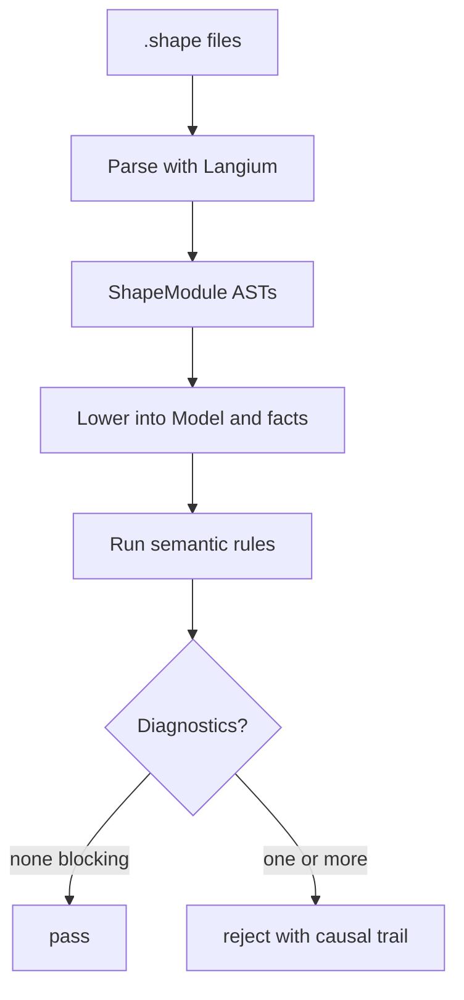
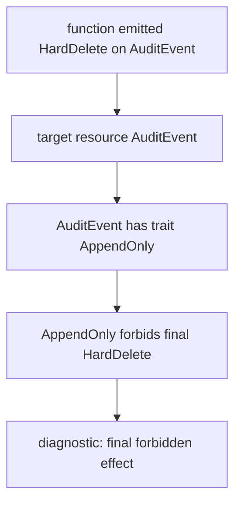

This page describes the production checker pipeline for contributors. The pipeline turns reviewed `.shape` claims into pass or fail diagnostics. It validates the declared architecture model; it does not prove that application source code is correct, execute application logic, or replace tests and code review.

The pipeline is deterministic: the same set of `.shape` files and changed-file inputs should produce the same lowered model, the same rule decisions, and the same diagnostics. Analyzer hints and authoring helpers may assist drafting, but they are not part of semantic pass/fail unless a human turns them into reviewed Shape claims.




## Phases

The production path is four phases. Entrypoints live under `packages/shp-checker/src/checker/`:

| Phase | Code | Input | Output | Job |
| --- | --- | --- | --- | --- |
| Parse | `parseShapeModule` / `checkShapeFiles` | Source text | `ShapeModule` ASTs or parse diagnostics | Reject text the grammar cannot accept. |
| Lower facts | `lowerShapeModules` | Parsed modules | `Model` (typed indexes + `facts` + lowering diagnostics) | Normalize declarations into records rules can use. |
| Run rules | `runSemanticChecks` + optional `checkBindings` | Lowered `Model` and check options | Semantic diagnostics | Reject incoherent claims and missing obligations. |
| Format diagnostics | `formatDiagnostics` and CLI/editor presentation | Diagnostics with provenance | Human-readable output | Show the causal path to the reviewer. |

Public orchestration is `checkShapeFiles` (parse then check) and `checkShapeModules` (lower then check). `checkLoweredShapeModel` reuses an already lowered model for the incremental checker.

Each phase stays narrow. The parser does not decide whether `HardDelete<AuditEvent>` is allowed. Rule evaluation does not re-parse source text. Diagnostic formatting does not invent new facts.

## Parse

Langium parses each loaded `.shape` file into a `ShapeModule`. A module contains imports and top-level declarations: resources, traits, components, relations, candidate effects, implementations, bindings, changes, attestations, rules, rationales, memories, reevaluations, roles, and policies.

At this stage the checker only knows whether the text follows the grammar. The following is syntactically meaningful even if later rules reject it:

```shape
module audit

resource AuditEvent : AppendOnly

component AuditStore {
  owns AuditEvent
  grants HardDelete<AuditEvent>
  fn purgeOldEvents
    source ts("src/audit/purge.ts#purgeOldEvents")
    effects complete {
      HardDelete<AuditEvent>
        evidence ts("src/audit/purge.ts#purgeOldEvents")
    }
}
```

The parser accepts the shape of the declaration. Later stages decide that an append-only resource cannot be hard-deleted.

Parse failures return exit code `2` because no semantic model was built. Semantic failures return exit code `1` because the model was understood and rejected.

## Lower Facts

`lowerShapeModules` builds the effective `Model` used by rules. Lowering is a fixed multi-pass process inside that function, not a separate public API:

1. Index module declarations and seed prelude traits.
2. Lower ordinary declarations into typed indexes and facts.
3. Apply `change` declarations on top of that base.
4. Rebuild shape-update paths from the final function registry.
5. Emit derived facts (for example final-forbid and context-required facts).

Files under `shape/` are the usual CI contract. Rules evaluate the committed global model as lowered, including any `change` blocks present in the loaded set.

For the `AuditStore` example above, lowered records include (conceptually):

```text
resource AuditEvent
resource_trait AuditEvent AppendOnly
component AuditStore
owns AuditStore AuditEvent
grants AuditStore HardDelete<AuditEvent>
function AuditStore.purgeOldEvents
effect AuditStore.purgeOldEvents HardDelete<AuditEvent>
```

The real `Model` keeps more detail: typed maps such as `components`, `resources`, `traits`, `hypergraph`, `memories`, plus a `facts` list with provenance. Production rules primarily read the typed indexes; the fact list is the public inspection stream and the input used by experimental engines.

## Run Rules

`SEMANTIC_CHECKS` in `packages/shp-checker/src/checker/rules.ts` runs domain checks in a fixed order, then binding enforcement runs unless disabled. Checks answer questions such as:

- Does a function emit an effect its component does not grant?
- Does a resource trait create a final forbid for an emitted effect?
- Did a governed source file change without a matching Shape update or current attestation?
- Did a function marked `RefactorSensitive` receive the required memory?
- Did a guarded target change without a matching reevaluation?
- Did a hypercycle or forbidden-path rule find a witness in the directed hypergraph?

These checks are deterministic comparisons over the lowered model and check options (`changedFiles`, `repoRoot`, optional `freshnessDate`). The checker does not infer effects from application source. If a function has `effects unknown`, the model records uncertainty; strict check treats that as a blocking diagnostic unless `allowUnknownEffects` downgrades it to a warning. If a function has `effects complete`, the author claims every material effect is represented in the model.

## Emit Diagnostics

A diagnostic should explain rejection as a causal trail. For a final-forbid failure, the reviewer needs the function effect, target resource, trait on the resource, and the specific final forbid.



That trail is the product surface for review and CI: change the code, change the claim, add missing context, or accept that the model is protecting an invariant.

## Pipeline Boundaries

When extending the checker:

- Grammar changes belong in `packages/shp-checker/src/language/shape.langium`.
- Normalization from declarations to `Model` / facts belongs in `checker/lowerer.ts` and `checker/lowering/*`.
- Project coherence checks belong in `checker/rules/*` and the ordered registry in `checker/rules.ts`.
- Human-facing explanation belongs in diagnostic formatting, `explain`, `graph`, `memory`, and `obligations` output.
- Analyzer hints remain advisory unless turned into reviewed Shape claims.
- Experimental engines (Datalog spike, semantic kernel) stay outside this production pipeline until explicitly adopted.

Related: [Fact Lowering](./fact-lowering/), [Rule Evaluation](./rule-evaluation/), [Rule Engine Strategy](./rule-engine-strategy/).
