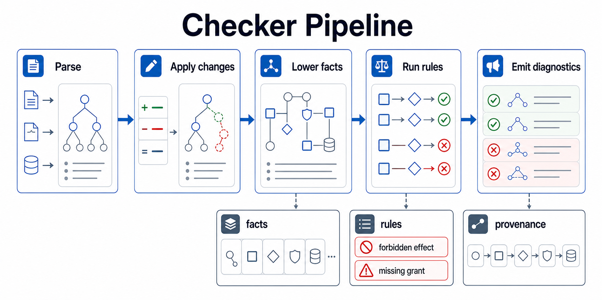
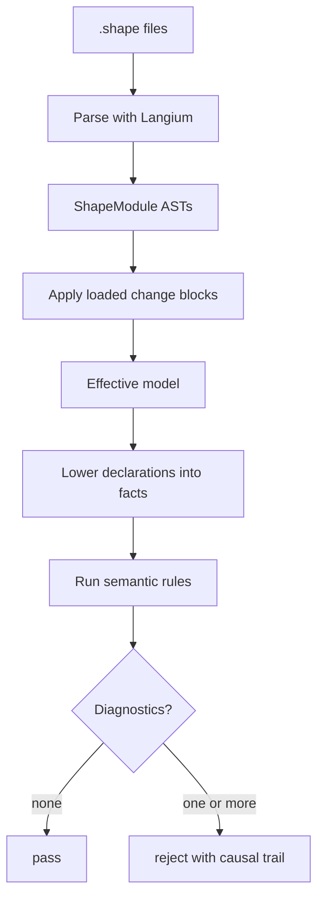
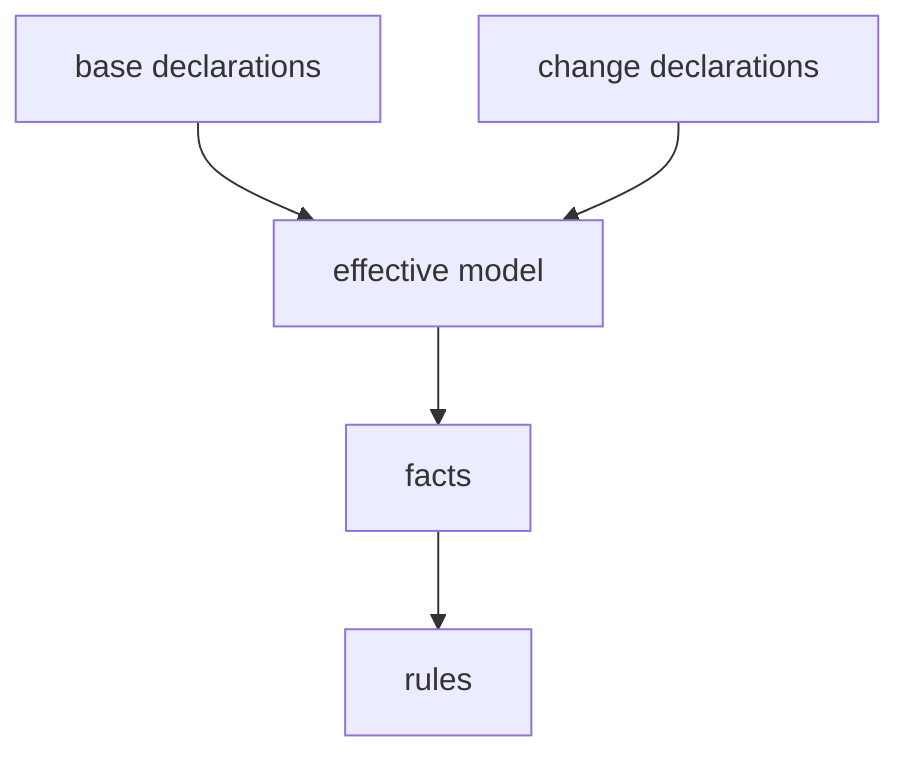
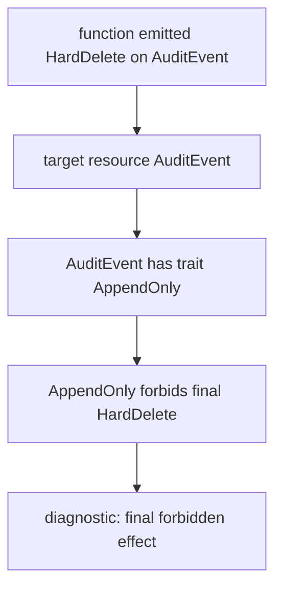

The checker pipeline is the part of Shape that turns reviewable architecture claims into pass or fail output. It is intentionally deterministic: the same set of `.shape` files and changed-file inputs should always produce the same facts, the same rule decisions, and the same diagnostics.

That determinism is important because Shape is not trying to infer intent from source code at the moment a PR is reviewed. The language records claims that a human can inspect, then the checker rejects claims that conflict with the model. Analyzer output and authoring helpers can assist the workflow, but the checker itself is built around explicit declarations.





## The Useful Mental Model

Think of the checker as five small phases rather than one large validator.

| Phase | Input | Output | Main job |
| --- | --- | --- | --- |
| Parse | Source text | `ShapeModule` ASTs | Reject syntax the language cannot understand. |
| Apply changes | Loaded declarations plus any `change` declarations | Effective architecture model | Apply model patches before rules run. |
| Lower facts | Effective model | Fact list and internal indexes | Normalize syntax into records rules can consume. |
| Run rules | Facts and indexes | Semantic diagnostics | Reject incoherent claims and missing obligations. |
| Format diagnostics | Diagnostics with provenance | CLI/editor output | Explain the shortest causal path to the reviewer. |

This split keeps each phase honest. The parser does not decide whether `HardDelete<AuditEvent>` is allowed. Rule evaluation does not re-parse source text. Diagnostic formatting does not invent new facts. The checker becomes easier to extend because each new concept must choose where it belongs in the pipeline.

## Parse

Langium parses each loaded `.shape` file into a `ShapeModule`. A module contains imports and a list of top-level declarations: resources, traits, components, implementations, changes, attestations, rules, rationales, memories, and reevaluations.

At this stage the checker only knows whether the text follows the grammar. For example, this is syntactically meaningful even if later rules reject it:

```shape
module audit

resource AuditEvent : AppendOnly

component AuditStore {
  owns AuditEvent
  grants HardDelete<AuditEvent>
  fn purgeOldEvents
    source ts("src/audit/purge.ts#purgeOldEvents")
    effects complete {
      HardDelete<AuditEvent>
        evidence ts("src/audit/purge.ts:12-16")
    }
}
```

The parser accepts the shape of the declaration. The later semantic stages decide that an append-only resource cannot be hard-deleted.

Parser diagnostics have exit code `2` because the checker could not build a semantic model at all. Semantic diagnostics have exit code `1` because the model was understood and rejected.

## Apply Changes

Files under `shape/` are the normal CI contract. Change blocks are applied before facts are lowered. That order matters: rules should see the proposed architecture, not a base model plus a separate list of edits.



A change can add, modify, or remove functions and declarations:

```shape
module changes.PR_042

import audit

change ReviewAuditPurge {
  modify fn AuditStore.purgeOldEvents
    source ts("src/audit/purge.ts#purgeOldEvents")
    effects complete {
      HardDelete<AuditEvent>
        evidence ts("src/audit/purge.ts:12-16")
    }
}
```

After this phase, the checker treats `AuditStore.purgeOldEvents` as having the modified summary. Coverage, memory guard, grant, and final-forbid checks all evaluate the effective version.

This is why change files are useful in review. They do not merely annotate a diff; they alter the architecture model that the checker evaluates.

## Lower Facts

The semantic checker does not want every rule to walk the raw AST. Instead it lowers declarations into small records such as resources, traits, grants, function effects, implementation paths, shape traits, context objects, and rule declarations.

For the `AuditStore` example above, lowering produces facts conceptually like:

```text
resource AuditEvent
resource_trait AuditEvent AppendOnly
component AuditStore
owns AuditStore AuditEvent
grants AuditStore HardDelete<AuditEvent>
function AuditStore.purgeOldEvents
effect AuditStore.purgeOldEvents HardDelete<AuditEvent>
```

The real checker keeps more detail than this simplified view, including provenance for each fact. Provenance is the bridge between internal reasoning and useful diagnostics: every fact knows which source declaration created it.

## Run Rules

Rules consume facts and internal indexes. They answer questions such as:

- Does a function emit an effect its component does not grant?
- Does a resource trait create a final forbid for an emitted effect?
- Did a governed source file change without a matching Shape update or current attestation?
- Did a function marked `RefactorSensitive` receive the required memory?
- Did a guarded target change without a matching reevaluation?
- Did a dependency rule find a forbidden cycle, and what path proves it?

The important detail is that these checks are deterministic comparisons over a lowered model. The checker can be conservative because it is not guessing from code. If a function has `effects unknown`, the model says uncertainty remains. If a function has `effects complete`, the author is claiming every material effect is represented.

## Emit Diagnostics

A good diagnostic should explain the rejection as a causal trail. For a final-forbid failure, the reviewer needs to see more than "effect rejected." They need the function effect, target resource, trait on the resource, and specific final forbid.



That causal trail is the product surface. Shape is meant to make architecture review explicit, so an error should help a reviewer decide whether to change the code, change the claim, add missing context, or accept that the model is protecting a real invariant.

## Pipeline Boundaries

When extending the checker, these boundaries keep the design predictable:

- Grammar changes belong in `packages/shp-checker/src/language/shape.langium`.
- Normalization from declarations to records belongs in lowering.
- Project coherence checks belong in semantic rule functions.
- Human-facing explanation belongs in diagnostic formatting, `explain`, `graph`, `memory`, and `obligations` output.
- Analyzer hints remain advisory unless a human turns them into reviewed Shape claims.

The result is a small but teachable architecture: parse the language, build the effective model, lower it into facts, evaluate coherence, then explain any rejection.
