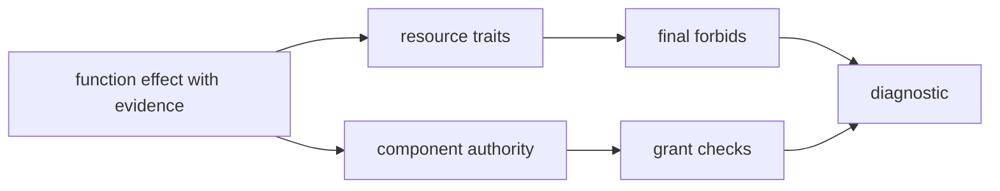

This page records the design reasons behind Shape for contributors. Shape is a typed architecture conformance language: humans and agents write claims in `.shape` files; the deterministic checker accepts or rejects those claims for model coherence.

```text
Draft claims (human or agent).
Review claims (human).
Check claims (deterministic checker).
```

Shape is not a proof assistant, a source-code compiler, or a replacement for tests. It makes architecture claims explicit enough that agents can draft them, humans can review them, and the checker can reject contradictions in the declared model.


## Product Boundary

Shape validates reviewed architecture claims against each other and against workflow inputs such as changed files. It does not prove that implementation source code performs only the declared effects.

That boundary is deliberate. A compiler or theorem prover would need deep application semantics. Shape records material architectural effects in `.shape` files and rejects incoherent records. Application correctness still depends on tests, review, and other tools outside Shape.

What the model can make reviewable:

- Which resources a function claims to read, append, delete, or export.
- Which authority a component is allowed to exercise.
- Durable resource invariants such as append-only storage.
- Why an unusual function shape must be handled carefully (typed memory).
- The evidence path a reviewer can open next to the claim.

The checker asks whether those claims fit together, not whether the source implementation is true.

## Non-goals

Shape does not aim to:

- compile TypeScript or other languages into `.shape`
- prove application implementation correctness
- replace tests
- replace code review
- become a full proof assistant
- execute business logic
- generate application code as a product feature
- waive `forbid final` via rationale, memory, reevaluation, or grants

These non-goals keep the language small enough that a reviewer can understand the model and the checker can produce useful diagnostics.

## Why Explicit Claims

The workflow assumes a technical reviewer who may not know every subsystem. Explicit claims reduce inference.

```shape
module audit

resource AuditEvent : AppendOnly

component AuditStore {
  owns AuditEvent
  grants Append<AuditEvent>
  fn appendEvent
    source ts("src/audit/store.ts#appendEvent")
    effects complete {
      Append<AuditEvent>
        evidence ts("src/audit/store.ts#appendEvent")
    }
}
```

This states:

- `AuditEvent` is modeled as append-only.
- `AuditStore` owns the resource.
- `AuditStore.appendEvent` claims one material effect.
- The claim is complete, not partial.
- Source and evidence are inspectable.

An expert could often recover the same information from source. Shape makes it available to tools and to less familiar readers as typed, checkable text.

## Why Explicit Syntax

Syntax should stay explicit and stable because the files are review surfaces.

Prefer this:

```shape
module audit

resource AuditEvent : AppendOnly

component AuditStore {
  owns AuditEvent
  grants HardDelete<AuditEvent>
  fn purgeOldEvents
    source ts("src/audit/purge.ts#purgeOldEvents")
    effects complete {
      HardDelete<AuditEvent>
        evidence ts("src/audit/purge.ts#purgeOldEvents")
    }
}
```

Avoid compressed notation that saves characters but hides structure from reviewers:

```shape no-verify
AuditStore.purgeOldEvents -> HardDelete(AuditEvent) @ src/audit/purge.ts#purgeOldEvents
```

The compact form is shorter but loses structure. Is `AuditStore` a component? Is `AuditEvent` a resource? Is this a complete effect summary or a hint? Where would a rationale attach? Where would the formatter put evidence?

Explicit syntax gives the checker and the reviewer stable handles.

## Why Memory Is Typed

Generic prose comments tend to rot. Shape memory is typed because the checker needs to know what a memory applies to and what obligations it creates.

```shape
module gateway

resource PolicySnapshot

component Gateway {
  owns PolicySnapshot
  grants Read<PolicySnapshot>
  fn derivePolicyDecision : RefactorSensitive
    effects complete {
      Read<PolicySnapshot>
    }
}

memory DecisionRefactorConstraint : RefactorConstraint<fn Gateway.derivePolicyDecision> {
  applies_to fn Gateway.derivePolicyDecision
  status Unexplained
  confidence High
  protects { shape CheckOrder }
  guards { on_change require ReEvaluation<Self> }
  summary "Previous refactors broke error normalisation."
  who { owner GatewayTeam }
}
```

That memory is not free-form explanation only. It has a target, context type, owner, confidence, protected property, and guard. The checker can require it when `RefactorSensitive` appears and require reevaluation if the guarded function changes.

This is the difference between a note in a comment and a review obligation in the model.

## Why Diagnostics Matter

Checker output is part of the product. A rejection should be explainable as a causal path from a source-backed function claim to an architecture constraint.



For example, a final-forbid diagnostic should teach this chain:

```text
AuditStore.purgeOldEvents emits HardDelete<AuditEvent>
AuditEvent has trait AppendOnly
AppendOnly forbids final HardDelete<AuditEvent>
The effect is rejected even if AuditStore grants it
```

The diagnostic should make the model legible, not only fail the build.

## Agents Draft; Humans Review

Shape is designed so agents can participate in drafting architecture claims without unsupervised trust.

Agents are useful at scanning diffs, producing first drafts, and applying checklists. They can also invent confident but wrong summaries. The language design uses agents where they help and forces uncertainty into visible states:

- `effects unknown` is better than pretending a summary is complete.
- `evidence` makes an effect reviewable against source.
- `rationale` and `memory` turn design talk into typed context.
- `reevaluation` records review when protected shape changes.
- Final forbids remain final even when prose argues otherwise.

Agents scaffold; humans review; the checker rejects incoherent claims. That split is intentional.

## Design Pressure

When evaluating a new Shape feature, use these questions:

- Does this make architecture claims clearer to a human reviewer?
- Can an agent draft it without hiding uncertainty?
- Can the checker reject contradictions deterministically?
- Can diagnostics explain the failure without requiring internal knowledge?
- Does the feature preserve the boundary between reviewed claims and source-code proof?

If the answer is no, the feature probably belongs in docs, authoring prompts, analyzer hints, or tests rather than in the core language.
