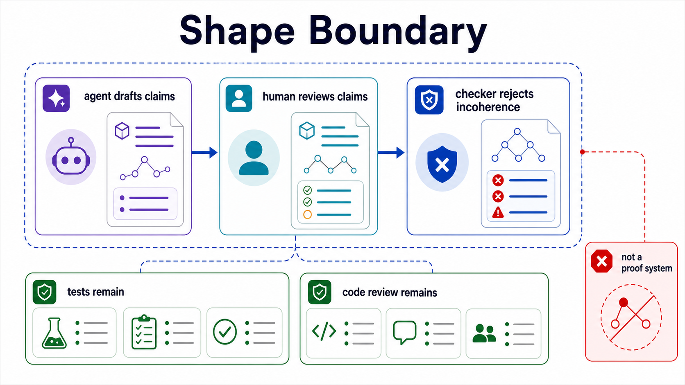
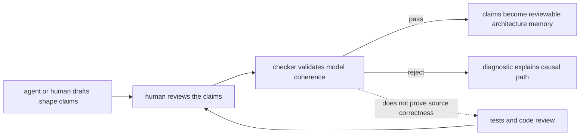
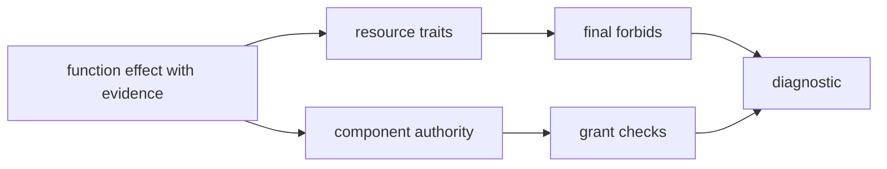

Shape is built around one product distinction:

```text
The LLM writes claims.
The human reviews claims.
The checker rejects incoherent claims.
```

That distinction drives most of the design. Shape is not a proof assistant, a source-code compiler, or a replacement for tests. It is a small language for making architecture claims explicit enough that agents can draft them, humans can review them, and a deterministic checker can reject contradictions.





## The Boundary

Shape validates reviewed architecture claims. It does not prove that implementation source code truly performs only those effects. That boundary is deliberate.

A source compiler or theorem prover would need to understand application semantics deeply. Shape takes a smaller, more pragmatic position: the project records material architectural effects in `.shape` files, and the checker rejects incoherent records.

This makes Shape useful in the messy middle of software engineering:

- A PR can say which resources a function reads, appends, deletes, or exports.
- A component can declare the authority it is allowed to exercise.
- A resource trait can encode a durable invariant such as append-only storage.
- A memory can preserve why an unusual function shape must be handled carefully.
- A reviewer can see the exact claim being made and the evidence attached to it.

The checker then asks whether those claims fit together.

## Non-goals

Shape should not initially try to:

- compile TypeScript into `.shape`
- prove application implementation correctness
- replace tests
- replace code review
- become a full proof assistant
- execute business logic
- generate application code

Those non-goals are protective. They keep the language small enough that a reviewer can understand the model and the checker can produce useful diagnostics.

## Why Explicit Claims

The core workflow assumes a technical reviewer who may not know every subsystem in advance. Explicit claims reduce the amount of inference that reviewer must do.

```shape
module audit

resource AuditEvent : AppendOnly

component AuditStore {
  owns AuditEvent
  grants Append<AuditEvent>
  fn appendEvent
    source ts("src/audit/store.ts#appendEvent")
    effects complete {
      Append<AuditEvent>
        evidence ts("src/audit/store.ts:8-14")
    }
}
```

This tells the reader:

- `AuditEvent` is modeled as append-only.
- `AuditStore` owns the resource.
- `AuditStore.appendEvent` claims one material effect.
- The claim is complete, not partial.
- The source and evidence are inspectable.

The same information could be inferred from source code by an expert reviewer, but Shape makes it available to tools and less familiar readers.

## Why Boring Syntax

The syntax should be explicit and stable because the files are review surfaces.

Prefer this:

```shape
module audit

resource AuditEvent : AppendOnly

component AuditStore {
  owns AuditEvent
  grants HardDelete<AuditEvent>
  fn purgeOldEvents
    source ts("src/audit/purge.ts#purgeOldEvents")
    effects complete {
      HardDelete<AuditEvent>
        evidence ts("src/audit/purge.ts:12-16")
    }
}
```

Avoid compressed notation that saves characters but hides meaning from reviewers:

```shape no-verify
AuditStore.purgeOldEvents -> HardDelete(AuditEvent) @ src/audit/purge.ts:12
```

The compact version is shorter, but it loses important structure. Is `AuditStore` a component? Is `AuditEvent` a resource? Is this a complete effect summary or a hint? Where would a rationale attach? Where would a future formatter put evidence?

Boring syntax gives the checker and the reviewer stable handles.

## Why Memory Is Typed

Generic prose comments tend to rot. Shape memory is typed because the checker needs to know what a memory applies to and what obligations it creates.

```shape
module gateway

resource PolicySnapshot

component Gateway {
  owns PolicySnapshot
  grants Read<PolicySnapshot>
  fn derivePolicyDecision : RefactorSensitive
    effects complete {
      Read<PolicySnapshot>
    }
}

memory DecisionRefactorConstraint : RefactorConstraint<fn Gateway.derivePolicyDecision> {
  applies_to fn Gateway.derivePolicyDecision
  status Unexplained
  confidence High
  protects shape CheckOrder
  guards on_change require ReEvaluation<Self>
  summary "Previous refactors broke error normalisation."
  owner GatewayTeam
}
```

That memory is not just explanation. It has a target, context type, owner, confidence, protected property, and guard. The checker can require it when `RefactorSensitive` appears and require reevaluation if the guarded function changes.

This is the difference between "we wrote a note" and "the model now contains a review obligation."

## Why Diagnostics Matter

The checker's output is part of the product. A rejection should be explainable as a causal path from a source-backed function claim to an architecture constraint.



For example, a final-forbid diagnostic should teach the reviewer this chain:

```text
AuditStore.purgeOldEvents emits HardDelete<AuditEvent>
AuditEvent has trait AppendOnly
AppendOnly forbids final HardDelete<AuditEvent>
The effect is rejected even if AuditStore grants it
```

That style of output is crucial for a reader who is new to the system. The diagnostic should make the model legible, not merely fail the build.

## Agentic, But Reviewable

Shape is designed for agentic software engineering, but not for unsupervised trust.

Agents are good at scanning diffs, producing first drafts, and remembering checklist items. They are also capable of inventing confident but wrong summaries. Shape's design uses agents where they help and forces uncertainty into visible states:

- `effects unknown` is better than pretending a summary is complete.
- `evidence` makes an effect reviewable.
- `rationale` and `memory` turn vague design talk into typed context.
- `reevaluation` records review when protected shape changes.
- final forbids remain final even when an agent supplies persuasive prose.

The language is exciting because it gives agents a structured way to participate in architecture review without letting them silently move the boundary of correctness.

## Design Pressure

When evaluating a new Shape feature, use these questions:

- Does this make architecture claims clearer to a human reviewer?
- Can an agent draft it without hiding uncertainty?
- Can the checker reject contradictions deterministically?
- Can diagnostics explain the failure without requiring internal knowledge?
- Does the feature preserve the boundary between reviewed claims and source-code proof?

If the answer is no, the feature probably belongs in docs, authoring prompts, analyzer hints, or tests rather than in the core language.
