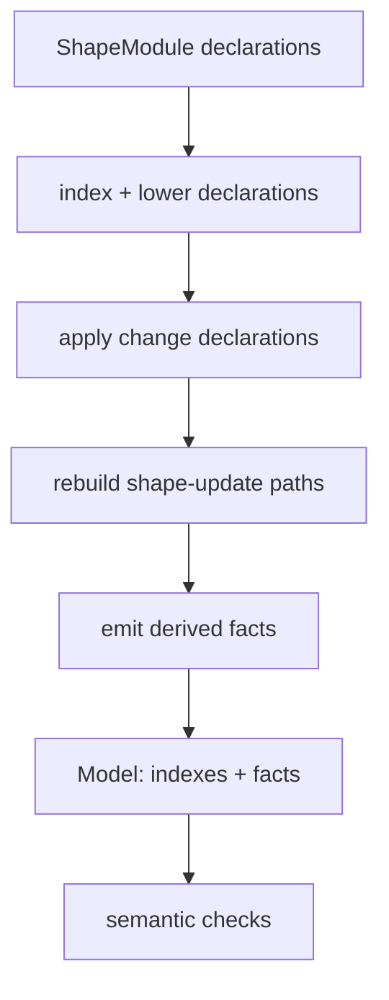
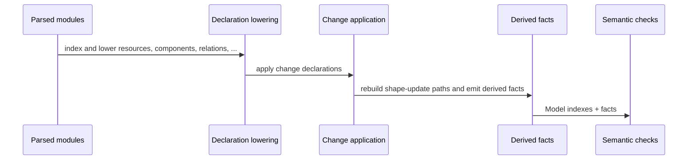
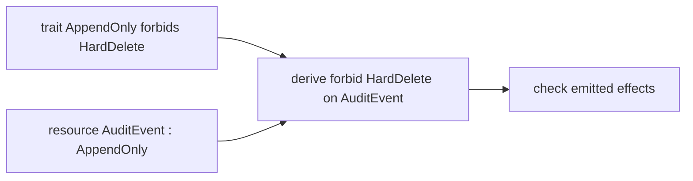

This page describes fact lowering for contributors. The parser produces syntax trees. Semantic checks become clearer after those trees are lowered into a `Model`: typed indexes plus a list of facts (small normalized records with provenance).

Lowering is part of the production pipeline: parse → lower → run rules → diagnostics. It validates and normalizes the declared model. It does not inspect application runtime behavior or prove implementation correctness.




## Why Facts and Indexes Exist

Raw ASTs preserve exactly what the author wrote. That is useful for formatting and source locations, but awkward for rule evaluation. A rule should not need to know whether a grant appeared before or after a function in the component body. It should ask: does this component grant this effect on this resource?

Lowering produces direct records for those questions. Production rules primarily use typed indexes on `Model` (`components`, `resources`, `traits`, `hypergraph`, `memories`, and similar). The `facts` array is the public inspection stream, used by `includeFacts`, explain/graph helpers, and experimental engines. It is not currently a complete substitute for the typed indexes (see [Rule Engine Strategy](./rule-engine-strategy/)).

Conceptual records look like:

```text
component AuditStore owns AuditEvent
component AuditStore grants Append<AuditEvent>
function AuditStore.appendEvent emits Append<AuditEvent>
resource AuditEvent has trait AppendOnly
trait AppendOnly forbids final HardDelete<AuditEvent>
memory DecisionRefactorConstraint applies to fn Gateway.derivePolicyDecision
```

Those records are easier to index, compare, and explain than raw parse nodes.

## Example: From Syntax To Facts

Start with a small passing model:

```shape
module audit

resource AuditEvent : AppendOnly

component AuditStore {
  owns AuditEvent
  grants Append<AuditEvent>
  fn appendEvent
    source ts("src/audit/store.ts#appendEvent")
    effects complete {
      Append<AuditEvent>
        evidence ts("src/audit/store.ts#appendEvent")
    }
}
```

The lowered facts include the obvious declarations:

```text
resource AuditEvent
resource_trait AuditEvent AppendOnly
component AuditStore
owns AuditStore AuditEvent
grants AuditStore Append<AuditEvent>
function AuditStore.appendEvent
effect AuditStore.appendEvent Append<AuditEvent>
shape_update_for src/audit/store.ts
```

They also preserve provenance. Conceptually, the effect fact is not only `Append<AuditEvent>`; it is `Append<AuditEvent>` caused by the `fn appendEvent` summary, with optional evidence from `src/audit/store.ts#appendEvent`.

Provenance is why the checker can produce a useful diagnostic instead of a generic failure. When a rule rejects a claim, it can point at which declaration created the claim and which declaration created the constraint.

## How Lowering Builds the Effective Model

`lowerShapeModules` in `packages/shp-checker/src/checker/lowerer.ts` builds one effective model from all loaded modules before rules run. Domain lowerers live under `checker/lowering/*`.



If the global model contains a function with `effects unknown`, lowering emits a function fact plus an `effect_unknown` fact, and the unknown-effects rule can reject that uncertainty under strict check.

```shape
module audit

component AuditStore {
  fn reviewPurgeShape1
    source ts("src/audit/purge.ts")
    effects unknown
}
```

## Incremental Invalidation

Library integrations that repeatedly check an in-memory workspace can use `IncrementalShapeChecker`. Each call supplies the complete current document snapshot:

```ts
import { IncrementalShapeChecker } from "@shape/shp-checker";

const checker = new IncrementalShapeChecker();
const checked = checker.check(
  [
    {
      filePath: "shape/audit.shape",
      source: "module audit\nresource AuditEvent\n"
    }
  ],
  { includeFacts: true }
);
```

The incremental boundary is deliberately conservative:

- an unchanged document reuses its parsed syntax tree;
- adding, changing, or removing any Shape document rebuilds the complete effective model and all derived facts;
- changing only checker options, including `changedFiles`, reuses the lowered model but reruns semantic and binding diagnostics when those options do not change an implicit document origin;
- changing `repoRoot` rebuilds the lowered model without reparsing only when it changes whether an absolute, implicit-origin document is trusted as generated AST;
- an exact no-op reuses the previous diagnostics;
- any parse failure makes derived facts unavailable until the document set parses again.

The global rebuild on document mutation is required because imports, duplicate declarations, change blocks, concrete targets, and derived facts can cross file boundaries. The checker does not claim that one file owns an independent fact shard.

Each result includes an `invalidation` report with the cause, reparsed/reused/removed document paths, and whether facts and diagnostics were rebuilt or reused. Paths are sorted deterministically. Returned check results are cloned so caller mutation cannot corrupt the cache.

Document paths must be unique within a snapshot. A duplicate path is rejected rather than making array order decide which source wins.

`checkShapeModules` and `checkShapeFiles` remain the uncached full-check APIs and the semantic authority. `checkShapeFiles` and the incremental checker both resolve implicit generated-AST origins against the normalized `repoRoot`, rather than ambient process state. Incremental results are tested differentially against the full path; the cache changes work reuse, not checker meaning.

## Trait Lowering

Traits are compact syntax for reusable architectural constraints. During lowering, a trait declaration is recorded separately from the resources that use it.

```shape
module audit

trait AppendOnly<T: Resource> {
  allow Append<T>
  allow Read<T>
  forbid final HardDelete<T>
}

resource AuditEvent : AppendOnly
```

The trait creates a final-forbid pattern. The resource creates a resource-trait fact. Rule evaluation combines them when a function effect targets `AuditEvent`.



This split is why diagnostics can say both things: the resource has `AppendOnly`, and the trait forbids the specific effect.

## Relation Lowering

Structural links between components and resources live in top-level `relation` declarations. Lowering turns each `relation` into a hyperedge in the model's directed hypergraph plus one fact per endpoint.

```shape
module audit

resource AuditEvent

component Gateway {
}

component AuditStore {
}

relation GatewayCallsAudit {
  kind calls
  connects Gateway -> AuditStore
}

relation AuditWritePath {
  kind coordinated_call
  connects Gateway -> AuditStore -> AuditEvent
}
```

The lowered facts include:

```text
hyperedge GatewayCallsAudit kind=calls ordered=true
hyperedge_member GatewayCallsAudit Gateway index=0
hyperedge_member GatewayCallsAudit AuditStore index=1
hyperedge AuditWritePath kind=coordinated_call ordered=true
hyperedge_member AuditWritePath Gateway index=0
hyperedge_member AuditWritePath AuditStore index=1
hyperedge_member AuditWritePath AuditEvent index=2
```

Lowering also builds a vertex-to-hyperedge incidence index keyed by endpoint name. Rule evaluation uses it to answer hypergraph questions without rescanning the AST: `forbid path` performs canonical shortest-path search, `forbid hypercycle` finds a canonical shortest cycle, and `forbid provides T except C` filters incidence at `T`. Path and hypercycle rules share the directed step-graph builder and kind traversal semantics; path evaluation excludes unresolved, ambiguous, or endpoint-type-invalid relations from witnesses.

A binary dependency is a 2-vertex hyperedge. Shape does not maintain a separate binary-edge layer.

## Context Lowering

Function shape traits such as `PreserveInline`, `RequiresDescription`, and `RefactorSensitive` lower into context requirements. Matching `rationale`, `memory`, and `reevaluation` blocks lower into context facts that may satisfy those requirements. Nested `protects` / `guards` / `who` / `when` blocks are flattened into the shared context-info fields used by rules.

```shape
module gateway

resource PolicySnapshot

component Gateway {
  owns PolicySnapshot
  grants Read<PolicySnapshot>
  fn derivePolicyDecision : RefactorSensitive
    effects complete {
      Read<PolicySnapshot>
    }
}

memory DecisionRefactorConstraint : RefactorConstraint<fn Gateway.derivePolicyDecision> {
  applies_to fn Gateway.derivePolicyDecision
  status Unexplained
  confidence High
  summary "Previous refactors broke error normalisation."
  who { owner GatewayTeam }
  guards { on_change require ReEvaluation<Self> }
}
```

The checker sees these internal facts:

```text
shape_trait fn Gateway.derivePolicyDecision RefactorSensitive
context_required fn Gateway.derivePolicyDecision RefactorConstraint
memory DecisionRefactorConstraint RefactorConstraint fn Gateway.derivePolicyDecision
guard_requires_reevaluation memory DecisionRefactorConstraint fn Gateway.derivePolicyDecision
```

That is enough to check both the current state and future changes. The memory satisfies the required context now, and the guard creates an obligation if the protected function is modified or removed later.

## Coverage Lowering

Implementations connect source paths to components. They are how Shape can say that a kind of source change needs a Shape update or current attestation.

```shape
module audit

resource AuditEvent

component AuditStore {
  owns AuditEvent
  grants Append<AuditEvent>
  fn appendEvent
    source ts("src/audit/store.ts#appendEvent")
    effects complete {
      Append<AuditEvent>
    }
}

implementation AuditImplementation {
  paths {
    "src/audit/**/*.ts"
  }
  conforms_to AuditStore
  on_change require shape_update
}
```

Lowering records implementation paths and function source paths. Coverage checks then compare changed files against those paths. A matching `source` or `evidence` reference creates a `shape_update_for` fact, but coverage only accepts it when the declaring `.shape` file is also in the current changed-file list. An explicit `attest no_shape_change` creates an attestation fact with the same current-file requirement.

## Design Rule

Fact lowering should stay deterministic and local. If a fact cannot be explained from loaded declarations, standard prelude facts, or the explicit changed-file input, it should not appear in diagnostics.

A reviewer should be able to ask why the checker believes a claim and trace the answer back to source text.
