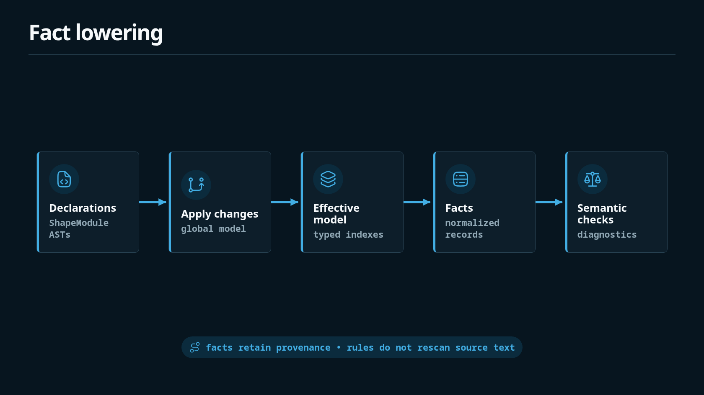
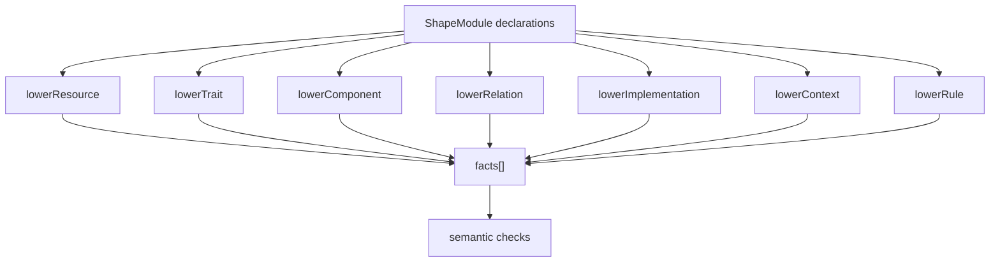
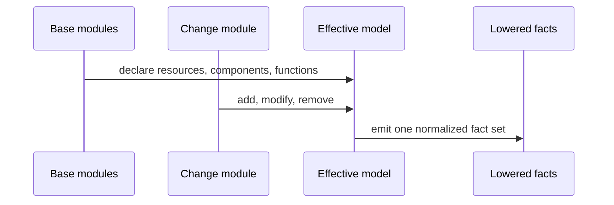
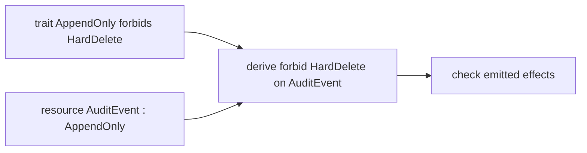

The parser gives the checker syntax trees. Semantic checks become clearer after those trees are lowered into facts: small normalized records that describe what the model claims to be true.

This page is about that translation layer. If the grammar is the front door to Shape, fact lowering is the point where review syntax becomes an internal architecture database.





## Why Facts Exist

Raw ASTs preserve exactly what the author wrote. That is valuable for formatting and source locations, but it is awkward for rule evaluation. A rule should not need to know whether a grant came before or after a function in the component body. It should ask a direct question: does this component grant this effect on this resource?

Lowering gives the checker direct records for those questions.

```text
component AuditStore owns AuditEvent
component AuditStore grants Append<AuditEvent>
function AuditStore.appendEvent emits Append<AuditEvent>
resource AuditEvent has trait AppendOnly
trait AppendOnly forbids final HardDelete<AuditEvent>
memory DecisionRefactorConstraint applies to fn Gateway.derivePolicyDecision
```

Those records are easier to index, compare, and explain than raw parse nodes.

## Example: From Syntax To Facts

Start with a small passing model:

```shape
module audit

resource AuditEvent : AppendOnly

component AuditStore {
  owns AuditEvent
  grants Append<AuditEvent>
  fn appendEvent
    source ts("src/audit/store.ts#appendEvent")
    effects complete {
      Append<AuditEvent>
        evidence ts("src/audit/store.ts:8-14")
    }
}
```

The lowered facts include the obvious declarations:

```text
resource AuditEvent
resource_trait AuditEvent AppendOnly
component AuditStore
owns AuditStore AuditEvent
grants AuditStore Append<AuditEvent>
function AuditStore.appendEvent
effect AuditStore.appendEvent Append<AuditEvent>
shape_delta_for src/audit/store.ts
```

They also preserve provenance. Conceptually, the effect fact is not just `Append<AuditEvent>`; it is `Append<AuditEvent>` caused by the `fn appendEvent` summary, with optional evidence from `src/audit/store.ts:8-14`.

Provenance is why the checker can produce a useful diagnostic instead of a generic failure. When a rule rejects a fact, it can tell the reviewer which declaration created the fact and which declaration created the constraint.

## Effective Model First

Change declarations are applied before facts are lowered. The checker does not lower "base facts" and "patch facts" independently, then try to reconcile them later. It first builds the model that would exist if the change were accepted.



That design keeps PR review straightforward. If a change modifies a guarded function, the modified function is what rule evaluation sees. If a change adds a function with `effects unknown`, the model really contains a function with unknown effects, and the relevant rule can reject or surface that uncertainty.

```shape
module changes.PR_042

import audit

change ReviewAuditPurge {
  add fn AuditStore.reviewPurgeShape1
    source ts("src/audit/purge.ts")
    effects unknown
}
```

This lowers into a function fact plus an `effect_unknown` fact. The checker can then require the reviewer to replace uncertainty with a reviewed effect summary before treating the shape as complete.

## Trait Lowering

Traits are compact syntax for reusable architectural constraints. During lowering, a trait declaration is recorded separately from the resources that use it.

```shape
module audit

trait AppendOnly<T: Resource> {
  allow Append<T>
  allow Read<T>
  forbid final HardDelete<T>
}

resource AuditEvent : AppendOnly
```

The trait creates a final-forbid pattern. The resource creates a resource-trait fact. Rule evaluation combines them when a function effect targets `AuditEvent`.



This split is why diagnostics can say both things: the resource has `AppendOnly`, and the trait forbids the specific effect.

## Relation Lowering

Structural links between components and resources live exclusively in top-level `relation` declarations. Lowering turns each `relation` into a hyperedge in the model's directed hypergraph plus one fact per endpoint.

```shape
module audit

resource AuditEvent

component Gateway {
}

component AuditStore {
}

relation GatewayCallsAudit {
  kind calls
  connects Gateway -> AuditStore
}

relation AuditWritePath {
  kind coordinated_call
  connects Gateway -> AuditStore -> AuditEvent
}
```

The lowered facts include:

```text
hyperedge GatewayCallsAudit kind=calls ordered=true
hyperedge_member GatewayCallsAudit Gateway index=0
hyperedge_member GatewayCallsAudit AuditStore index=1
hyperedge AuditWritePath kind=coordinated_call ordered=true
hyperedge_member AuditWritePath Gateway index=0
hyperedge_member AuditWritePath AuditStore index=1
hyperedge_member AuditWritePath AuditEvent index=2
```

Lowering also builds a vertex-to-hyperedge incidence index keyed by endpoint name. Rule evaluation uses it to answer hypergraph questions without rescanning the AST: `forbid hypercycle` walks the directed step graph derived from each kind's traversal semantics, and `forbid provides T except C` filters incidence at `T`.

A binary dependency is just a 2-vertex hyperedge. Shape does not maintain a separate binary-edge layer.

## Context Lowering

Function shape traits such as `PreserveInline`, `RequiresDescription`, and `RefactorSensitive` lower into context requirements. Matching `rationale`, `memory`, and `reevaluation` blocks lower into context facts that may satisfy those requirements.

```shape
module gateway

resource PolicySnapshot

component Gateway {
  owns PolicySnapshot
  grants Read<PolicySnapshot>
  fn derivePolicyDecision : RefactorSensitive
    effects complete {
      Read<PolicySnapshot>
    }
}

memory DecisionRefactorConstraint : RefactorConstraint<fn Gateway.derivePolicyDecision> {
  applies_to fn Gateway.derivePolicyDecision
  status Unexplained
  confidence High
  summary "Previous refactors broke error normalisation."
  owner GatewayTeam
  guards on_change require ReEvaluation<Self>
}
```

The checker sees these internal facts:

```text
shape_trait fn Gateway.derivePolicyDecision RefactorSensitive
context_required fn Gateway.derivePolicyDecision RefactorConstraint
memory DecisionRefactorConstraint RefactorConstraint fn Gateway.derivePolicyDecision
guard_requires_reevaluation memory DecisionRefactorConstraint fn Gateway.derivePolicyDecision
```

That is enough to check both the current state and future changes. The memory satisfies the required context now, and the guard creates an obligation if the protected function is modified or removed later.

## Coverage Lowering

Implementations connect source paths to components. They are how Shape can say, "this kind of source change needs a Shape update or current attestation."

```shape
module audit

resource AuditEvent

component AuditStore {
  owns AuditEvent
  grants Append<AuditEvent>
  fn appendEvent
    source ts("src/audit/store.ts#appendEvent")
    effects complete {
      Append<AuditEvent>
    }
}

implementation AuditImplementation {
  paths {
    "src/audit/**/*.ts"
  }
  conforms_to AuditStore
  on_change require shape_delta
}
```

Lowering records implementation paths and function source paths. Coverage checks then compare changed files against those paths. A matching `source` or `evidence` reference creates a `shape_delta_for` fact, but coverage only accepts it when the declaring `.shape` file is also in the current changed-file list. An explicit `attest no_shape_change` creates an attestation fact with the same current-file requirement.

## Design Rule

Fact lowering should stay deterministic and local. If a fact cannot be explained from loaded declarations, standard prelude facts, or the explicit changed-file input, it should not appear in diagnostics.

That rule keeps Shape useful for technical reviewers. A reviewer should be able to ask, "why does the checker believe this?" and trace the answer back to source text.
