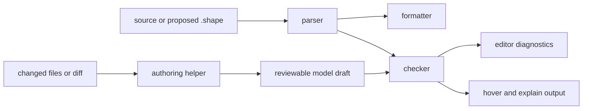
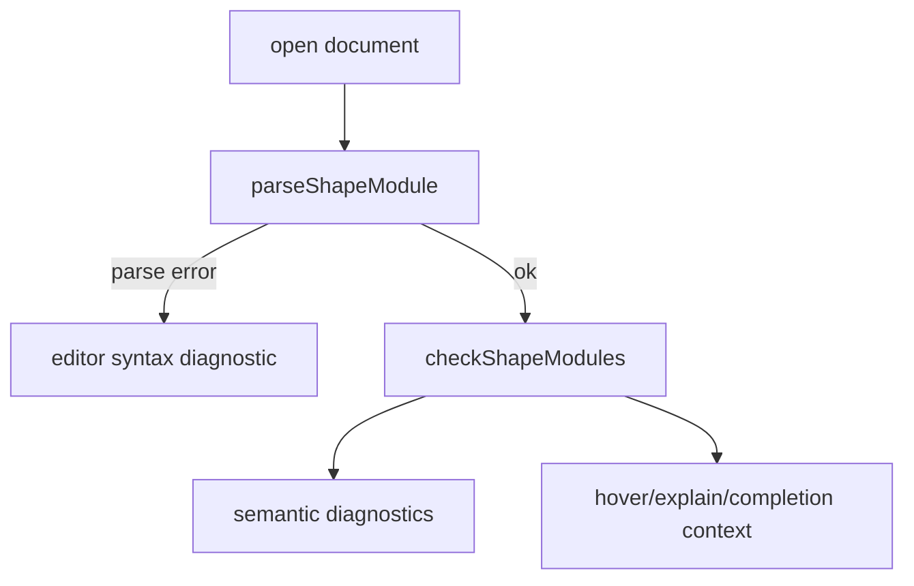
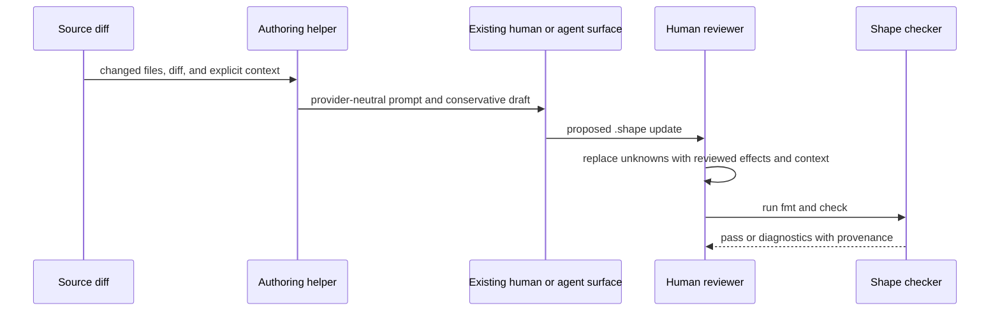

This page describes helper APIs in `@shape/shp-checker` for contributors. The checker package exports more than parse and check. Shape files are review artifacts, so formatter, editor, and authoring helpers exist to make authoring and review loops predictable.

The checker owns semantic truth: pass/fail for model coherence. Helpers make that truth easier to work with in a CLI, editor, or agent workflow. They do not prove application correctness and must not implement a softer or different semantic checker.




## Why These Helpers Exist

Shape sits in a feedback loop:

1. A human or agent proposes architecture claims.
2. The formatter makes the diff stable.
3. The checker rejects incoherent claims.
4. Editor and CLI helpers explain what to fix.
5. The reviewer turns uncertainty into explicit effects, rationale, memory, or reevaluation.

The helper APIs keep that loop from becoming a collection of one-off scripts. The `shp lsp` adapter exposes them through the Language Server Protocol without moving semantics into the CLI.

The formatter and editor helpers also understand repository binding declarations. Bindings remain semantic checker claims; helper surfaces keep them readable and discoverable like other top-level Shape declarations.

Shared checker-package metadata backs the helper surfaces. Prelude shape traits, context requirements, relation-kind names, and source-reference string normalization live in package-local helpers. The formatter, editor, analyzer, checker, and authoring prompt derive output from those helpers instead of maintaining separate copies.

## Formatter

`formatShapeSource` parses source text and returns canonical formatting. `formatShapeModule` formats an already parsed `ShapeModule`. The CLI exposes this through `shp fmt`:

```bash
bun run shp -- fmt --check fixtures/pass/append_only_append/audit.shape
```

Canonical formatting matters because Shape files are reviewed in diffs. The formatter sorts declarations and members in a predictable way, normalizes indentation, and keeps function shape traits, descriptions, rationale, memory, and reevaluation blocks easy to scan. It also canonicalizes graph rules such as `forbid path Gateway -> SecretStore over calls or provides`, and editor completions expose that rule prefix alongside the existing hypercycle and provider forms. Rationale/memory guard members are authored as grouped blocks (`protects`, `guards`, `who`, `when`), and the formatter aggregates repeated blocks of the same kind into one, so there is a single canonical on-disk form.

For example, an author might write:

```shape no-verify
memory DecisionRefactorConstraint : RefactorConstraint<fn Gateway.derivePolicyDecision> { summary "Previous refactors broke error normalisation." guards on_change require ReEvaluation<Self> confidence High status Unexplained applies_to fn Gateway.derivePolicyDecision owner GatewayTeam protects shape CheckOrder }
```

The formatter expands that into a reviewable block:

```shape
module gateway

resource PolicySnapshot

component Gateway {
  owns PolicySnapshot
  grants Read<PolicySnapshot>
  fn derivePolicyDecision : RefactorSensitive
    effects complete {
      Read<PolicySnapshot>
    }
}

memory DecisionRefactorConstraint : RefactorConstraint<fn Gateway.derivePolicyDecision> {
  applies_to fn Gateway.derivePolicyDecision
  status Unexplained
  confidence High
  protects { shape CheckOrder }
  guards { on_change require ReEvaluation<Self> }
  summary "Previous refactors broke error normalisation."
  who { owner GatewayTeam }
}
```

The formatter does not approve the model. It only makes the model easier to inspect. Semantic approval still belongs to the checker.

## Editor Helpers

The editor helpers expose the building blocks used by `shp lsp`:

| Helper | Purpose |
| --- | --- |
| `getEditorDiagnostics` | Parse and check a source string, then return editor-shaped diagnostics. |
| `getEditorDiagnosticsForDocuments` | Parse and check a deterministic document set so imports participate in one semantic model and diagnostics retain their source file. |
| `getCompletions` | Offer language keywords, known prelude names, and declarations from the current document. |
| `getHoverText` | Explain prelude shape traits or show `explain` output for known symbols. |
| `getDefinitionLocation` | Locate declarations for resources, traits, components, rules, contexts, and functions. |
| `formatOnSave` | Run the same canonical formatter used by the CLI. |

These helpers use the same parser and checker as the CLI. An editor should not have a different understanding of Shape than CI.

Definition lookup and completions also walk `change` entries, so declarations and functions introduced by `add` entries resolve through the same editor surface as global declarations. `modify` and `remove` entries are treated as references or removals, not definition sites.

Memory Guard context is target-aware. A definition query for a complete reference such as `InlineRationale<fn Gateway.derivePolicyDecision>` resolves the matching rationale or memory instead of the first declaration that happens to use `InlineRationale`. A reevaluation's satisfied memory or rationale continues to resolve by its declared name. Completion candidates include parsed memory and rationale names plus context types derived from the shared prelude, such as `InlineRationale` and `RefactorConstraint`.



Editor behavior is a projection of checker behavior. Hover text can teach what `RefactorSensitive` requires because the checker already has that prelude concept. Diagnostics can point to missing context because semantic rules already found the obligation.

## Language Server

`shp lsp` is a small stdio transport around the editor helpers. It advertises
incremental text synchronization, diagnostics, hover, go to definition,
completion, and whole-document formatting. The transport converts between LSP's
zero-based UTF-16 positions and the helpers' source locations; it does not
implement an alternative parser or checker.

For semantic diagnostics, the server discovers `shape/**/*.shape` beneath each
initial workspace folder and overlays the current text of open documents. That
full document set is passed to `getEditorDiagnosticsForDocuments`, so a valid
file does not report unknown names merely because its imported module lives in
another file. Validation results are generation-checked before publication, and
previously published URIs receive an empty diagnostic set when their problems or
documents disappear.

Hover and definitions begin with the current document. An external definition
is returned only when exactly one other workspace document matches the
reference; ambiguous declarations deliberately return no location. Completion
candidates are the deterministic union of the open workspace snapshot, with
replacement ranges derived from the candidates so phrases such as
`forbid path` replace the full typed prefix.

The server's formatting capability returns the same canonical output as
`formatOnSave`. Editors implement format-on-save by requesting
`textDocument/formatting`; the server never writes the document itself.

## Authoring Helpers

Authoring helpers are built for agent-assisted review. They help create a conservative draft; they do not claim to know more than the reviewer knows.

Authoring helpers start from changed files and a component:

```bash
bun run shp -- author --changed-files fixtures/changed/audit_purge.txt --component AuditStore
```

The generated scaffold is intentionally conservative and should be folded into the owning global model after review:

```shape
module audit

component AuditStore {
  fn reviewAuditPurgeShape1
    source ts("src/audit/purge.ts")
    effects unknown
}
```

`effects unknown` stops an agent from producing an empty `effects complete` block that looks clean but hides uncertainty. The reviewer can then inspect the diff, add effect entries, refine file-scoped references to stable `#symbol` anchors when supported by source evidence, and include any required rationale, memory, or reevaluation.

The conservative scaffold remains file-scoped. A unified diff is prompt context only: the authoring workflow does not convert hunk coordinates into `path:start-end` references or guess which added lines represent the architectural change.

## Prompt Helpers

`buildShapeAuthorPrompt` and `buildShapeCriticPrompt` encode the same review posture in text. The critic helper accepts a typed `ShapeCriticInput`, so the changed files, diff, path-labeled existing Shape, proposed update, optional snippets, optional project prelude, and human instructions stay explicit and deterministic. The prompts tell an authoring or reviewing agent to:

- output valid Shape syntax
- cover every governed changed file
- use `effects complete` only when material effects are represented
- keep destructive operations explicit
- prefer stable `#symbol` references and otherwise keep evidence file-scoped
- never add line-number or line-range suffixes
- add context for function shape traits
- add reevaluation for guarded changes
- never use memory or rationale to waive final forbidden effects

The critic prompt asks the inverse questions. It is designed to catch common failure modes before the deterministic checker runs.

`reviewShapeAuthoringProposal` adds two deterministic advisory categories without turning the helper into another checker:

- `guarded_target_without_reevaluation` matches changed files coarsely against source-backed functions protected by an `on_change require ReEvaluation` or `ReEvaluation<Self>` guard, then checks the proposal for a namespace-resolved reevaluation satisfying that memory or rationale. Critic and checker lowering share the same qualified, local, imported, ambiguous, and unknown module-reference precedence.
- `destructive_effect_omission` runs the existing lexical analyzer over added diff lines only, then compares its hints with effects declared by the existing and proposed Shape modules. Deleted lines are excluded, and the advisory reports the affected file plus code evidence without turning diff coordinates into authored Shape references.

The result is typed and returns parse diagnostics for malformed Shape input. `formatShapeCriticAdvisories` gives the advisory union stable ordering and text. These helpers do not invoke `checkShapeModules`, a model provider, a subprocess, or a network service; they only prepare review context and flag likely omissions.

`buildShapeAuthoringBundle` connects the deterministic pieces without adding a model runtime. It accepts changed-file and component metadata plus a unified diff, path-preserving existing Shape files, optional source snippets, an optional project-prelude context file, and human instructions. It returns:

- a conservative parseable draft
- an author prompt containing all supplied context and the draft

The CLI exposes that bundle with `--prompt`:

```bash
bun run shp -- author \
  --changed-files fixtures/changed/audit_purge.txt \
  --component AuditStore \
  --module audit \
  --diff fixtures/diffs/audit_purge.diff \
  --prompt \
  --shape-files fixtures/pass/append_only_append/audit.shape \
  --snippet-files fixtures/source/audit_purge.ts
```

Prompt mode requires an explicit Shape-file list instead of loading every file under `shape/`, which keeps generated AST context and unrelated models out of the prompt. A supplied project prelude is context only; the authoring command does not discover, import, or install domain libraries. Shape writes the prompt to stdout and never invokes a provider, subprocess, or network service.

Critic mode uses the same explicit context and reads the proposed update from `--critic-prompt`:

```bash
bun run shp -- author \
  --changed-files fixtures/changed/audit_purge.txt \
  --diff fixtures/diffs/audit_purge.diff \
  --critic-prompt proposed.shape \
  --shape-files fixtures/pass/append_only_append/audit.shape \
  --snippet-files fixtures/source/audit_purge.ts
```

The critic prompt is written to stdout and deterministic advisories are written to stderr. Advisory findings still exit `0`, because strict checker results remain the authoritative gate. Invalid critic input exits `2`, and `--critic-prompt` cannot be combined with `--prompt`.

## A Typical Agentic Review Loop



Agents can scaffold, remind, and compare. Humans still review the claims. The generated draft is parseable but authored `effects unknown` remains unresolved; after folding the update into its owning global model, strict `shp check --changed-files changed.txt` is the final gate.

## What Not To Put In Helpers

Keep helper APIs out of semantic decision-making. If a behavior changes whether a model passes, it belongs in the checker or language, not in the formatter, editor adapter, or prompt text.

That boundary prevents the CLI, docs, editor extension, and CI from drifting into different versions of Shape.
