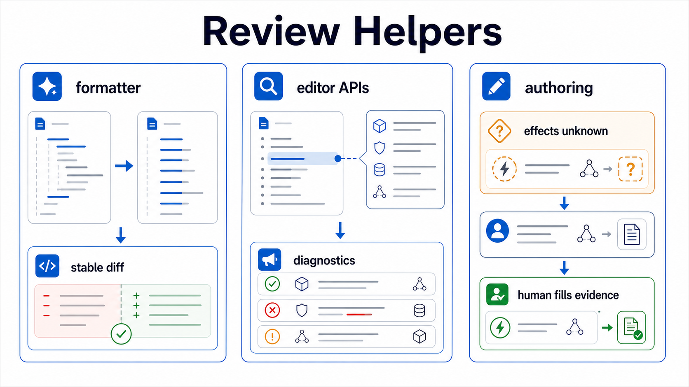

The checker package exports more than parse and check.



## Formatter

`formatShapeSource` and `formatShapeModule` produce canonical Shape formatting. The CLI exposes this as:

```bash
shp fmt --check fixtures/pass/append_only_append/audit.shape
```

Canonical formatting matters because Shape files are review artifacts.

The formatter also canonicalizes function shape traits, descriptions, rationale, memory, and reevaluation blocks so refactor constraints remain easy to review in diffs.

## Editor helpers

The checker package exposes editor primitives for diagnostics, completion, hover text, definitions, and on-save formatting.

Those APIs are intended to support a future language-server or editor integration without making the CLI responsible for editor behavior.

## Authoring helpers

Authoring helpers generate change scaffolds and prompts for LLM-assisted review.

```bash
shp author --changed-files fixtures/changed/audit_purge.txt --component AuditStore
```

Generated deltas should keep uncertainty explicit with `effects unknown` until a reviewed effect summary replaces it.

Authoring prompts also remind agents to include rationale or memory for function shape traits, and to add reevaluation when a guarded function is modified or removed.
