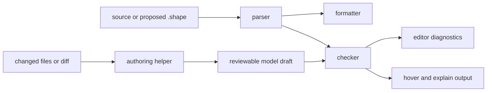
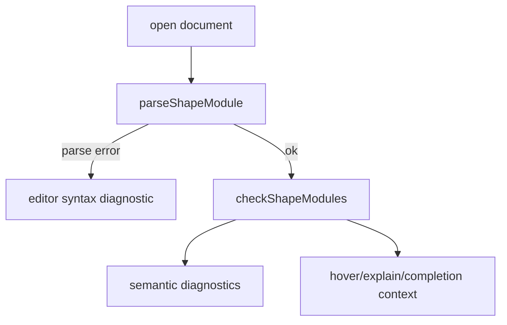
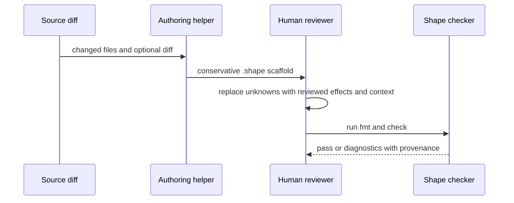

The checker package exports more than parse and check. Shape files are review artifacts, so the surrounding helper APIs exist to make authoring, editing, formatting, and review loops predictable.

The short version is: the checker owns semantic truth, while the helper APIs make that truth easier to work with in a CLI, editor, or agent workflow.




## Why These Helpers Exist

Shape is meant to sit in a feedback loop:

1. A human or agent proposes architecture claims.
2. The formatter makes the diff stable.
3. The checker rejects incoherent claims.
4. Editor and CLI helpers explain what to fix.
5. The reviewer turns uncertainty into explicit effects, rationale, memory, or reevaluation.

The helper APIs keep that loop from becoming a collection of one-off scripts. They also make it possible to build a language server later without moving semantics into the CLI.

The formatter and editor helpers also understand repository binding declarations. Bindings remain semantic checker claims, but helper surfaces should keep them readable, discoverable, and highlighted like other top-level Shape declarations.

Shared checker-package metadata backs the helper surfaces. Prelude shape traits, context requirements, relation-kind names, and source-reference string normalization live in package-local helpers, and the formatter, editor, analyzer, checker, and authoring prompt derive their own output from those helpers instead of maintaining separate copies.

## Formatter

`formatShapeSource` parses source text and returns canonical formatting. `formatShapeModule` formats an already parsed `ShapeModule`. The CLI exposes this through `shp fmt`:

```bash
bun run shp -- fmt --check fixtures/pass/append_only_append/audit.shape
```

Canonical formatting matters because Shape files are meant to be reviewed in diffs. The formatter sorts declarations and members in a predictable way, normalizes indentation, and keeps function shape traits, descriptions, rationale, memory, and reevaluation blocks easy to scan. Rationale/memory guard members are authored as grouped blocks (`protects`, `guards`, `who`, `when`), and the formatter aggregates repeated blocks of the same kind into one, so there is a single canonical on-disk form.

For example, an author might write:

```shape no-verify
memory DecisionRefactorConstraint : RefactorConstraint<fn Gateway.derivePolicyDecision> { summary "Previous refactors broke error normalisation." guards on_change require ReEvaluation<Self> confidence High status Unexplained applies_to fn Gateway.derivePolicyDecision owner GatewayTeam protects shape CheckOrder }
```

The formatter expands that into a reviewable block:

```shape
module gateway

resource PolicySnapshot

component Gateway {
  owns PolicySnapshot
  grants Read<PolicySnapshot>
  fn derivePolicyDecision : RefactorSensitive
    effects complete {
      Read<PolicySnapshot>
    }
}

memory DecisionRefactorConstraint : RefactorConstraint<fn Gateway.derivePolicyDecision> {
  applies_to fn Gateway.derivePolicyDecision
  status Unexplained
  confidence High
  protects { shape CheckOrder }
  guards { on_change require ReEvaluation<Self> }
  summary "Previous refactors broke error normalisation."
  who { owner GatewayTeam }
}
```

The formatter does not approve the model. It only makes the model easier to inspect. Semantic approval still belongs to the checker.

## Editor Helpers

The editor helpers expose building blocks that a future language server can use:

| Helper | Purpose |
| --- | --- |
| `getEditorDiagnostics` | Parse and check a source string, then return editor-shaped diagnostics. |
| `getCompletions` | Offer language keywords, known prelude names, and declarations from the current document. |
| `getHoverText` | Explain prelude shape traits or show `explain` output for known symbols. |
| `getDefinitionLocation` | Locate declarations for resources, traits, components, rules, contexts, and functions. |
| `formatOnSave` | Run the same canonical formatter used by the CLI. |

These helpers use the same parser and checker as the CLI. That is important: an editor should not have a softer or different understanding of Shape than CI.

Definition lookup also walks `change` entries, so declarations and functions introduced by `add` or `modify` entries resolve through the same editor surface as global declarations.



For a new reader, the practical takeaway is that editor behavior is a projection of checker behavior. Hover text can teach what `RefactorSensitive` requires because the checker already has that prelude concept. Diagnostics can point to missing context because semantic rules already found the obligation.

## Authoring Helpers

Authoring helpers are built for agent-assisted review. They should help create a safe draft, not pretend to know more than the reviewer knows.

Authoring helpers start from changed files and a component:

```bash
bun run shp -- author --changed-files fixtures/changed/audit_purge.txt --component AuditStore
```

The generated scaffold is intentionally conservative and should be folded into the owning global model after review:

```shape
module audit

component AuditStore {
  fn reviewAuditPurgeShape1
    source ts("src/audit/purge.ts")
    effects unknown
}
```

That `effects unknown` is doing real work. It stops an agent from producing an empty `effects complete` block that looks clean but hides uncertainty. The reviewer can then inspect the diff, add effect entries, attach evidence spans, and include any required rationale, memory, or reevaluation.

## Prompt Helpers

`buildShapeAuthorPrompt` and `buildShapeCriticPrompt` encode the same review posture in text. They tell an authoring agent to:

- output valid Shape syntax
- cover every governed changed file
- use `effects complete` only when material effects are represented
- keep destructive operations explicit
- include evidence spans when available
- add context for function shape traits
- add reevaluation for guarded changes
- never use memory or rationale to waive final forbidden effects

The critic prompt asks the inverse questions. It is designed to catch the common failure modes before the deterministic checker runs.

## A Typical Agentic Review Loop



The loop is agentic without being credulous. Agents can scaffold, remind, and compare. Humans still review the claims. The checker rejects contradictions deterministically.

## What Not To Put In Helpers

Keep helper APIs out of semantic decision-making. If a behavior changes whether a model passes, it belongs in the checker or language, not in the formatter, editor adapter, or prompt text.

That boundary prevents the CLI, docs, future editor extension, and CI from drifting into subtly different versions of Shape.
