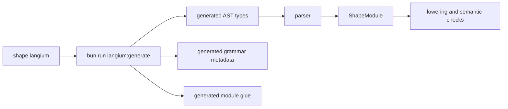

Shape uses Langium for the language front end. The grammar lives at `packages/shp-checker/src/language/shape.langium`, and its job is deliberately narrow: define which source text can become a `ShapeModule` AST.

The grammar does not decide whether a model is architecturally coherent. It gives the rest of the checker a typed syntax tree so semantic code can make those decisions deterministically.



## Entry Point

The entry rule is `ShapeModule`. A module has an optional module name, zero or more imports, and zero or more top-level declarations.

```text
ShapeModule
  module declaration?
  imports*
  declarations*
```

Top-level declarations currently include:

| Declaration | What it represents |
| --- | --- |
| `resource` | A modeled thing the architecture cares about, often with traits. |
| `trait` | Reusable constraints or capabilities, such as final forbidden effects. |
| `component` | An owner of resources, authority grants, and function summaries. |
| `relation` | A top-level structural hyperedge over components and resources, with `kind`, `connects`, and optional `roles`/`summary`. |
| `effect candidate` | Generated, machine-readable effect evidence that can point at AST anchors without becoming a reviewed effect claim. |
| `implementation` | Source path governance for coverage checks. |
| `binding` | Changed-file coupling, such as requiring docs when Shape-affecting code changes. |
| `change` | A patch to the architecture model. |
| `attest` | A typed statement such as `no_shape_change`. |
| `rule` | Project-specific semantic policy. |
| `rationale` | Typed design context for non-obvious function shapes. |
| `memory` | Durable design memory and guards. |
| `reevaluation` | A review record satisfying a memory or rationale guard. |

## Syntax Bias

Shape syntax should stay boring. That is a design choice, not a lack of ambition. The files are meant to be read in code review by humans and agents who need to answer, "what architectural claim is this line making?"

```shape
module audit

resource AuditEvent : AppendOnly

component AuditStore {
  owns AuditEvent
  grants Append<AuditEvent>
  fn appendEvent
    source ts("src/audit/store.ts#appendEvent")
    effects complete {
      Append<AuditEvent>
        evidence ts("src/audit/store.ts#appendEvent")
    }
}
```

This is intentionally more verbose than a compact policy DSL. The verbosity buys reviewability:

- declarations have stable names
- module-qualified references can disambiguate same-named declarations with `other.module::Name`, including function targets such as `other.module::Component.fn`
- effects are explicit
- source and evidence references have obvious targets
- descriptions, rationale, memory, and reevaluations are typed blocks
- formatter output can remain predictable

## Function Summaries

Function summaries are the center of most Shape checks. The grammar lets a function declare shape traits, source, an optional description, and either complete or unknown effects.

```shape no-verify
fn derivePolicyDecision : RequiresDescription, RefactorSensitive
  source ts("src/gateway/authorize.ts#derivePolicyDecision")
  description required "Policy decision branches remain local for auditability."
  effects complete {
    Read<PolicySnapshot>
        evidence ts("src/gateway/authorize.ts#authorize")
  }
```

The semantic checker gives those fields meaning:

- `RequiresDescription` creates a required description and rationale obligation.
- `RefactorSensitive` creates a memory requirement.
- `effects complete` claims every material effect is represented.
- `evidence` gives diagnostics and reviewers a source-backed trail.

The grammar only says the structure is legal. The checker decides whether obligations are satisfied.

Generated AST drafts may also emit candidate effect declarations:

```shape
effect candidate AppendAuditEventCandidate {
  fn AuditStore.appendEvent
  effect Append<AuditEvent>
    source ts("src/audit/store.ts#AuditStore.appendEvent")
  confidence low
  pin AuditStoreAppendEventAstAnchor fingerprint ast.semantic_subtree_v1("sha256:aaaaaaaaaaaaaaaaaaaaaaaaaaaaaaaaaaaaaaaaaaaaaaaaaaaaaaaaaaaaaaaa")
}
```

This syntax is intentionally separate from function `effects complete`: it carries evidence for review, while authored Shape remains responsible for final effect claims.

## Global Update Syntax

The repo workflow updates the global model directly. The grammar accepts the normal declarations that make up that model.

```shape
module audit

component AuditStore {
  fn purgeOldEvents
    source ts("src/audit/purge.ts#purgeOldEvents")
    effects complete {
      HardDelete<AuditEvent>
        evidence ts("src/audit/purge.ts#purgeOldEvents")
    }
}
```

Global updates can add, modify, or remove ordinary declarations in the owning module:

```shape no-verify
component ComponentName {
  fn newFunction
    effects unknown

  fn existingFunction
    effects complete {
      Read<ResourceName>
    }
}

resource NewResource

rule new_policy {
  forbid hypercycle over calls
  forbid path Gateway -> SecretStore over calls or provides
}
```

The checker lowers the committed global model into facts before evaluating rules.
Rule headers are intentionally simple names; subject variables for final effect forbids are introduced by `when T has TraitName` members, not by rule-level type parameters.

## Binding Syntax

Bindings are checked only when the workflow provides changed files. They connect a trigger path set to a required path set:

```shape
module repo

binding GrammarDocs {
  when_changed paths {
    "packages/shp-checker/src/language/shape.langium"
  }
  require_changed paths {
    "docs-site/src/content/docs/reference/language-syntax.md"
  }
  allow attest docs_not_needed
}
```

This is deliberately a language feature rather than ad hoc CI shell logic because bindings are architecture claims: the repo is saying that one surface cannot change without another being reviewed.

## Context Syntax

Rationale, memory, and reevaluation syntax uses typed references. A context block names both its context type and target:

```shape
module gateway

resource PolicySnapshot

component Gateway {
  owns PolicySnapshot
  grants Read<PolicySnapshot>
  fn derivePolicyDecision : RefactorSensitive
    effects complete {
      Read<PolicySnapshot>
    }
}

memory DecisionRefactorConstraint : RefactorConstraint<fn Gateway.derivePolicyDecision> {
  applies_to fn Gateway.derivePolicyDecision
  status Unexplained
  confidence High
  summary "Previous refactors broke error normalisation."
  who { owner GatewayTeam }
  guards { on_change require ReEvaluation<Self> }
}
```

That explicit target is useful in two places. The parser can produce structured target references, and the semantic checker can detect unknown targets, mismatched `applies_to` declarations, and guarded changes that need reevaluation.

A `protects` clause uses `ProtectsPropertyKind`, which accepts the `description` keyword or any identifier, followed by an optional value. This keeps the value-bearing form `protects shape PreserveInline` while also allowing the valueless `protects description`. Adding a literal such as `'shape'` here would reserve it as a global keyword and break identifiers (module segments like `shape.generated.ast`), so only the already-reserved `description` keyword is listed.

A `guards` clause is a choice between `'on_change' 'require' ContextTypeName` and `'forbid' 'transform' ID`, and a `ModifyFunctionChange` carries an optional `TransformDecl` (`'transform' ID (',' ID)*`) after its shape-trait list. The `transform` keyword is new; it is safe to add because no identifier in the model uses it as a name.

Typed review governance adds three more keywords: top-level `RoleDecl` (`'role' ID`) and `PolicyDecl` (`'policy' ID '{' RequireApproverDecl* '}'`), plus a valueless `SensitiveDecl` (`'sensitive'`) as a memory member. Reserving `role`, `policy`, and `sensitive` means they can no longer be used as bare lowercase identifiers (module segments or function names); PascalCase names such as `Policy` are unaffected.

User-defined context obligations add a `RequireContextDecl` trait member (`'require_context' ID '<' ID '>' ('satisfied_by' ContextObjectKind ('or' ContextObjectKind)*)?`), reserving `require_context` and `satisfied_by`. Each new keyword must also be added to `SHAPE_RESERVED_WORDS` in `ast-generation-utils.ts`; the "reserved words cover every ID-shaped grammar keyword" test enforces this so the AST generator never emits an unparsable bare keyword.

Memory-guard members are grouped blocks (`ProtectsBlock`, `GuardsBlock`, `WhoBlock`, `WhenBlock`, reserving `who`) in `RationaleMember`/`MemoryMember`. This is the only guard-member syntax — the earlier flat `ProtectsDecl`/`GuardDecl` (and bare top-level `owner`/`review_by`) members were removed, so there is one canonical on-disk form. The checker lowers block entries into the shared context info, and the formatter aggregates repeated blocks of the same kind into one.

`ProtectsBlock` entries are comma-separated, because a `ProtectsEntry`'s optional value would otherwise swallow the next entry's keyword. `GuardsBlock` entries are self-delimiting (each starts with `on_change` or `forbid`). `WhoBlock`/`WhenBlock` hold a single optional `OwnerDecl`/`ReviewByDecl`, matching the single-valued lowering so the formatter cannot reorder repeated entries into a different document-order winner.

## Generated Artifacts

After grammar edits, run:

```bash
bun run langium:generate
```

Generated files live under `packages/shp-checker/src/language/generated/`.

Do not hand-edit generated files. Change the grammar, regenerate, and then update parser, formatter, checker, editor, authoring, and docs code that depends on the new AST shape.

## Safe Grammar Change Checklist

When changing the grammar, make the corresponding semantic and tooling changes in the same branch:

- Add or update parser tests for the syntax.
- Update formatter output so diffs stay canonical.
- Lower new semantic concepts into facts or internal indexes.
- Add rule checks only if the syntax has semantic meaning.
- Add or update bindings when the syntax affects docs, CLI behavior, or other review surfaces.
- Add editor completions or hovers if the construct is user-facing.
- Update docs with a valid example and, when needed, `shape no-verify` for partial snippets.
- Run `bun run langium:generate`, `bun test`, `bun run docs:check`, and `bun run typecheck`.

The grammar is the first contract users meet. Keep it explicit, stable, and easy to explain.
