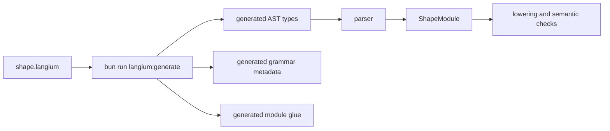

Shape uses Langium for the language front end. The grammar lives at `packages/shp-checker/src/language/shape.langium`, and its job is deliberately narrow: define which source text can become a `ShapeModule` AST.

The grammar does not decide whether a model is architecturally coherent. It gives the rest of the checker a typed syntax tree so semantic code can make those decisions deterministically.



## Entry Point

The entry rule is `ShapeModule`. A module has an optional module name, zero or more imports, and zero or more top-level declarations.

```text
ShapeModule
  module declaration?
  imports*
  declarations*
```

Top-level declarations currently include:

| Declaration | What it represents |
| --- | --- |
| `resource` | A modeled thing the architecture cares about, often with traits. |
| `trait` | Reusable constraints or capabilities, such as final forbidden effects. |
| `component` | An owner of resources, authority grants, dependencies, and function summaries. |
| `implementation` | Source path governance for coverage checks. |
| `binding` | Changed-file coupling, such as requiring docs when Shape-affecting code changes. |
| `change` | A patch to the architecture model. |
| `attest` | A typed statement such as `no_shape_change`. |
| `rule` | Project-specific semantic policy. |
| `rationale` | Typed design context for non-obvious function shapes. |
| `memory` | Durable design memory and guards. |
| `reevaluation` | A review record satisfying a memory or rationale guard. |

## Syntax Bias

Shape syntax should stay boring. That is a design choice, not a lack of ambition. The files are meant to be read in PR review by humans and agents who need to answer, "what architectural claim is this line making?"

```shape
module audit

resource AuditEvent : AppendOnly

component AuditStore {
  owns AuditEvent
  grants Append<AuditEvent>
  fn appendEvent
    source ts("src/audit/store.ts#appendEvent")
    effects complete {
      Append<AuditEvent>
        evidence ts("src/audit/store.ts:8-14")
    }
}
```

This is intentionally more verbose than a compact policy DSL. The verbosity buys reviewability:

- declarations have stable names
- effects are explicit
- source and evidence references have obvious targets
- descriptions, rationale, memory, and reevaluations are typed blocks
- formatter output can remain predictable

## Function Summaries

Function summaries are the center of most Shape checks. The grammar lets a function declare shape traits, source, an optional description, and either complete or unknown effects.

```shape no-verify
fn derivePolicyDecision : RequiresDescription, RefactorSensitive
  source ts("src/gateway/authorize.ts#derivePolicyDecision")
  description required "Policy decision branches remain local for auditability."
  effects complete {
    Read<PolicySnapshot>
      evidence ts("src/gateway/authorize.ts:34-41")
  }
```

The semantic checker gives those fields meaning:

- `RequiresDescription` creates a required description and rationale obligation.
- `RefactorSensitive` creates a memory requirement.
- `effects complete` claims every material effect is represented.
- `evidence` gives diagnostics and reviewers a source-backed trail.

The grammar only says the structure is legal. The checker decides whether obligations are satisfied.

## Change Syntax

Change blocks are how a PR proposes architecture deltas without rewriting the whole model.

```shape
module changes.PR_042

import audit

change ReviewAuditPurge {
  modify fn AuditStore.purgeOldEvents
    source ts("src/audit/purge.ts#purgeOldEvents")
    effects complete {
      HardDelete<AuditEvent>
        evidence ts("src/audit/purge.ts:12-16")
    }
}
```

The grammar supports function-level edits and declaration-level edits:

```shape no-verify
change Example {
  add fn ComponentName.newFunction
    effects unknown

  modify fn ComponentName.existingFunction
    effects complete {
      Read<ResourceName>
    }

  remove fn ComponentName.oldFunction

  add resource NewResource
  modify component ExistingComponent {
    owns NewResource
  }
  remove rule old_policy
}
```

The checker applies these edits before lowering facts. That is why change syntax belongs in the language rather than a separate metadata file.

## Binding Syntax

Bindings are checked only when the workflow provides changed files. They connect a trigger path set to a required path set:

```shape
module repo

binding GrammarDocs {
  when_changed paths {
    "packages/shp-checker/src/language/shape.langium"
  }
  require_changed paths {
    "docs-site/src/content/docs/reference/language-syntax.md"
  }
  allow attest docs_not_needed
}
```

This is deliberately a language feature rather than ad hoc CI shell logic because bindings are architecture claims: the repo is saying that one surface cannot change without another being reviewed.

## Context Syntax

Rationale, memory, and reevaluation syntax uses typed references. A context block names both its context type and target:

```shape
module gateway

resource PolicySnapshot

component Gateway {
  owns PolicySnapshot
  grants Read<PolicySnapshot>
  fn derivePolicyDecision : RefactorSensitive
    effects complete {
      Read<PolicySnapshot>
    }
}

memory DecisionRefactorConstraint : RefactorConstraint<fn Gateway.derivePolicyDecision> {
  applies_to fn Gateway.derivePolicyDecision
  status Unexplained
  confidence High
  summary "Previous refactors broke error normalisation."
  owner GatewayTeam
  guards on_change require ReEvaluation<Self>
}
```

That explicit target is useful in two places. The parser can produce structured target references, and the semantic checker can detect unknown targets, mismatched `applies_to` declarations, and guarded changes that need reevaluation.

## Generated Artifacts

After grammar edits, run:

```bash
bun run langium:generate
```

Generated files live under `packages/shp-checker/src/language/generated/`.

Do not hand-edit generated files. Change the grammar, regenerate, and then update parser, formatter, checker, editor, authoring, and docs code that depends on the new AST shape.

## Safe Grammar Change Checklist

When changing the grammar, make the corresponding semantic and tooling changes in the same branch:

- Add or update parser tests for the syntax.
- Update formatter output so diffs stay canonical.
- Lower new semantic concepts into facts or internal indexes.
- Add rule checks only if the syntax has semantic meaning.
- Add or update bindings when the syntax affects docs, CLI behavior, or other review surfaces.
- Add editor completions or hovers if the construct is user-facing.
- Update docs with a valid example and, when needed, `shape no-verify` for partial snippets.
- Run `bun run langium:generate`, `bun test`, `bun run docs:check`, and `bun run typecheck`.

The grammar is the first contract users meet. Keep it explicit, stable, and easy to explain.
