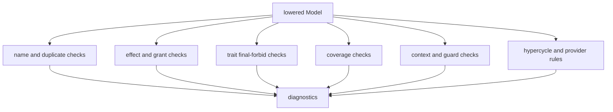
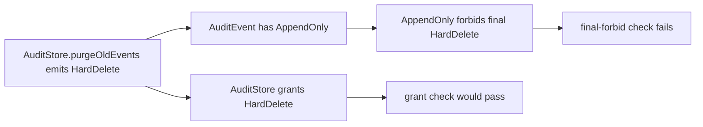

This page describes production rule evaluation for contributors. Rule evaluation decides whether the lowered Shape model is coherent. By the time rules run, syntax has been parsed and declarations have been lowered into a `Model` (typed indexes and facts with provenance).

The checker rejects incoherent or incomplete claims in the declared model. It does not search application source for hidden behavior, prove implementation correctness, or let prose override hard constraints such as `forbid final`.

Context lowering normalizes surface structure before rules run: user-defined `require_context` trait obligations are merged with prelude obligations, and nested `protects` / `guards` / `who` / `when` blocks are flattened into the shared context-info fields rules read.

Rules compare explicit claims. They do not invent effects from source code.




## What Rules Consume

The production checker has two views of the same model:

- Typed indexes such as `resources`, `components`, `traits`, `rules`, `memories`, `reevaluations`, and `hypergraph`, which most domain checks read directly.
- Fact records on `model.facts`, useful for inspection and for experiments. Production modules under `checker/rules/*` currently use the indexes, not a relational join over the fact stream.

A function effect check looks at a function's lowered effects, the owning component's grants, and final forbids derived from the target resource's traits. It does not scan AST text.

## Core Checks

`SEMANTIC_CHECKS` in `packages/shp-checker/src/checker/rules.ts` runs domain checks in fixed order. Binding enforcement runs after that list unless disabled. Major categories:

| Check | Question it answers | Typical fix |
| --- | --- | --- |
| Final forbidden effects | Did a function emit an effect that a resource trait forbids with `final`? | Change the implementation or model; do not waive it with memory. |
| Missing grants | Did a function emit an effect its component lacks permission to emit? | Add the narrow grant if the architecture allows it. |
| Unknown effects | Is a function still marked `effects unknown`? | Replace uncertainty with reviewed complete effects. |
| Source coverage | Did governed source change without a Shape update or current attestation? | Update `shape` or add a narrow current `attest no_shape_change`. |
| Bindings | Did a Shape-affecting change require a paired docs or workflow change? | Update the bound path or add a narrow `docs_not_needed` attestation. |
| Required context | Did a shape trait require rationale, memory, or description? | Add the typed context block. |
| Guarded changes | Did a protected target change without reevaluation? | Add a matching `reevaluation` or preserve the shape. |
| Forbidden paths | Did a `forbid path` rule find a directed route over its explicit relation kinds? | Remove or redirect a hop, or revise the rule intentionally. |
| Hypercycles | Did a `forbid hypercycle` rule find a cycle in the directed hypergraph? | Break the cycle or revise the rule intentionally. |
| Provider rules | Does any `provides` relation expose a target outside the allowed component? | Move provider responsibility, remove the relation, or change the rule. |

Coverage and binding checks use a normalized changed-file context. A source, evidence reference, or attestation only counts for the current run when the declaring Shape file is also in the changed-file list; stale attestations from older reviews are ignored. Function facts are emitted from the final component function registry, so add, modify, and remove changes update the model first and then produce facts from that final state.

Final forbids take precedence over missing grants for the same effect: if a final forbid matches, the checker emits `final_forbidden_effect` and does not also emit `missing_grant` for that effect.

## Incremental Runs

`IncrementalShapeChecker` may reuse a globally lowered model when only checker options change, but it always reruns semantic and binding rules against the new options. If a `repoRoot` change reclassifies an absolute, implicit-origin generated-AST document, it rebuilds the model without reparsing. An exact no-op may reuse the prior diagnostics. Adding, changing, or removing a Shape document rebuilds the complete effective model and fact set before any rule runs, so incremental execution preserves the same phase order and diagnostics as `checkShapeModules`.

This is work reuse, not a second rule engine. The uncached full-check APIs remain available and authoritative.

## Final Forbids

Final forbids are stronger than grants. A grant says a component may emit an effect. A final forbid says the effect is not allowed for that target at all.

```shape
module audit

trait AppendOnly<T: Resource> {
  allow Append<T>
  allow Read<T>
  forbid final HardDelete<T>
}

resource AuditEvent : AppendOnly

component AuditStore {
  owns AuditEvent
  grants HardDelete<AuditEvent>
  fn purgeOldEvents
    source ts("src/audit/purge.ts#purgeOldEvents")
    effects complete {
      HardDelete<AuditEvent>
        evidence ts("src/audit/purge.ts#purgeOldEvents")
    }
}
```

This model fails. The component has a grant, but the target resource has `AppendOnly`, and `AppendOnly` derives a final forbid for `HardDelete<AuditEvent>`.



If final forbids could be overridden by adding a grant, traits would not be reliable architecture boundaries. Rationale, memory, reevaluation, and grants do not waive `forbid final`.

Rule-derived final forbids use the subject name from `when T has TraitName` as their generic binder. Multiple `when` clauses for the same subject must all match the resource. The condition trait must be either a marker trait with no type parameters or a trait with exactly one explicitly `Resource`-bound parameter, such as `AppendOnly<T: Resource>`. Unbound parameters, non-resource bounds, and multiple parameters are rejected because the rule syntax has no way to bind them to the resource subject; an invalid rule contributes no derived forbids. A final-forbid rule cannot bind multiple different subjects. Generic targets such as `HardDelete<T>` bind to the matching resource, while a concrete target such as `HardDelete<audit::AuditEvent>` remains that exact resource after normal module/import resolution.

## Missing Grants

Missing-grant checks ask whether the component is allowed to emit the effect it claims.

```shape
module audit

resource AuditEvent

component AuditStore {
  owns AuditEvent
  fn appendEvent
    effects complete {
      Append<AuditEvent>
    }
}
```

The checker rejects this because `AuditStore` emits `Append<AuditEvent>` but does not grant it. The usual fix is the smallest grant that reflects intended authority:

```shape
module audit

resource AuditEvent

component AuditStore {
  owns AuditEvent
  grants Append<AuditEvent>
  fn appendEvent
    effects complete {
      Append<AuditEvent>
    }
}
```

Grants are part of the architecture model. They should read like deliberate authority, not like a list of whatever made a test pass.

## Unknown Effects

`effects unknown` is a first-class state. It is useful while a change is being scaffolded, especially when an agent or human has not yet reviewed the diff deeply enough to claim completeness.

```shape
module audit

component AuditStore {
  fn reviewPurgeShape1
    source ts("src/audit/purge.ts")
    effects unknown
}
```

Unknown effects keep uncertainty visible. They are better than an empty `effects complete` block, which would claim that every material effect has been represented when it has not.

Under strict `shp check`, unknown effects are blocking errors. `allowUnknownEffects` can downgrade them to warnings for local authoring; committed models and CI should resolve them.

## Bindings

Bindings extend changed-file checks beyond implementation coverage. They let a repo say that if one source or model surface changes, another review surface must also change.

```shape
module repo

binding RuleEngineDocs {
  when_changed paths {
    "packages/shp-checker/src/checker/rules.ts"
    "packages/shp-checker/src/checker/rules/**/*.ts"
    "shape/checker.shape"
  }
  require_changed paths {
    "docs-site/src/content/docs/inside-shape/rule-evaluation.md"
    "docs-site/src/content/docs/reference/diagnostics.md"
  }
  allow attest docs_not_needed
}
```

When `shp check --changed-files changed.txt` sees a triggering path, at least one required path must also appear. A `docs_not_needed` attestation can satisfy the binding only when it points at the triggering path, gives a reason, and is declared in a `.shape` file changed by the current run. In this repo the rule engine is split into an ordered registry plus domain rule modules, and the binding watches both surfaces.

## Context And Memory Guards

Some function shapes are intentionally non-obvious. Shape represents those cases with typed context rather than free-form comments. A trait such as `RefactorSensitive` creates a required context fact; a matching `memory` can satisfy it.

```shape
module gateway

resource PolicySnapshot

component Gateway {
  owns PolicySnapshot
  grants Read<PolicySnapshot>
  fn derivePolicyDecision : RefactorSensitive
    effects complete {
      Read<PolicySnapshot>
    }
}

memory DecisionRefactorConstraint : RefactorConstraint<fn Gateway.derivePolicyDecision> {
  applies_to fn Gateway.derivePolicyDecision
  status Unexplained
  confidence High
  protects { shape CheckOrder }
  guards { on_change require ReEvaluation<Self> }
  summary "Previous refactors broke error normalisation."
  who { owner GatewayTeam }
}
```

This does two things:

- It explains why the current shape deserves attention.
- It creates a guard so future modifications need a reevaluation.

If a later model update modifies `Gateway.derivePolicyDecision`, this satisfies the guard:

```shape
module gateway

resource PolicySnapshot

component Gateway {
  owns PolicySnapshot
  grants Read<PolicySnapshot>
  fn derivePolicyDecision : RefactorSensitive
    effects complete {
      Read<PolicySnapshot>
    }
}

memory DecisionRefactorConstraint : RefactorConstraint<fn Gateway.derivePolicyDecision> {
  applies_to fn Gateway.derivePolicyDecision
  status Unexplained
  confidence High
  protects { shape CheckOrder }
  guards { on_change require ReEvaluation<Self> }
  summary "Previous refactors broke error normalisation."
  who { owner GatewayTeam }
}

reevaluation DecisionShapeRechecked {
  satisfies memory DecisionRefactorConstraint
  outcome Confirmed
  summary "Refactor preserves error-normalisation behaviour."
  reviewer GatewayTeam
  decided_on "2026-06-02"
  evidence test("gateway/error-normalisation.test.ts")
}
```

Memory is not a waiver. It can satisfy required design context and create review obligations, but it does not suppress final forbids, missing grants, or other hard model failures.

## Path and Hypercycle Witnesses

Hypergraph rules need to show their work. A forbidden path reports each directed relation hop; a hypercycle reports the relations and closed vertex walk that form the cycle. Both use the same canonical traversal semantics and deterministic tie-break order; path witnesses exclude semantically invalid relation endpoints.

```shape
module platform_path

resource SecretStore

component Api {
}
component PolicyService {
}

relation ApiCallsPolicy {
  kind calls
  connects Api -> PolicyService
}

relation PolicyProvidesSecret {
  kind provides
  connects PolicyService -> SecretStore
}

rule no_api_secret_route {
  forbid path Api -> SecretStore over calls or provides
}
```

The path witness is the fewest-hop matching route. A BFS visited set makes evaluation terminate even when the graph also contains cycles.

If a rule forbids cycles over `calls`, the diagnostic should include the relations and the vertex path that form the cycle.

```shape
module platform

component Api {
}
component Worker {
}
component Queue {
}

relation ApiCallsWorker {
  kind calls
  connects Api -> Worker
}

relation WorkerCallsQueue {
  kind calls
  connects Worker -> Queue
}

relation QueueCallsApi {
  kind calls
  connects Queue -> Api
}

rule no_runtime_control_cycle {
  forbid hypercycle over calls
}
```

The useful diagnostic is not only "cycle exists." It should point to the relations involved and a vertex witness path:

```text
calls ApiCallsWorker
calls WorkerCallsQueue
calls QueueCallsApi
witness: Api -> Worker -> Queue -> Api
```

That path gives the reviewer a concrete place to start: invert a dependency, split a component, or use a different relation kind if the model was wrong.

## Rule Design Principle

Rules should reject incoherent claims, not adjudicate taste. If a rule cannot explain itself through lowered model data and provenance, it is a poor fit for Shape.

When adding a new rule, ask:

- What index or fact does this rule consume?
- What exact declaration creates that data?
- What diagnostic should a reviewer see?
- Can a human fix the issue without knowing checker internals?

That discipline keeps Shape useful to both agents and human reviewers.

The [rule engine strategy](./rule-engine-strategy/) records why these direct checks remain the production approach, what the Datalog-like comparison spike demonstrated, and which evidence would justify revisiting the decision. That page is a design decision, not a second shipped evaluator.
