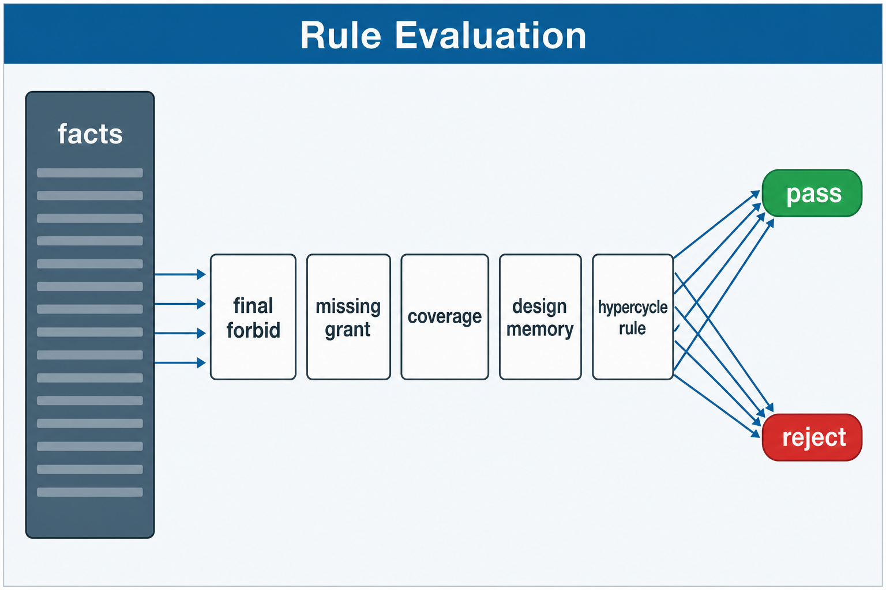
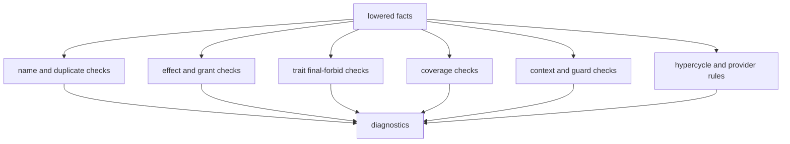

Rule evaluation decides whether the effective Shape model is coherent. By the time rules run, syntax has been parsed, change blocks have been applied, and declarations have been lowered into facts with provenance.

Rules are intentionally boring. They compare explicit claims. They do not search source code for hidden behavior, and they do not let prose override hard constraints.





## What Rules Consume

The checker has two useful views of the same model:

- Fact records, which are easy to expose and reason about.
- Internal indexes, such as `resources`, `components`, `traits`, `rules`, `memories`, and `reevaluations`, which make rule checks direct.

A function effect check, for example, does not scan every AST node looking for text. It looks at a function's lowered effects, the owning component's grants, and final forbids derived from the target resource's traits.

## Core Checks

The current checker covers these major categories:

| Check | Question it answers | Typical fix |
| --- | --- | --- |
| Final forbidden effects | Did a function emit an effect that a resource trait forbids with `final`? | Change the implementation or model; do not waive it with memory. |
| Missing grants | Did a function emit an effect its component lacks permission to emit? | Add the narrow grant if the architecture allows it. |
| Unknown effects | Is a function still marked `effects unknown`? | Replace uncertainty with reviewed complete effects. |
| Source coverage | Did governed source change without a Shape update or current attestation? | Update `shape` or add a narrow current `attest no_shape_change`. |
| Bindings | Did a Shape-affecting change require a paired docs or workflow change? | Update the bound path or add a narrow `docs_not_needed` attestation. |
| Required context | Did a shape trait require rationale, memory, or description? | Add the typed context block. |
| Guarded changes | Did a protected target change without reevaluation? | Add a matching `reevaluation` or preserve the shape. |
| Hypercycles | Did a `forbid hypercycle` rule find a cycle in the directed hypergraph? | Break the cycle or revise the rule intentionally. |
| Provider rules | Does any `provides` relation expose a target outside the allowed component? | Move provider responsibility, remove the relation, or change the rule. |

## Final Forbids

Final forbids are intentionally stronger than grants. A grant says a component may emit an effect. A final forbid says the effect is not allowed for that target at all.

```shape
module audit

trait AppendOnly<T: Resource> {
  allow Append<T>
  allow Read<T>
  forbid final HardDelete<T>
}

resource AuditEvent : AppendOnly

component AuditStore {
  owns AuditEvent
  grants HardDelete<AuditEvent>
  fn purgeOldEvents
    source ts("src/audit/purge.ts#purgeOldEvents")
    effects complete {
      HardDelete<AuditEvent>
        evidence ts("src/audit/purge.ts:12-16")
    }
}
```

This model fails. The component has a grant, but the target resource has `AppendOnly`, and `AppendOnly` derives a final forbid for `HardDelete<AuditEvent>`.


The failure is not an accident; it is the intended precedence rule. If final forbids could be overridden by adding a grant, traits would not be reliable architecture boundaries.

## Missing Grants

Missing-grant checks are narrower. They ask whether the component is allowed to emit the effect it claims.

```shape
module audit

resource AuditEvent

component AuditStore {
  owns AuditEvent
  fn appendEvent
    effects complete {
      Append<AuditEvent>
    }
}
```

The checker rejects this because `AuditStore` emits `Append<AuditEvent>` but does not grant it. The fix is not to add a broad permission. The fix is to add the smallest grant that reflects the component's intended authority:

```shape
module audit

resource AuditEvent

component AuditStore {
  owns AuditEvent
  grants Append<AuditEvent>
  fn appendEvent
    effects complete {
      Append<AuditEvent>
    }
}
```

Grants are part of the architecture model. They should read like deliberate authority, not like a list of whatever made a test pass.

## Unknown Effects

`effects unknown` is a first-class state. It is useful while a change is being scaffolded, especially when an agent or human has not yet reviewed the diff deeply enough to claim completeness.

```shape
module changes.PR_042

import audit

change ReviewAuditPurge {
  add fn AuditStore.reviewPurgeShape1
    source ts("src/audit/purge.ts")
    effects unknown
}
```

Unknown effects keep uncertainty visible. They are better than an empty `effects complete` block, which would falsely claim that every material effect has been represented.

Rule evaluation can then force the authoring loop to resolve the uncertainty before the shape is accepted.

## Bindings

Bindings extend changed-file checks beyond implementation coverage. They let a repo say, "if this source or model surface changes, another review surface must also change."

```shape
module repo

binding RuleEngineDocs {
  when_changed paths {
    "packages/shp-checker/src/checker.ts"
    "shape/checker.shape"
  }
  require_changed paths {
    "docs-site/src/content/docs/inside-shape/rule-evaluation.md"
    "docs-site/src/content/docs/reference/diagnostics.md"
  }
  allow attest docs_not_needed
}
```

When `shp check --changed-files changed.txt` sees a triggering path, at least one required path must also appear. A `docs_not_needed` attestation can satisfy the binding only when it points at the triggering path, gives a reason, and is declared in a `.shape` file changed by the current run.

## Context And Memory Guards

Some function shapes are intentionally non-obvious. Shape represents those cases with typed context rather than free-form comments. A trait such as `RefactorSensitive` creates a required context fact; a matching `memory` can satisfy it.

```shape
module gateway

resource PolicySnapshot

component Gateway {
  owns PolicySnapshot
  grants Read<PolicySnapshot>
  fn derivePolicyDecision : RefactorSensitive
    effects complete {
      Read<PolicySnapshot>
    }
}

memory DecisionRefactorConstraint : RefactorConstraint<fn Gateway.derivePolicyDecision> {
  applies_to fn Gateway.derivePolicyDecision
  status Unexplained
  confidence High
  protects shape CheckOrder
  guards on_change require ReEvaluation<Self>
  summary "Previous refactors broke error normalisation."
  owner GatewayTeam
}
```

This does two things:

- It explains why the current shape deserves attention.
- It creates a guard so future modifications need a reevaluation.

If a change later modifies `Gateway.derivePolicyDecision`, this satisfies the guard:

```shape
module gateway

resource PolicySnapshot

component Gateway {
  owns PolicySnapshot
  grants Read<PolicySnapshot>
  fn derivePolicyDecision : RefactorSensitive
    effects complete {
      Read<PolicySnapshot>
    }
}

memory DecisionRefactorConstraint : RefactorConstraint<fn Gateway.derivePolicyDecision> {
  applies_to fn Gateway.derivePolicyDecision
  status Unexplained
  confidence High
  protects shape CheckOrder
  guards on_change require ReEvaluation<Self>
  summary "Previous refactors broke error normalisation."
  owner GatewayTeam
}

reevaluation DecisionShapeRechecked {
  satisfies memory DecisionRefactorConstraint
  outcome Confirmed
  summary "Refactor preserves error-normalisation behaviour."
  reviewer GatewayTeam
  decided_on "2026-06-02"
  evidence test("gateway/error-normalisation.test.ts")
}

change RefactorDecision {
  modify fn Gateway.derivePolicyDecision : RefactorSensitive
    effects complete {
      Read<PolicySnapshot>
    }
}
```

Memory is not a waiver. It can satisfy required design context and create review obligations, but it does not suppress final forbids, missing grants, or other hard model failures.

## Hypercycle Witness Paths

Hypergraph rules need to show their work. If a rule forbids cycles over `calls`, the diagnostic should include the relations and the vertex path that prove the cycle.

```shape
module platform

component Api {
}
component Worker {
}
component Queue {
}

relation ApiCallsWorker {
  kind calls
  connects Api -> Worker
}

relation WorkerCallsQueue {
  kind calls
  connects Worker -> Queue
}

relation QueueCallsApi {
  kind calls
  connects Queue -> Api
}

rule no_runtime_control_cycle {
  forbid hypercycle over calls
}
```

The useful diagnostic is not merely "cycle exists." It should point to the relations involved and a vertex witness path:

```text
calls ApiCallsWorker
calls WorkerCallsQueue
calls QueueCallsApi
witness: Api -> Worker -> Queue -> Api
```

That path gives the reviewer a concrete place to start. They can decide whether the runtime dependency should be inverted, split, or expressed through a different relation kind.

## Rule Design Principle

Rules should reject incoherent claims, not adjudicate taste. If a rule cannot explain itself through facts and provenance, it is probably too magical for Shape.

When adding a new rule, ask:

- What fact or index does this rule consume?
- What exact declaration creates that fact?
- What diagnostic should a reviewer see?
- Can a human fix the issue without knowing checker internals?

That discipline is what keeps Shape useful to both agents and human reviewers.
