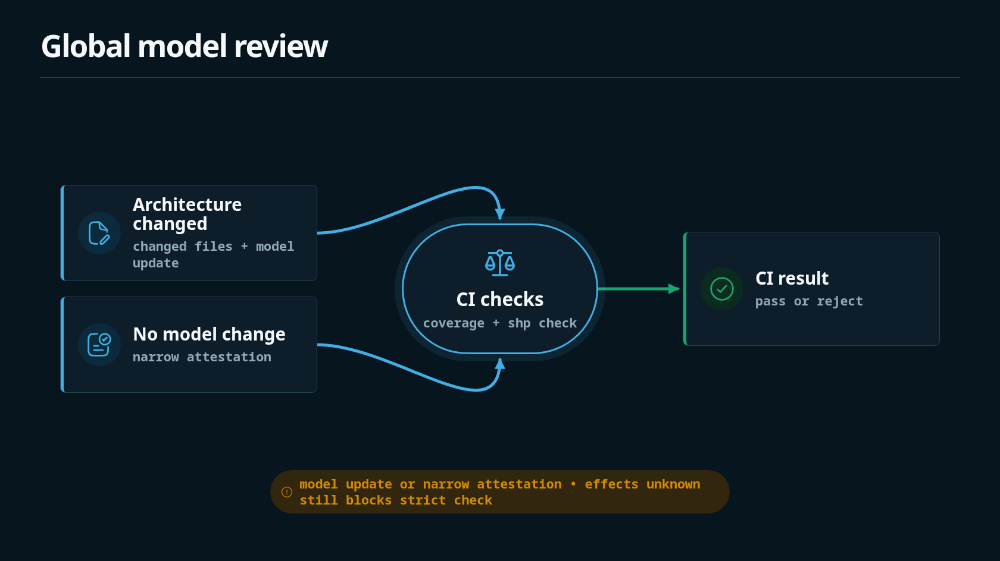

Shape is meant to run in review. In application repos, install a pinned `shp` release and run the checker directly.



## Recommended workflow

```yaml
name: Shape

on:
  pull_request:
  push:
    branches:
      - main

jobs:
  shape:
    runs-on: ubuntu-latest

    steps:
      - uses: actions/checkout@v4
      - uses: timbrinded/shapelang@v0.4.0
      - run: shp check
      - run: shp fmt --check
```

## Coverage gate

Coverage checks compare changed source paths with implementation blocks. A governed source change must be represented by a current `shape` update, or by a narrow attestation changed in the same change set:

```yaml
- name: Changed files
  run: git diff --name-only origin/main...HEAD > changed.txt

- name: Shape coverage
  run: shp coverage --changed-files changed.txt
```

If a governed source path changes without a Shape update or current attestation, the checker rejects the change.

## Claude Code contract review

CI can also run Claude Code as a PR job to check source semantics against the Shape model. This is separate from the deterministic checker: `shp check --changed-files` enforces current coverage and bindings, while Claude reviews whether the committed Shape claims faithfully describe the changed behavior.

The job needs `CLAUDE_CODE_OAUTH_TOKEN`. Repositories that proxy Anthropic traffic can also set `ANTHROPIC_BASE_URL` and `ANTHROPIC_AUTH_TOKEN`. Detect the token first so forked pull requests skip the Claude-only work instead of failing on an unavailable secret:

```yaml
shape-claude-review:
  if: github.event_name == 'pull_request'
  runs-on: ubuntu-latest
  steps:
    - name: Detect Claude token
      id: claude-token
      env:
        CLAUDE_CODE_OAUTH_TOKEN: ${{ secrets.CLAUDE_CODE_OAUTH_TOKEN }}
      run: |
        if [ -n "${CLAUDE_CODE_OAUTH_TOKEN:-}" ]; then
          echo "available=true" >> "$GITHUB_OUTPUT"
        else
          echo "available=false" >> "$GITHUB_OUTPUT"
          echo "Skipping Claude Shape contract review because CLAUDE_CODE_OAUTH_TOKEN is not available."
        fi
    - uses: actions/checkout@v4
      if: steps.claude-token.outputs.available == 'true'
      with:
        fetch-depth: 0
    - uses: oven-sh/setup-bun@v2
      id: setup-bun
      if: steps.claude-token.outputs.available == 'true'
    - run: bun install --frozen-lockfile
      if: steps.claude-token.outputs.available == 'true'
    - run: bun run changed-files
      if: steps.claude-token.outputs.available == 'true'
      env:
        GITHUB_BASE_REF: ${{ github.base_ref }}
        GITHUB_SHA: ${{ github.sha }}
    - uses: anthropics/claude-code-action@v1.0.88
      if: steps.claude-token.outputs.available == 'true'
      env:
        API_TIMEOUT_MS: 18000
        DISABLE_NON_ESSENTIAL_MODE_CALLS: 1
        ANTHROPIC_BASE_URL: ${{ secrets.ANTHROPIC_BASE_URL }}
        ANTHROPIC_AUTH_TOKEN: ${{ secrets.ANTHROPIC_AUTH_TOKEN }}
      with:
        github_token: ${{ github.token }}
        claude_code_oauth_token: ${{ secrets.CLAUDE_CODE_OAUTH_TOKEN }}
        path_to_bun_executable: ${{ steps.setup-bun.outputs.bun-path }}
        classify_inline_comments: false
        prompt: |
          Read AGENTS.md when it exists, then read
          .github/prompts/shape-contract-review.md.

          Analyze this repository for Shape contract drift.
          Changed files are listed in changed.txt.
          Return only the JSON result. Do not modify tracked repository files.
        claude_args: |
          --max-turns 100
          --allowedTools "Read,Glob,Grep,LS,Bash(git diff *),Bash(git show *),Bash(bun run shape:ci),Bash(bun shp check *),Bash(bun shp obligations *),Bash(bun shp memory *),Bash(bun shp explain *),Bash(bun shp analyze *)"
          --disallowedTools "Write,Edit,MultiEdit,NotebookEditCell"
```

Use a short prompt that makes `shape/` the authority:

```md
# Shape contract review

Review `changed.txt` against the durable Shape model in `shape/**/*.shape`.
For changed source behavior that affects the architecture contract, require a
faithful current Shape update or a narrow current attestation.

Run `bun shp check --changed-files changed.txt`, `bun shp obligations`, and
`bun shp memory`. Use `bun shp explain` when a symbol needs context and
`bun shp analyze` only as advisory input.

Return JSON with `status: "pass" | "drift" | "error"` and terse
evidence-backed findings.
```

## Shape repo workflow

The Shape repository dogfoods this workflow more strictly than a normal consumer repo. CI generates `changed.txt`, then runs formatting, semantic checks, coverage, obligations, and memory output:

```bash
bun run changed-files
bun run shape:ci
```

`shape:ci` runs `bun run ast:check` and then `bun shp check --changed-files changed.txt`, so generated AST context, implementation coverage, and bindings are checked together. Bindings are used for documentation coupling: if Shape-affecting code or model files change, the associated docs must change too, unless the current change set includes a narrow current `docs_not_needed` attestation.

## Direct binary install

If you do not want to use the setup action, use the release installer directly:

```yaml
- name: Install shp
  run: |
    curl --proto '=https' --tlsv1.2 -LsSf https://github.com/timbrinded/shapelang/releases/download/v0.4.0/install.sh | sh
```

Keep CI installs pinned to an explicit release. `shp update` is intended for local developer binaries and should not replace pinned CI installation.

## Shape repo checks

The Shape repository itself also runs Bun workspace tests, typechecking, docs verification, and release smoke tests. Those are contributor checks, not required for application repos that only consume `shp`.

See [Local Development](../reference/local-development) for the contributor commands.
