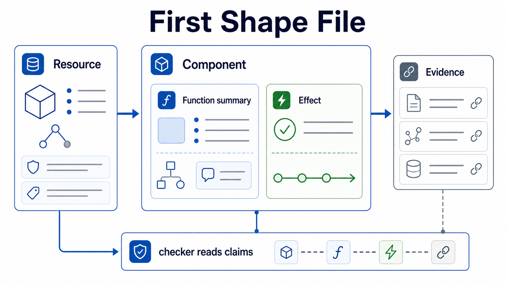

A useful Shape file usually starts with a resource, a component, and function effect summaries.



```shape
module audit

resource AuditEvent : AppendOnly

component AuditStore {
  owns AuditEvent
  grants Append<AuditEvent>
  fn appendEvent
    effects complete {
      Append<AuditEvent>
    }
}
```

## Resource

`resource AuditEvent : AppendOnly` says `AuditEvent` is governed by the `AppendOnly` trait.

The checker derives constraints from that trait. In the built-in checker logic and examples, append-only resources reject final destructive effects such as `HardDelete<T>`.

## Component

`component AuditStore` groups ownership, grants, dependencies, and functions.

`owns AuditEvent` makes the ownership claim explicit. `grants Append<AuditEvent>` says the component may contain functions that append to that resource.

## Function summary

`fn appendEvent` is not an implementation. It is a summary of the source function's architectural effects.

`effects complete` means the listed effects are intended to be complete. In protected components, `effects unknown` should be treated as a review blocker.

## Evidence

Source and evidence refs make claims reviewable:

```shape
module audit

resource AuditEvent : AppendOnly

component AuditStore {
  owns AuditEvent
  grants Append<AuditEvent>
  fn appendEvent
    source ts("src/audit/store.ts#appendEvent")
    effects complete {
      Append<AuditEvent>
        evidence ts("src/audit/store.ts:8-14")
    }
}
```

The checker does not need to understand the TypeScript span. The evidence tells a human reviewer where to inspect the claim.
