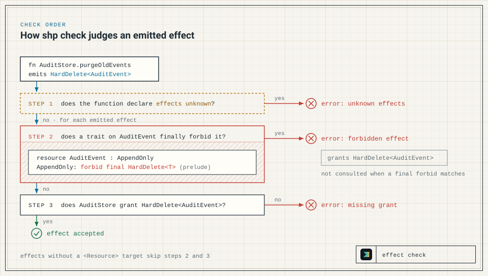

This page installs the released `shp` binary, builds a small Shape model for an audit log, and walks through the most common failure: a change that claims an effect the model finally forbids. The [home page](/shapelang/) describes what the checker decides and where it stops.

## Install

Pin a release version in scripts and CI. The current docs pin is `v0.9.0`:

```bash
curl --proto '=https' --tlsv1.2 -LsSf https://github.com/timbrinded/shapelang/releases/download/v0.9.0/install.sh | sh
```

On Windows:

```powershell
irm https://github.com/timbrinded/shapelang/releases/download/v0.9.0/install.ps1 | iex
```

The installer downloads the release archive for your platform and verifies it against the release's `checksums.txt` (SHA-256). It then installs `shp`, with the `tree-sitter-language-pack` parser directory beside it for `shp ast`. Archives exist for Linux x64 and ARM64, macOS ARM64, and Windows x64, and each GitHub release also attaches them with `checksums.txt` for manual download. The released binary needs neither Bun nor Node.

- **Location.** The default directory is `~/.local/bin`, or `$HOME\.local\bin` on Windows. Set `SHAPE_INSTALL_DIR` to install elsewhere. The POSIX installer also accepts `--install-dir`, passed through `sh`: `curl … install.sh | sh -s -- --install-dir DIR`.
- **Version.** An installer downloaded from a release installs that release. To pin another one, replace `v0.9.0` in the URL, or set `SHAPE_VERSION` to a release tag.
- **Updates.** `shp update` replaces the running binary with the latest release, or with the tag passed to `--version`. It is for local installs; CI should pin a version instead. See the [CLI Reference](/shapelang/reference/cli/).

If the install directory is not on your `PATH`, the installer prints the line to add. For the default directory in a POSIX shell, that line is equivalent to:

```bash
export PATH="$HOME/.local/bin:$PATH"
```

The PowerShell installer prints the equivalent `$env:PATH = "<dir>;$env:PATH"` line. Confirm the install; this prints the installed version:

```bash
shp --version
```

## Write a first model

Create `shape/audit.shape` in your repository:

```shape
module audit

resource AuditEvent : AppendOnly

component AuditStore {
  owns AuditEvent
  grants Append<AuditEvent>
  grants Read<AuditEvent>
  fn appendEvent
    source ts("src/audit/store.ts#appendEvent")
    effects complete {
      Append<AuditEvent>
        evidence ts("src/audit/store.ts#appendEvent")
    }
  fn listEvents
    source ts("src/audit/store.ts#listEvents")
    effects complete {
      Read<AuditEvent>
        evidence ts("src/audit/store.ts#listEvents")
    }
}
```

Each declaration is a claim:

- `module audit` names the namespace the declarations belong to.
- `resource AuditEvent : AppendOnly` declares a resource, the data the claims protect, and attaches the `AppendOnly` trait to it. The resource need not exist as a runtime type. `AppendOnly` comes from Shape's built-in prelude, which defines it with three final forbids on the resource: `HardDelete`, `Truncate`, and `DropStorage`. Do not redeclare it, because a `trait AppendOnly` in the same module silently replaces the prelude trait.
- `component AuditStore` is the part of the system that owns the resource. `owns AuditEvent` records that ownership for reviewers; the checker only checks that the resource exists, and ownership does not affect grants.
- `grants Append<AuditEvent>` permits the component's functions to emit that effect. An effect is an operation name, optionally targeted at a resource in angle brackets; names are free identifiers that the checker matches literally against grants and final forbids. A function that emits a targeted effect its component does not grant fails with `missing grant`, so grant only what the component needs.
- `fn appendEvent` summarises a source function; it is not an implementation. `effects complete { ... }` claims that the listed effects are all the function has.
- `source` and `evidence` are refs written `tag("path#symbol")`. `source` points at the function, and `evidence` at the code behind one effect. The checker never opens these files. Reviewers follow the refs to check the claim, and coverage uses their paths to match changed files to the model. Prefer `#symbol` anchors to line numbers, which go stale.

Structural links between components, such as one calling another, are top-level `relation` declarations, never members of a component. See [Relations and Graph Rules](/shapelang/concepts/relations/).

## Check the model

Run from the repository root:

```bash
shp check
```

```text
Shape check passed.
```

With no file arguments, `shp check` loads every `shape/**/*.shape` file under the working directory as one Shape model. File arguments replace that discovery: `shp check shape/audit.shape` checks only that file. With no `shape/` directory, `shp check` finds nothing and passes, so a pass in a new repository means nothing until the model exists. The [CLI Reference](/shapelang/reference/cli/) has the full discovery rules.

Check the formatting too:

```bash
shp fmt --check
```

```text
Shape format check passed.
```

`shp fmt` without `--check` rewrites the files in canonical form. It rebuilds each file from its parsed structure, so it drops `//` and `/* */` comments.

## Make it fail

A pull request adds a job that purges old audit events. The model must claim the new function's effect, so the author adds `purgeOldEvents` to `AuditStore`, together with `grants HardDelete<AuditEvent>` to allow it:

```shape
module audit

resource AuditEvent : AppendOnly

component AuditStore {
  owns AuditEvent
  grants Append<AuditEvent>
  grants HardDelete<AuditEvent>
  grants Read<AuditEvent>
  fn appendEvent
    source ts("src/audit/store.ts#appendEvent")
    effects complete {
      Append<AuditEvent>
        evidence ts("src/audit/store.ts#appendEvent")
    }
  fn listEvents
    source ts("src/audit/store.ts#listEvents")
    effects complete {
      Read<AuditEvent>
        evidence ts("src/audit/store.ts#listEvents")
    }
  fn purgeOldEvents
    source ts("src/audit/purge.ts#purgeOldEvents")
    effects complete {
      HardDelete<AuditEvent>
        evidence ts("src/audit/purge.ts#purgeOldEvents")
    }
}
```

`shp check` now prints this diagnostic to stderr and exits 1:

```text
error: forbidden effect

AuditStore.purgeOldEvents emits HardDelete<AuditEvent>.
AuditEvent has trait AppendOnly.
AppendOnly forbids final HardDelete<AuditEvent>.
evidence: ts("src/audit/purge.ts#purgeOldEvents")

caused by:
  - shape/audit.shape: effect AuditStore.purgeOldEvents emits HardDelete<AuditEvent>
  - shape/audit.shape: resource AuditEvent : AppendOnly
  - standard prelude: trait AppendOnly forbids final HardDelete<T>
```

The first line names the check that failed. The three sentences trace the chain from the function's claim, through the resource's trait, to the final forbid, and `evidence:` repeats the effect's ref. `caused by:` lists the declaration behind each step and where it came from. [Diagnostics](/shapelang/reference/diagnostics/) explains every diagnostic.



The checker judges each function in this order:

1. A function that declares `effects unknown` fails with `unknown effects`; see [Draft with unknown effects](#draft-with-unknown-effects).
2. For each effect with a resource target: does a trait on that resource finally forbid it? If so, the result is `forbidden effect`, and the grant question is skipped.
3. Otherwise, does the component grant the effect? If not, the result is `missing grant`.

Effects without a resource target skip steps 2 and 3. `HardDelete<AuditEvent>` has a target and stops at step 2, so its grant is never consulted: delete the grant and the output is identical. The [Effect Model](/shapelang/concepts/effect-model/) gives the complete check order.

## Resolve it

Nothing in the model waives a final forbid: not a grant, rationale, memory, reevaluation, or attestation. To land the purge, change one of the facts the diagnostic names:

- **Remove the destructive code.** Take the hard delete out of the source, then remove its `HardDelete<AuditEvent>` claim and grant from the model.
- **Change the decision.** If audit events may be deleted after all, remove `AppendOnly` from `AuditEvent`, and have reviewers approve that as a design change.
- **Move the behaviour.** Have the purge act on a resource whose traits do not finally forbid `HardDelete`, and claim the effect against that resource.

Never make the check pass by deleting the `HardDelete<AuditEvent>` entry while the code still performs the delete. The summary claims to be complete, so a missing real effect makes the model false, and the checker cannot tell.

To continue with a passing model, remove `purgeOldEvents` and its grant.

## Draft with unknown effects

When a function exists but its effects are not yet known, say so with `effects unknown` inside `AuditStore`:

```shape no-verify
  fn exportEvents
    source ts("src/audit/export.ts#exportEvents")
    effects unknown
```

Prefer this to an empty `effects complete {}`, which claims the function has no effects. Strict `shp check` rejects unknown effects in authored modules, so an unresolved summary fails the check. (A function is exempt only when its module is named `shape.generated.ast` or starts with `shape.generated.ast.`, and its file is under `shape/generated/ast/`, which is where `shp ast` writes its drafts; see [Generate Drafts from Source](/shapelang/guides/ast-drafts/).) Strict `shp check` exits 1 with:

```text
error: unknown effects

AuditStore.exportEvents declares effects unknown.

caused by:
  - shape/audit.shape: fn AuditStore.exportEvents
```

While drafting locally, `--allow-unknown-effects` downgrades only this diagnostic to a warning. The run prints to stdout and exits 0:

```bash
shp check --allow-unknown-effects
```

```text
warning: unknown effects

AuditStore.exportEvents declares effects unknown.

caused by:
  - shape/audit.shape: fn AuditStore.exportEvents

Shape check passed with warnings.
```

Every other diagnostic still fails the run. Resolve the unknowns and run strict `shp check` before review, and never pass the flag in CI. The [CLI Reference](/shapelang/reference/cli/) has the flag's full contract.

## Use Shape with Claude Code

The Shape skills ship as a Claude Code plugin. They call the `shp` CLI, so keep the binary on your `PATH`:

```text
/plugin marketplace add timbrinded/shapelang
/plugin install shapelang@shapelang-local
/reload-plugins
```

| Skill | Use it to |
| --- | --- |
| `shapelang:shape-lang` | Write, repair, explain, format, and validate `.shape` files |
| `shapelang:shape-contract-preflight` | Map a planned code change onto the Shape model and its obligations before editing |
| `shapelang:shape-contract-guard` | Compare a base and a candidate `.shape` contract for changes that loosen it |
| `shapelang:shape-index` | Create or refresh a whole-repository Shape model, when asked to explicitly |
| `shapelang:shape-review` | Review a code diff for reachable bugs, using the Shape model |
| `shapelang:unix-system-visualiser` | Generate a browsable visual atlas of an authored Shape model |

A skill's output is advice for the author. Only `shp check` decides whether the model passes.

## Add Shape to CI

In CI, install the same pin with the setup action and run both checks:

```yaml
steps:
  - uses: actions/checkout@v4
  - uses: timbrinded/shapelang@v0.9.0
  - run: shp fmt --check
  - run: shp check
```

[Keep the Model Current](/shapelang/guides/keep-model-current/) explains how source changes and model updates travel together. [Run Shape in CI](/shapelang/guides/ci/) then extends this job with a changed-file list, so that `shp check --changed-files changed.txt` also enforces coverage and bindings.
