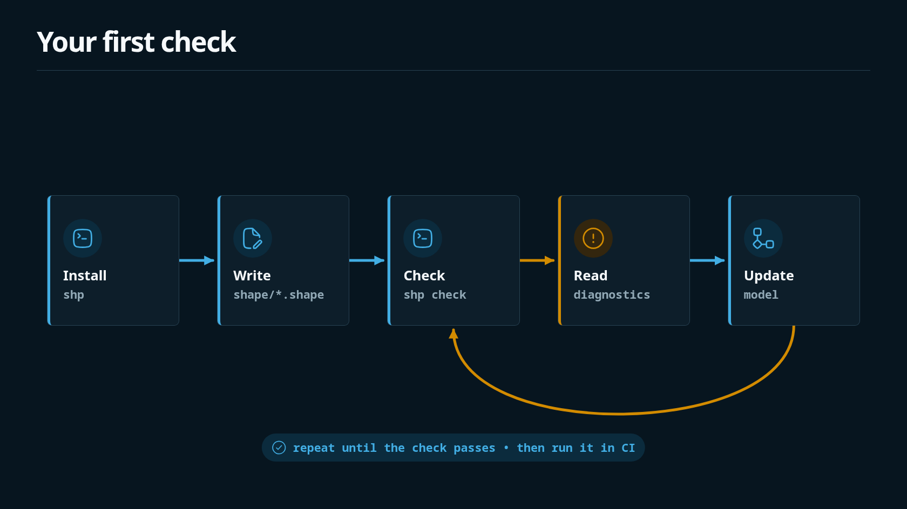

This page installs the released `shp` typechecker and runs the commands you need in an application repo that already has, or is about to add, `.shape` files. You do not need Bun or Node to run the released binary.



## Install

Pin a release version in scripts and CI. The current docs pin is `v0.8.0`:

```bash
curl --proto '=https' --tlsv1.2 -LsSf https://github.com/timbrinded/shapelang/releases/download/v0.8.0/install.sh | sh
```

On Windows:

```powershell
irm https://github.com/timbrinded/shapelang/releases/download/v0.8.0/install.ps1 | iex
```

The installer downloads the matching release archive, verifies its SHA-256 checksum, and installs `shp` plus bundled Tree-sitter parser assets into `~/.local/bin`. Replace `v0.8.0` with the release tag you want to pin.

If your shell cannot find `shp` after installation:

```bash
export PATH="$HOME/.local/bin:$PATH"
```

Confirm the binary:

```bash
shp --version
shp --help
```

## Check a repo

```bash
shp check
```

With no file arguments, Shape file commands scan:

```text
shape/**/*.shape
```

That recursive set includes modules under `shape/vendor/` when you vendor domain packs. Pass explicit paths when you want a narrower check:

```bash
shp check shape/audit.shape
```

## Format shape files

```bash
shp fmt --check
```

Use `shp fmt` without `--check` to rewrite files with canonical formatting.

## Coverage for changed files

When governed source changes, coverage requires a current Shape update or a narrow attestation in a changed `.shape` file:

```bash
git diff --name-only origin/main...HEAD > changed.txt
shp coverage --changed-files changed.txt
```

`shp check --changed-files changed.txt` also runs coverage and bindings as part of the check. Prefer listing the same `changed.txt` in CI that you use for local validation.

## Draft unknowns while authoring

Strict `shp check` rejects `effects unknown` so committed models cannot keep unresolved effects silently. For local draft iteration:

```bash
shp check --allow-unknown-effects draft.shape
```

Unknowns become warnings; parse errors, final forbids, missing grants for known effects, guarded-change obligations, coverage, and bindings still fail the command. Resolve unknowns and run strict `shp check` before review or CI.

## Other useful commands

| Command | Purpose |
| --- | --- |
| `shp explain SYMBOL` | Facts and incident relations for a symbol |
| `shp graph stats` / `show` / `all` | Inspect the relation hypergraph |
| `shp memory` | List design-memory guards |
| `shp obligations` | List open review obligations |
| `shp analyze` | Advisory source hints vs declared effects |
| `shp author` | Conservative draft or authoring prompt |
| `shp ast source` / `json` | AST-backed draft generation |
| `shp lsp` | Language server on stdio |
| `shp update` | Update a local released binary (not for pinned CI installs) |

See [CLI Reference](../reference/cli) for flags and full usage.

## GitHub Actions

```yaml
steps:
  - uses: actions/checkout@v4
  - uses: timbrinded/shapelang@v0.8.0
  - run: shp check
  - run: shp fmt --check
```

For coverage on pull requests, produce `changed.txt` and run `shp coverage --changed-files changed.txt` or `shp check --changed-files changed.txt`. See [CI Workflow](./ci-workflow).

## Use with Claude Code

Shape authoring, review, and visualization skills ship as a Claude Code plugin. They call the `shp` CLI, so keep the binary on your `PATH`.

```text
/plugin marketplace add timbrinded/shapelang
/plugin install shapelang@shapelang-local
/reload-plugins
```

That exposes skills such as `shapelang:shape-lang`, `shapelang:shape-contract-preflight`, `shapelang:shape-contract-guard`, `shapelang:shape-index`, `shapelang:shape-review`, and `shapelang:unix-system-visualiser`.

## Practice

**Do**

- Pin install and action versions to an explicit tag such as `v0.8.0`
- Keep the durable model under `shape/**/*.shape`
- Run strict `shp check` before merge; use `--allow-unknown-effects` only for drafts

**Do not**

- Use `shp update` as a substitute for pinned CI installation
- Treat analyzer or authoring output as checker approval
- Expect Shape to validate application runtime behavior outside the declared model

## Related pages

- [What Shape Is](./what-is-shape) — product boundary
- [First Shape File](./first-shape-file) — write a minimal model
- [CI Workflow](./ci-workflow) — full PR gates
- [Local Development](../reference/local-development) — contributor Bun workspace setup
