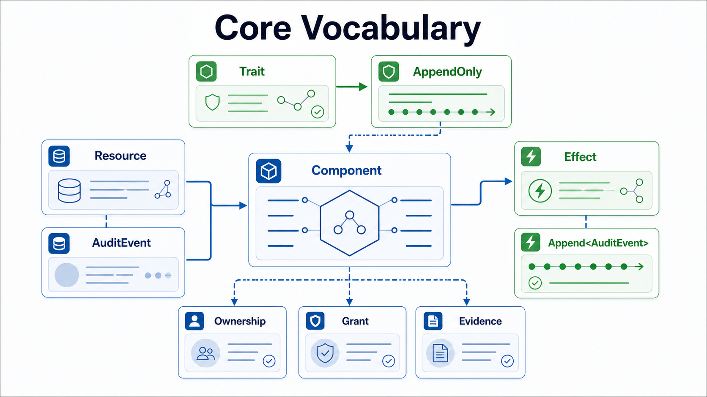
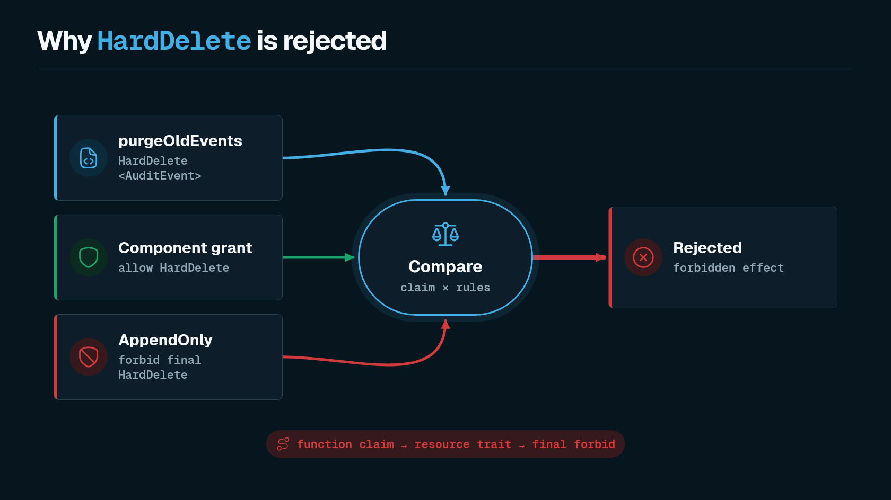
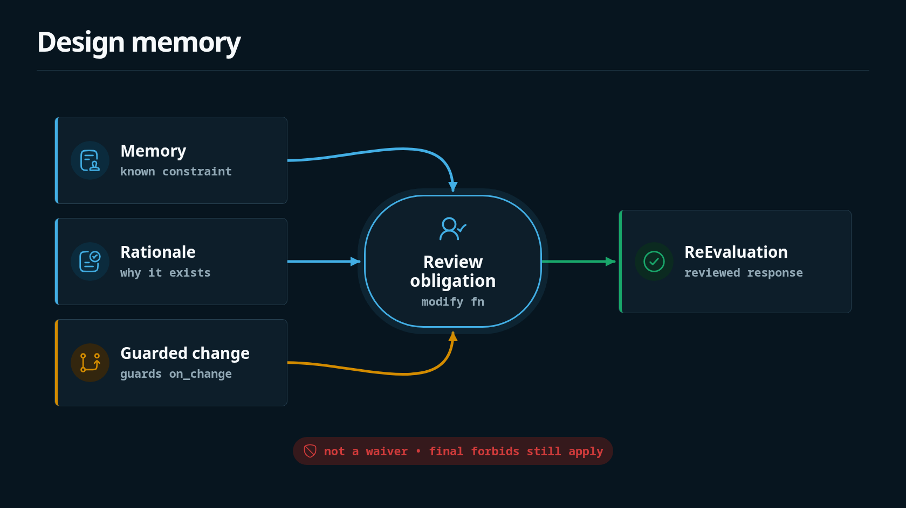

These diagrams are the fastest way to orient around Shape's model, review loop, and checker behavior.

## Shape Review Loop

## Core Vocabulary

## Final Forbid Wins

## PR Change Review

## Design Memory

## Checker Pipeline

